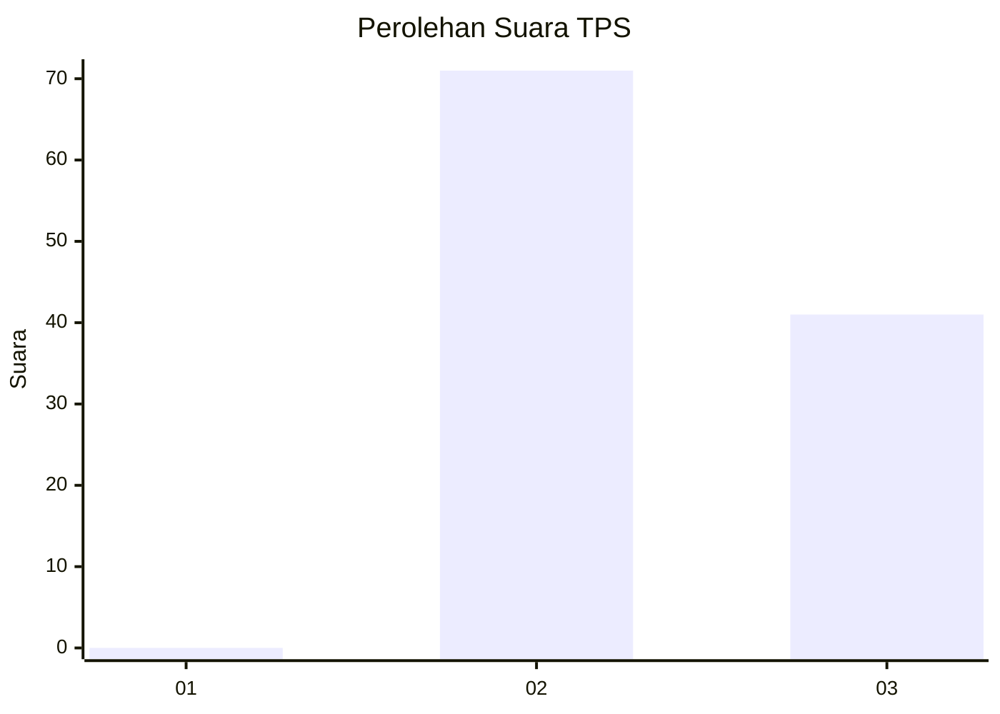
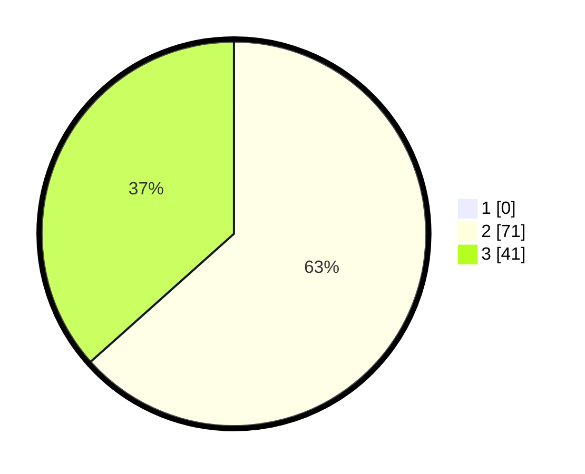

# Hasil

## Grafik

## Tabel

| No. | Nama Paslon    | Suara | Suara (raw) | Persentase |
|:--- |:-------------- | -----:| -----------:| ----------:|
| 1   | ANIES MUHAIMIN | 0     | [0][p-1]    | 0,00       |
| 2   | PRABOWO GIBRAN | 71    | [71][p-2]   | 63,39      |
| 3   | GANJAR MAHFUD  | 41    | [41][p-3]   | 36,61      |

[p-1]: https://github.com/gigit-pemilu/pemilu-2024/blob/main/pilpres/hitung-suara/sub/12-sumatera-utara/sub/02-tapanuli-utara/sub/15-muara/sub/2011-silali-toruan/sub/003-tps/sub/paslon-1.txt
[p-2]: https://github.com/gigit-pemilu/pemilu-2024/blob/main/pilpres/hitung-suara/sub/12-sumatera-utara/sub/02-tapanuli-utara/sub/15-muara/sub/2011-silali-toruan/sub/003-tps/sub/paslon-2.txt
[p-3]: https://github.com/gigit-pemilu/pemilu-2024/blob/main/pilpres/hitung-suara/sub/12-sumatera-utara/sub/02-tapanuli-utara/sub/15-muara/sub/2011-silali-toruan/sub/003-tps/sub/paslon-3.txt

## Foto C Plano

https://sirekap-obj-formc.kpu.go.id/9fac/pemilu/ppwp/12/02/15/20/11/1202152011003-20240216-194004--dcc7a01b-edef-41be-9576-f438e5dfeed8.jpg

https://sirekap-obj-formc.kpu.go.id/9fac/pemilu/ppwp/12/02/15/20/11/1202152011003-20240216-154558--3bdd7ff9-c4d6-4e37-92b0-563de13162d3.jpg

https://sirekap-obj-formc.kpu.go.id/9fac/pemilu/ppwp/12/02/15/20/11/1202152011003-20240216-154629--7c540bdf-2705-45e8-8520-5179022c79d2.jpg

## Metadata

| Key        | Value               |
| ---------- | ------------------- |
| Time Stamp | 2024-02-25 22:00:00 |

