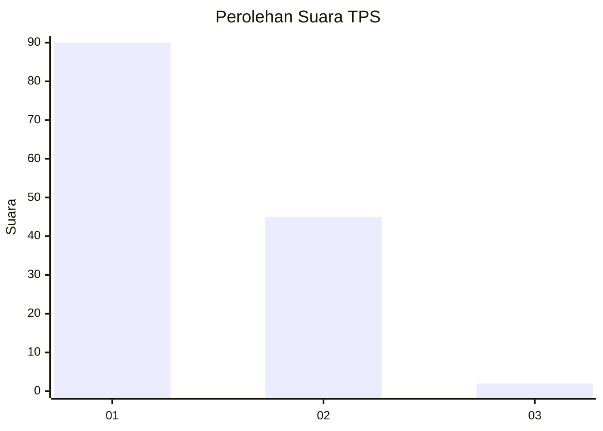
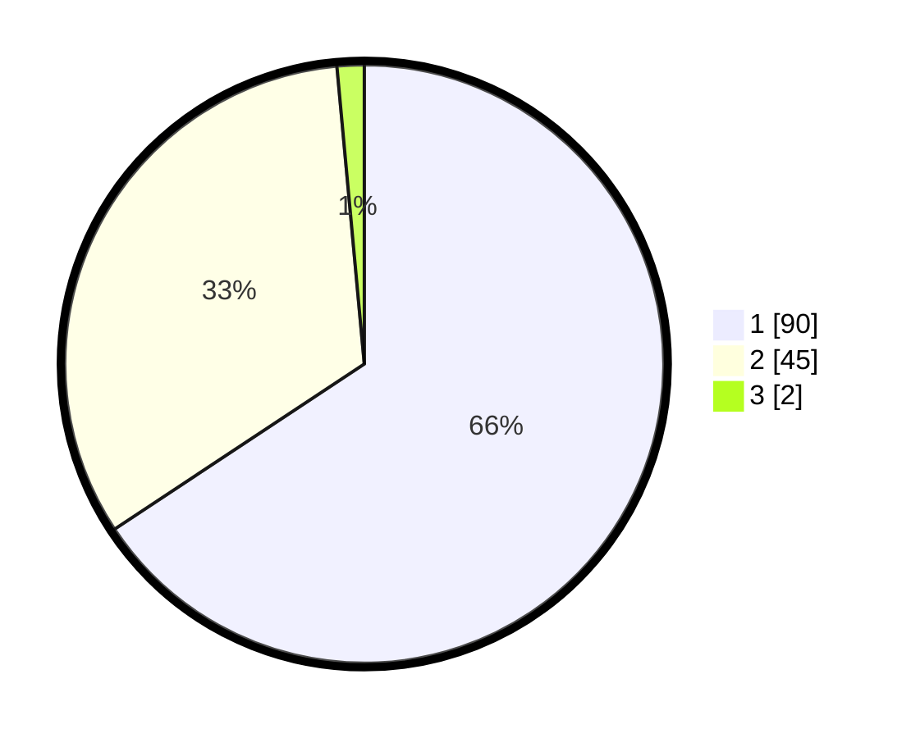

# Hasil

## Grafik

## Tabel

| No. | Nama Paslon    | Suara | Suara (raw) | Persentase |
|:--- |:-------------- | -----:| -----------:| ----------:|
| 1   | ANIES MUHAIMIN | 90    | [90][p-1]   | 65,69      |
| 2   | PRABOWO GIBRAN | 45    | [45][p-2]   | 32,85      |
| 3   | GANJAR MAHFUD  | 2     | [2][p-3]    | 1,46       |

[p-1]: https://github.com/gigit-pemilu/pemilu-2024/blob/main/pilpres/hitung-suara/sub/12-sumatera-utara/sub/03-tapanuli-selatan/sub/01-angkola-barat/sub/1001-sitinjak/sub/002-tps/sub/paslon-1.txt
[p-2]: https://github.com/gigit-pemilu/pemilu-2024/blob/main/pilpres/hitung-suara/sub/12-sumatera-utara/sub/03-tapanuli-selatan/sub/01-angkola-barat/sub/1001-sitinjak/sub/002-tps/sub/paslon-2.txt
[p-3]: https://github.com/gigit-pemilu/pemilu-2024/blob/main/pilpres/hitung-suara/sub/12-sumatera-utara/sub/03-tapanuli-selatan/sub/01-angkola-barat/sub/1001-sitinjak/sub/002-tps/sub/paslon-3.txt

## Foto C Plano

https://sirekap-obj-formc.kpu.go.id/8098/pemilu/ppwp/12/03/01/10/01/1203011001002-20240216-095840--3d8cd1ab-2f57-462e-b538-af6834575721.jpg

https://sirekap-obj-formc.kpu.go.id/8098/pemilu/ppwp/12/03/01/10/01/1203011001002-20240216-095844--42da5e48-1c21-411d-a73a-445116786939.jpg

https://sirekap-obj-formc.kpu.go.id/8098/pemilu/ppwp/12/03/01/10/01/1203011001002-20240216-095842--159f9e66-8c48-4531-be8e-c646c0c21b47.jpg

## Metadata

| Key        | Value               |
| ---------- | ------------------- |
| Time Stamp | 2024-02-21 22:00:00 |

## DATA PEMILIH TETAP

Jumlah pemilih dalam DPT: **172**.
 * L: **83**.
 * P: **89**.

## DATA PENGGUNA HAK PILIH

Jumlah pengguna hak pilih dalam DPT: **134**.
 * L: **58**.
 * P: **76**.

Jumlah pengguna hak pilih dalam DPTb: **2**.
 * L: **1**.
 * P: **1**.

Jumlah pengguna hak pilih dalam DPK: **1**.
 * L: **1**.
 * P: **0**.

Jumlah pengguna hak pilih: **137**.
 * L: **60**.
 * P: **77**.

## JUMLAH SUARA SAH DAN TIDAK SAH

JUMLAH SELURUH SUARA SAH: **137**.

JUMLAH SUARA TIDAK SAH: **0**.

JUMLAH SELURUH SUARA SAH DAN SUARA TIDAK SAH: **137**.

