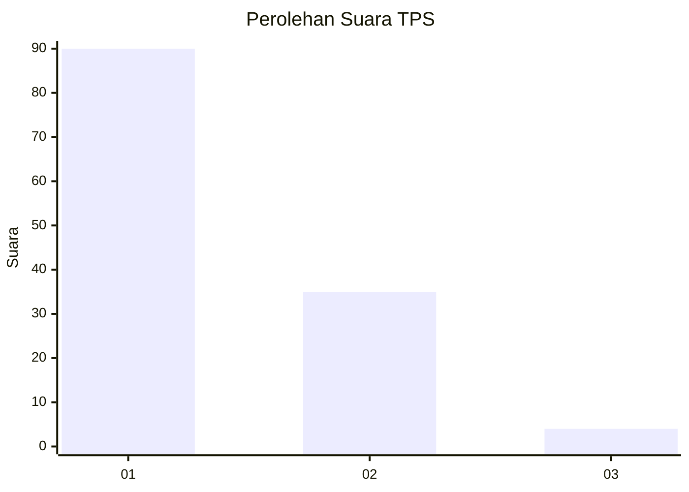
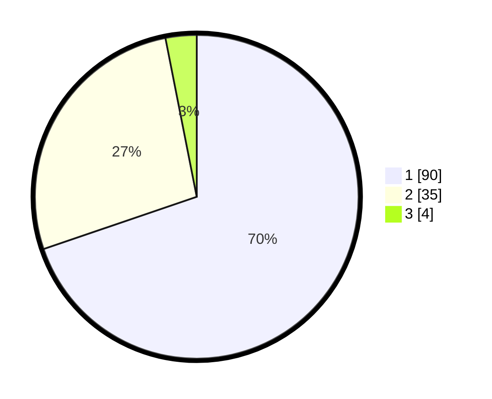

# Hasil

## Grafik

## Tabel

| No. | Nama Paslon    | Suara | Suara (raw) | Persentase |
|:--- |:-------------- | -----:| -----------:| ----------:|
| 1   | ANIES MUHAIMIN | 90    | [90][p-1]   | 69,77      |
| 2   | PRABOWO GIBRAN | 35    | [35][p-2]   | 27,13      |
| 3   | GANJAR MAHFUD  | 4     | [4][p-3]    | 3,10       |

[p-1]: https://github.com/gigit-pemilu/pemilu-2024-12-sumatera-utara/blob/main/pilpres/hitung-suara/sub/12-sumatera-utara/sub/03-tapanuli-selatan/sub/01-angkola-barat/sub/1001-sitinjak/sub/003-tps/sub/paslon-1.txt
[p-2]: https://github.com/gigit-pemilu/pemilu-2024-12-sumatera-utara/blob/main/pilpres/hitung-suara/sub/12-sumatera-utara/sub/03-tapanuli-selatan/sub/01-angkola-barat/sub/1001-sitinjak/sub/003-tps/sub/paslon-2.txt
[p-3]: https://github.com/gigit-pemilu/pemilu-2024-12-sumatera-utara/blob/main/pilpres/hitung-suara/sub/12-sumatera-utara/sub/03-tapanuli-selatan/sub/01-angkola-barat/sub/1001-sitinjak/sub/003-tps/sub/paslon-3.txt

## Foto C Plano

https://sirekap-obj-formc.kpu.go.id/37e3/pemilu/ppwp/12/03/01/10/01/1203011001003-20240216-152425--9a68f2e2-7584-433e-b9d6-11a9b6ed29bd.jpg

https://sirekap-obj-formc.kpu.go.id/37e3/pemilu/ppwp/12/03/01/10/01/1203011001003-20240216-152426--ccb9c1f8-0fdf-422a-9a02-f30d20febf8c.jpg

https://sirekap-obj-formc.kpu.go.id/37e3/pemilu/ppwp/12/03/01/10/01/1203011001003-20240216-152425--f9b3b76e-d2dd-415b-abcf-3c007cf71e55.jpg

## Metadata

| Key        | Value               |
| ---------- | ------------------- |
| Time Stamp | 2024-02-24 22:31:28 |

## DATA PEMILIH TETAP

Jumlah pemilih dalam DPT: **181**.
 * L: **88**.
 * P: **93**.

## DATA PENGGUNA HAK PILIH

Jumlah pengguna hak pilih dalam DPT: **130**.
 * L: **54**.
 * P: **76**.

Jumlah pengguna hak pilih dalam DPTb: **0**.
 * L: **0**.
 * P: **0**.

Jumlah pengguna hak pilih dalam DPK: **1**.
 * L: **0**.
 * P: **1**.

Jumlah pengguna hak pilih: **131**.
 * L: **54**.
 * P: **77**.

## JUMLAH SUARA SAH DAN TIDAK SAH

JUMLAH SELURUH SUARA SAH: **129**.

JUMLAH SUARA TIDAK SAH: **2**.

JUMLAH SELURUH SUARA SAH DAN SUARA TIDAK SAH: **131**.

