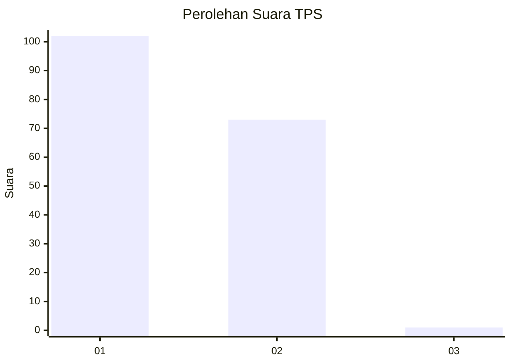
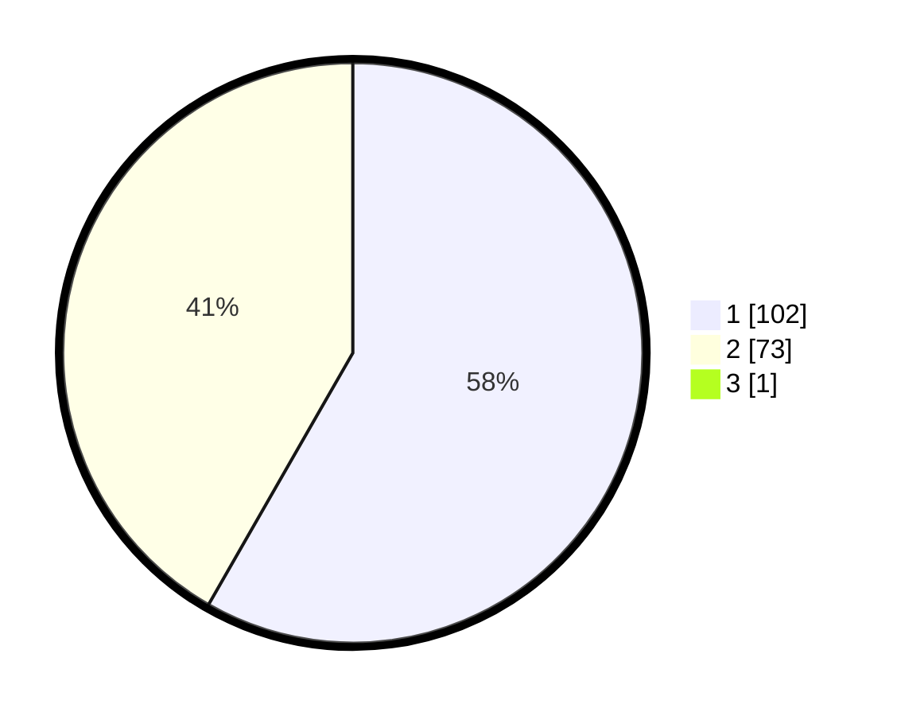

# Hasil

## Grafik

## Tabel

| No. | Nama Paslon    | Suara | Suara (raw) | Persentase |
|:--- |:-------------- | -----:| -----------:| ----------:|
| 1   | ANIES MUHAIMIN | 102   | [102][p-1]  | 57,95      |
| 2   | PRABOWO GIBRAN | 73    | [73][p-2]   | 41,48      |
| 3   | GANJAR MAHFUD  | 1     | [1][p-3]    | 0,57       |

[p-1]: https://github.com/gigit-pemilu/pemilu-2024/blob/main/pilpres/hitung-suara/sub/12-sumatera-utara/sub/03-tapanuli-selatan/sub/02-batang-toru/sub/1001-wek-i/sub/002-tps/sub/paslon-1.txt
[p-2]: https://github.com/gigit-pemilu/pemilu-2024/blob/main/pilpres/hitung-suara/sub/12-sumatera-utara/sub/03-tapanuli-selatan/sub/02-batang-toru/sub/1001-wek-i/sub/002-tps/sub/paslon-2.txt
[p-3]: https://github.com/gigit-pemilu/pemilu-2024/blob/main/pilpres/hitung-suara/sub/12-sumatera-utara/sub/03-tapanuli-selatan/sub/02-batang-toru/sub/1001-wek-i/sub/002-tps/sub/paslon-3.txt

## Foto C Plano

https://sirekap-obj-formc.kpu.go.id/1648/pemilu/ppwp/12/03/02/10/01/1203021001002-20240215-022018--60da45c2-f39f-43d7-a9f9-4bdc29f4d9b3.jpg

https://sirekap-obj-formc.kpu.go.id/1648/pemilu/ppwp/12/03/02/10/01/1203021001002-20240215-021735--af0f1cd8-df86-4471-9a85-66235ffc3299.jpg

https://sirekap-obj-formc.kpu.go.id/1648/pemilu/ppwp/12/03/02/10/01/1203021001002-20240215-021822--557b47c1-36b6-44ee-bbc2-ea7bd2f2ca7c.jpg

## Metadata

| Key        | Value               |
| ---------- | ------------------- |
| Time Stamp | 2024-02-15 21:01:18 |

