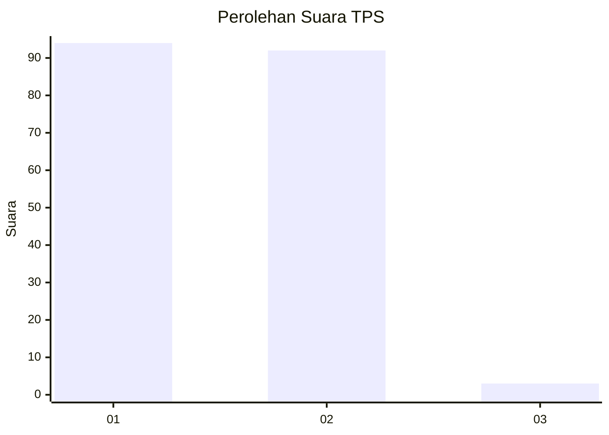
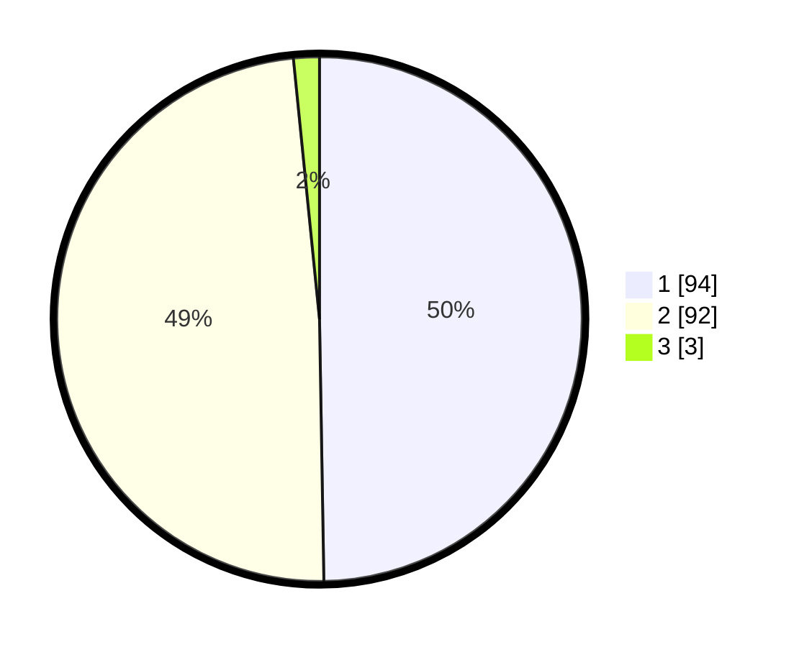

# Hasil

## Grafik

## Tabel

| No. | Nama Paslon    | Suara | Suara (raw) | Persentase |
|:--- |:-------------- | -----:| -----------:| ----------:|
| 1   | ANIES MUHAIMIN | 94    | [94][p-1]   | 49,74      |
| 2   | PRABOWO GIBRAN | 92    | [92][p-2]   | 48,68      |
| 3   | GANJAR MAHFUD  | 3     | [3][p-3]    | 1,59       |

[p-1]: https://github.com/gigit-pemilu/pemilu-2024/blob/main/pilpres/hitung-suara/sub/12-sumatera-utara/sub/03-tapanuli-selatan/sub/02-batang-toru/sub/1001-wek-i/sub/003-tps/sub/paslon-1.txt
[p-2]: https://github.com/gigit-pemilu/pemilu-2024/blob/main/pilpres/hitung-suara/sub/12-sumatera-utara/sub/03-tapanuli-selatan/sub/02-batang-toru/sub/1001-wek-i/sub/003-tps/sub/paslon-2.txt
[p-3]: https://github.com/gigit-pemilu/pemilu-2024/blob/main/pilpres/hitung-suara/sub/12-sumatera-utara/sub/03-tapanuli-selatan/sub/02-batang-toru/sub/1001-wek-i/sub/003-tps/sub/paslon-3.txt

## Foto C Plano

https://sirekap-obj-formc.kpu.go.id/dddd/pemilu/ppwp/12/03/02/10/01/1203021001003-20240215-003134--47efb817-ad25-45a6-a431-cd186d07c5a8.jpg

https://sirekap-obj-formc.kpu.go.id/dddd/pemilu/ppwp/12/03/02/10/01/1203021001003-20240215-003317--c5962c93-0628-45d0-a8f2-7a632143cc2e.jpg

https://sirekap-obj-formc.kpu.go.id/dddd/pemilu/ppwp/12/03/02/10/01/1203021001003-20240215-003404--30588c2c-c211-4fa9-97d8-8f62cd271897.jpg

## Metadata

| Key        | Value               |
| ---------- | ------------------- |
| Time Stamp | 2024-02-15 17:30:25 |

