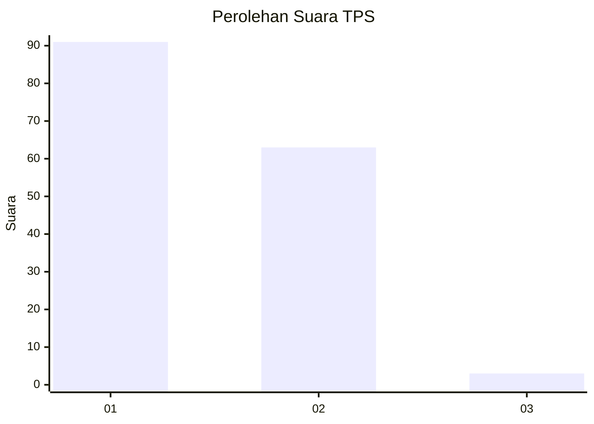
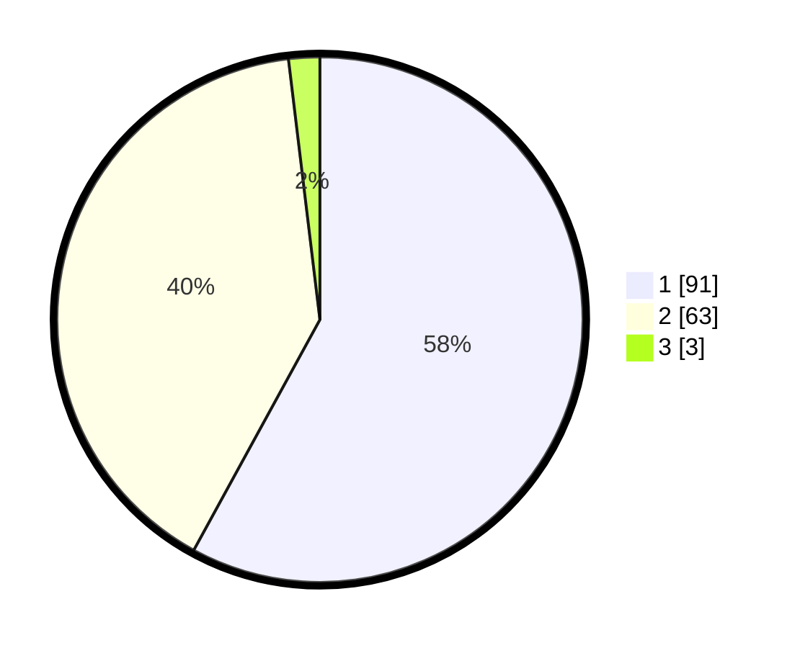

# Hasil

## Grafik

## Tabel

| No. | Nama Paslon    | Suara | Suara (raw) | Persentase |
|:--- |:-------------- | -----:| -----------:| ----------:|
| 1   | ANIES MUHAIMIN | 91    | [91][p-1]   | 57,96      |
| 2   | PRABOWO GIBRAN | 63    | [63][p-2]   | 40,13      |
| 3   | GANJAR MAHFUD  | 3     | [3][p-3]    | 1,91       |

[p-1]: https://github.com/gigit-pemilu/pemilu-2024-12-sumatera-utara/blob/main/pilpres/hitung-suara/sub/12-sumatera-utara/sub/03-tapanuli-selatan/sub/02-batang-toru/sub/1001-wek-i/sub/004-tps/sub/paslon-1.txt
[p-2]: https://github.com/gigit-pemilu/pemilu-2024-12-sumatera-utara/blob/main/pilpres/hitung-suara/sub/12-sumatera-utara/sub/03-tapanuli-selatan/sub/02-batang-toru/sub/1001-wek-i/sub/004-tps/sub/paslon-2.txt
[p-3]: https://github.com/gigit-pemilu/pemilu-2024-12-sumatera-utara/blob/main/pilpres/hitung-suara/sub/12-sumatera-utara/sub/03-tapanuli-selatan/sub/02-batang-toru/sub/1001-wek-i/sub/004-tps/sub/paslon-3.txt

## Foto C Plano

https://sirekap-obj-formc.kpu.go.id/c2e6/pemilu/ppwp/12/03/02/10/01/1203021001004-20240215-052521--6f6742c3-9ed5-47ce-b949-b7d6e1efb8c3.jpg

https://sirekap-obj-formc.kpu.go.id/c2e6/pemilu/ppwp/12/03/02/10/01/1203021001004-20240215-052823--ff285ae8-e5bd-4bb1-b804-3321d413e8b2.jpg

https://sirekap-obj-formc.kpu.go.id/c2e6/pemilu/ppwp/12/03/02/10/01/1203021001004-20240215-052942--dae1a031-550a-4c53-907e-c4c5769f9f24.jpg

## Metadata

| Key        | Value               |
| ---------- | ------------------- |
| Time Stamp | 2024-02-15 21:30:27 |

