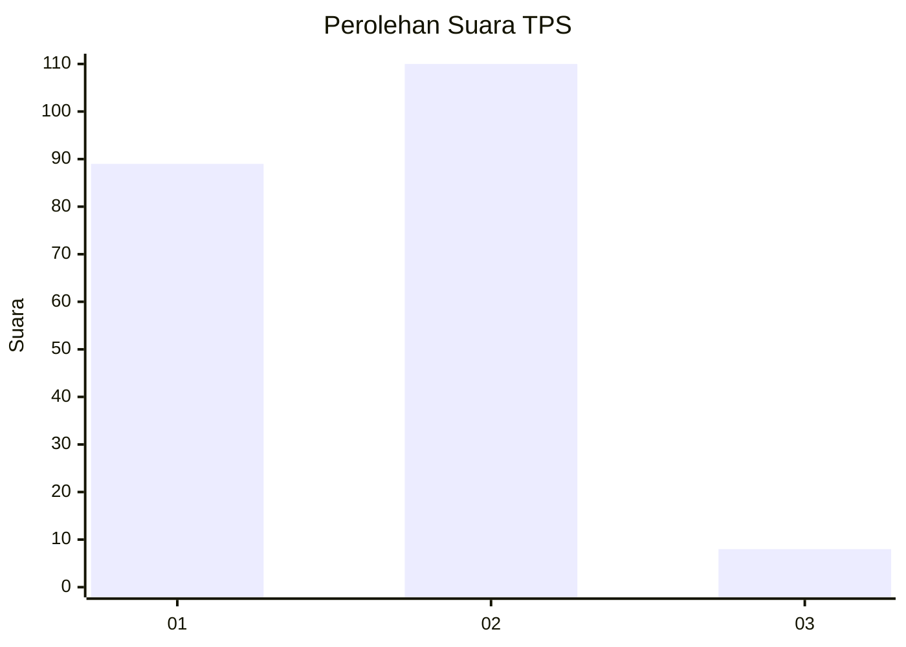
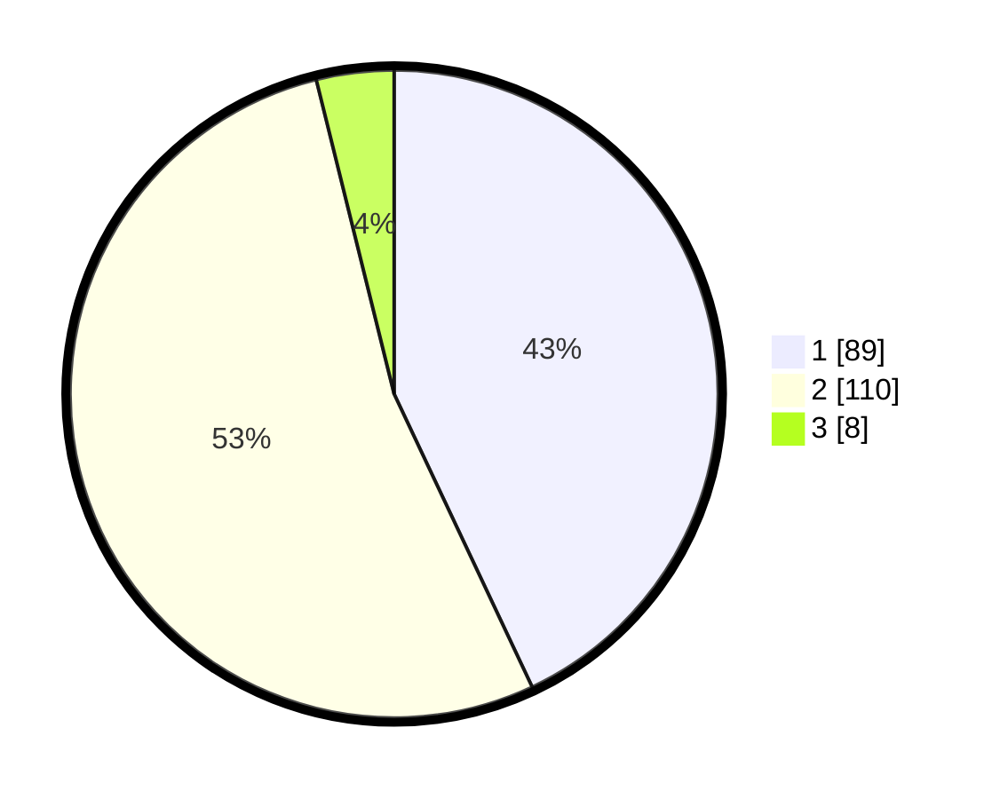

# Hasil

## Grafik

## Tabel

| No. | Nama Paslon    | Suara | Suara (raw) | Persentase |
|:--- |:-------------- | -----:| -----------:| ----------:|
| 1   | ANIES MUHAIMIN | 89    | [89][p-1]   | 43,00      |
| 2   | PRABOWO GIBRAN | 110   | [110][p-2]  | 53,14      |
| 3   | GANJAR MAHFUD  | 8     | [8][p-3]    | 3,86       |

[p-1]: https://github.com/gigit-pemilu/pemilu-2024/blob/main/pilpres/hitung-suara/sub/12-sumatera-utara/sub/03-tapanuli-selatan/sub/02-batang-toru/sub/1002-wek-ii/sub/005-tps/sub/paslon-1.txt
[p-2]: https://github.com/gigit-pemilu/pemilu-2024/blob/main/pilpres/hitung-suara/sub/12-sumatera-utara/sub/03-tapanuli-selatan/sub/02-batang-toru/sub/1002-wek-ii/sub/005-tps/sub/paslon-2.txt
[p-3]: https://github.com/gigit-pemilu/pemilu-2024/blob/main/pilpres/hitung-suara/sub/12-sumatera-utara/sub/03-tapanuli-selatan/sub/02-batang-toru/sub/1002-wek-ii/sub/005-tps/sub/paslon-3.txt

## Foto C Plano

https://sirekap-obj-formc.kpu.go.id/c58b/pemilu/ppwp/12/03/02/10/02/1203021002005-20240215-043045--c74bf1ec-04b1-4e82-a7c1-7525d536bd08.jpg

https://sirekap-obj-formc.kpu.go.id/c58b/pemilu/ppwp/12/03/02/10/02/1203021002005-20240215-025116--7ab8d44a-9e27-4d2f-b040-ab6825427b9b.jpg

https://sirekap-obj-formc.kpu.go.id/c58b/pemilu/ppwp/12/03/02/10/02/1203021002005-20240215-025206--016ec79a-9956-4031-8fdd-2adf41297cfa.jpg

## Metadata

| Key        | Value               |
| ---------- | ------------------- |
| Time Stamp | 2024-02-15 17:30:25 |

