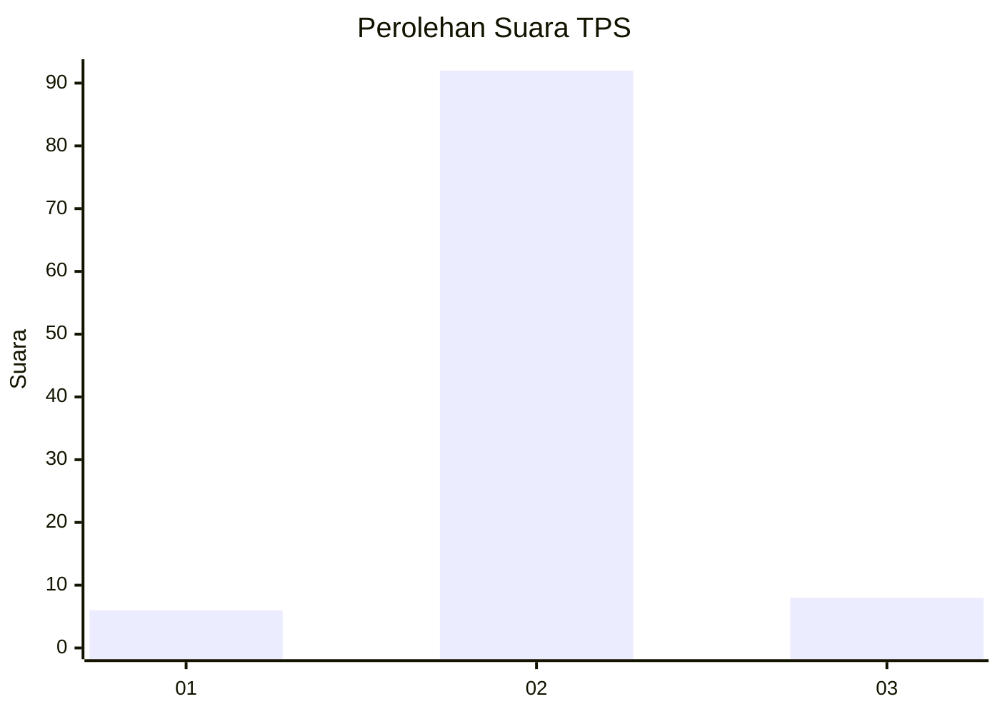
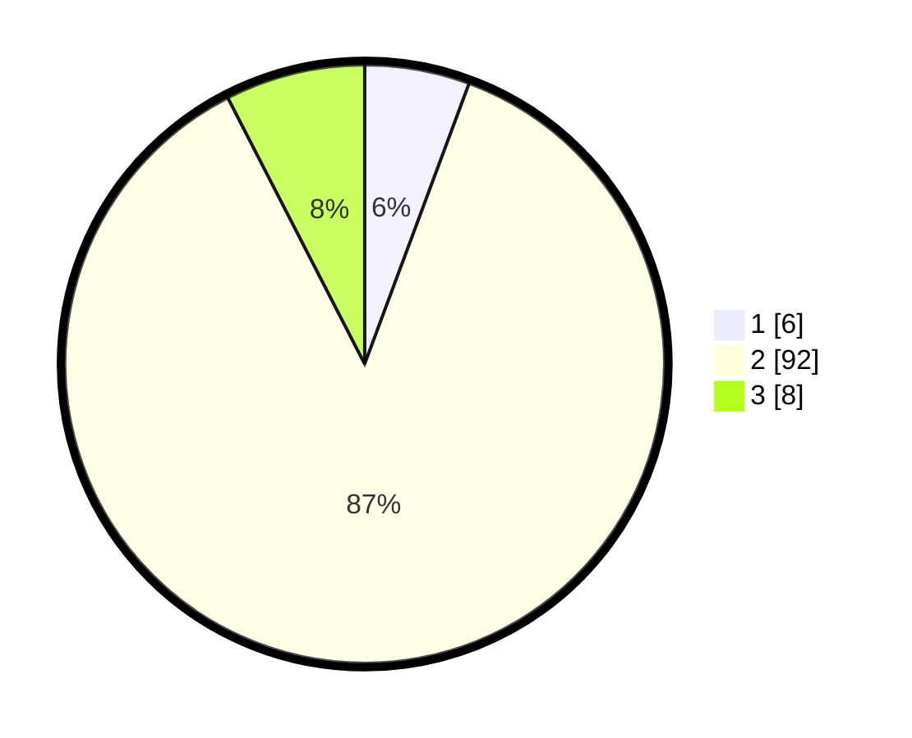

# Hasil

## Grafik

## Tabel

| No. | Nama Paslon    | Suara | Suara (raw) | Persentase |
|:--- |:-------------- | -----:| -----------:| ----------:|
| 1   | ANIES MUHAIMIN | 6     | [6][p-1]    | 5,66       |
| 2   | PRABOWO GIBRAN | 92    | [92][p-2]   | 86,79      |
| 3   | GANJAR MAHFUD  | 8     | [8][p-3]    | 7,55       |

[p-1]: https://github.com/gigit-pemilu/pemilu-2024-12-sumatera-utara/blob/main/pilpres/hitung-suara/sub/12-sumatera-utara/sub/03-tapanuli-selatan/sub/02-batang-toru/sub/1011-perkebunan-batang-toru/sub/004-tps/sub/paslon-1.txt
[p-2]: https://github.com/gigit-pemilu/pemilu-2024-12-sumatera-utara/blob/main/pilpres/hitung-suara/sub/12-sumatera-utara/sub/03-tapanuli-selatan/sub/02-batang-toru/sub/1011-perkebunan-batang-toru/sub/004-tps/sub/paslon-2.txt
[p-3]: https://github.com/gigit-pemilu/pemilu-2024-12-sumatera-utara/blob/main/pilpres/hitung-suara/sub/12-sumatera-utara/sub/03-tapanuli-selatan/sub/02-batang-toru/sub/1011-perkebunan-batang-toru/sub/004-tps/sub/paslon-3.txt

## Foto C Plano

https://sirekap-obj-formc.kpu.go.id/629f/pemilu/ppwp/12/03/02/10/11/1203021011004-20240215-031227--82107695-498d-4fd9-9c24-40e7ca218af0.jpg

https://sirekap-obj-formc.kpu.go.id/629f/pemilu/ppwp/12/03/02/10/11/1203021011004-20240215-031434--dad7d8f4-1f7d-4da5-b338-bf24714d4c4d.jpg

https://sirekap-obj-formc.kpu.go.id/629f/pemilu/ppwp/12/03/02/10/11/1203021011004-20240215-031619--d1a15758-339e-4950-8053-132914ab7c71.jpg

## Metadata

| Key        | Value               |
| ---------- | ------------------- |
| Time Stamp | 2024-02-15 18:00:26 |

