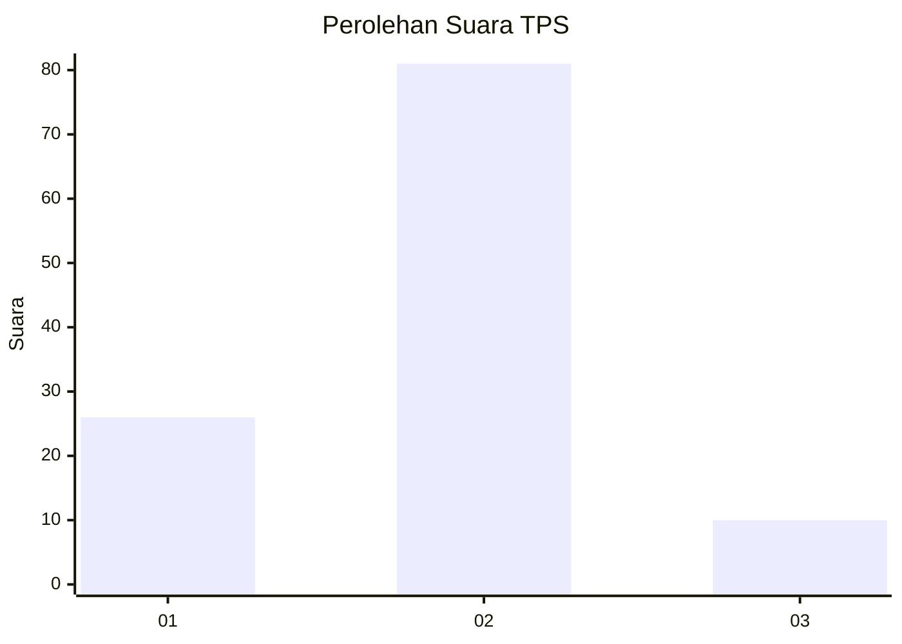
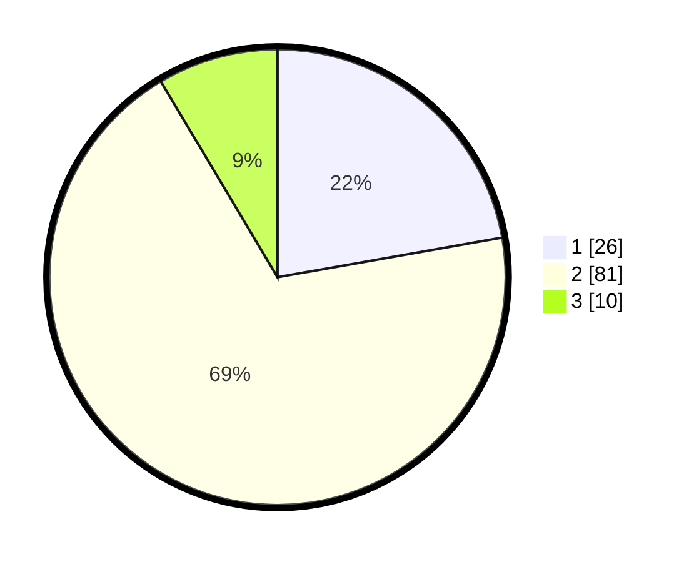

# Hasil

## Grafik

## Tabel

| No. | Nama Paslon    | Suara | Suara (raw) | Persentase |
|:--- |:-------------- | -----:| -----------:| ----------:|
| 1   | ANIES MUHAIMIN | 26    | [26][p-1]   | 22,22      |
| 2   | PRABOWO GIBRAN | 81    | [81][p-2]   | 69,23      |
| 3   | GANJAR MAHFUD  | 10    | [10][p-3]   | 8,55       |

[p-1]: https://github.com/gigit-pemilu/pemilu-2024/blob/main/pilpres/hitung-suara/sub/12-sumatera-utara/sub/03-tapanuli-selatan/sub/02-batang-toru/sub/2036-aek-ngadol-sitinjak/sub/004-tps/sub/paslon-1.txt
[p-2]: https://github.com/gigit-pemilu/pemilu-2024/blob/main/pilpres/hitung-suara/sub/12-sumatera-utara/sub/03-tapanuli-selatan/sub/02-batang-toru/sub/2036-aek-ngadol-sitinjak/sub/004-tps/sub/paslon-2.txt
[p-3]: https://github.com/gigit-pemilu/pemilu-2024/blob/main/pilpres/hitung-suara/sub/12-sumatera-utara/sub/03-tapanuli-selatan/sub/02-batang-toru/sub/2036-aek-ngadol-sitinjak/sub/004-tps/sub/paslon-3.txt

## Foto C Plano

https://sirekap-obj-formc.kpu.go.id/79e3/pemilu/ppwp/12/03/02/20/36/1203022036004-20240214-235850--3be4243c-2a45-4f2e-b955-9f330c1c1bd3.jpg

https://sirekap-obj-formc.kpu.go.id/79e3/pemilu/ppwp/12/03/02/20/36/1203022036004-20240215-000619--83157f67-c131-4875-94fb-78a3c4d6bad3.jpg

https://sirekap-obj-formc.kpu.go.id/79e3/pemilu/ppwp/12/03/02/20/36/1203022036004-20240215-002056--be6296f9-fd86-4a49-acdc-1c7db13dc309.jpg

## Metadata

| Key        | Value               |
| ---------- | ------------------- |
| Time Stamp | 2024-02-15 22:00:27 |

