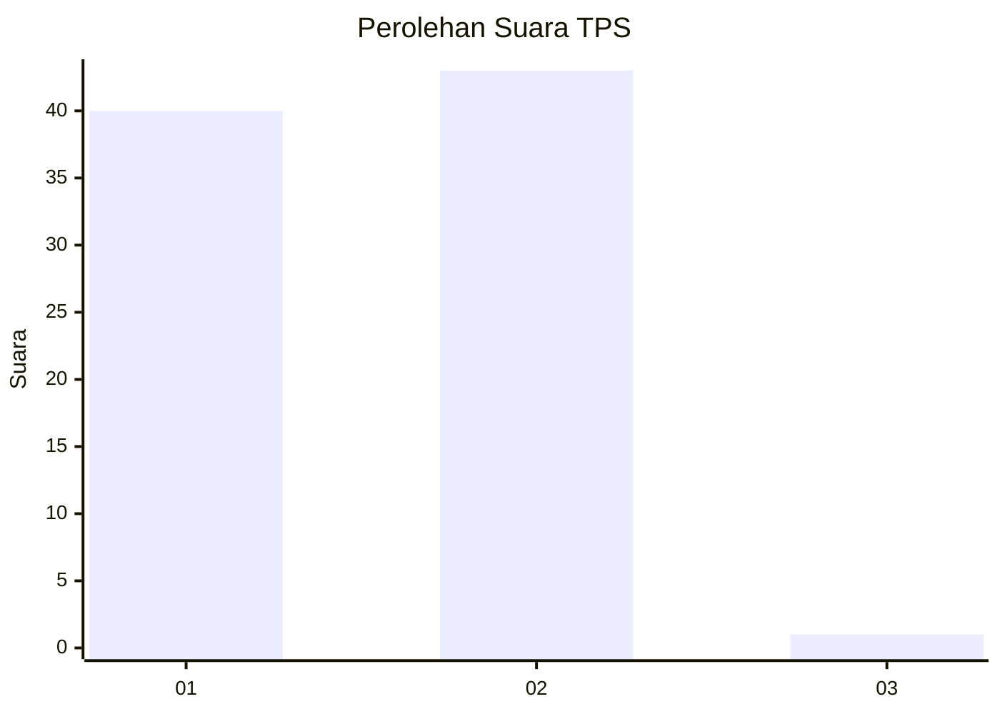
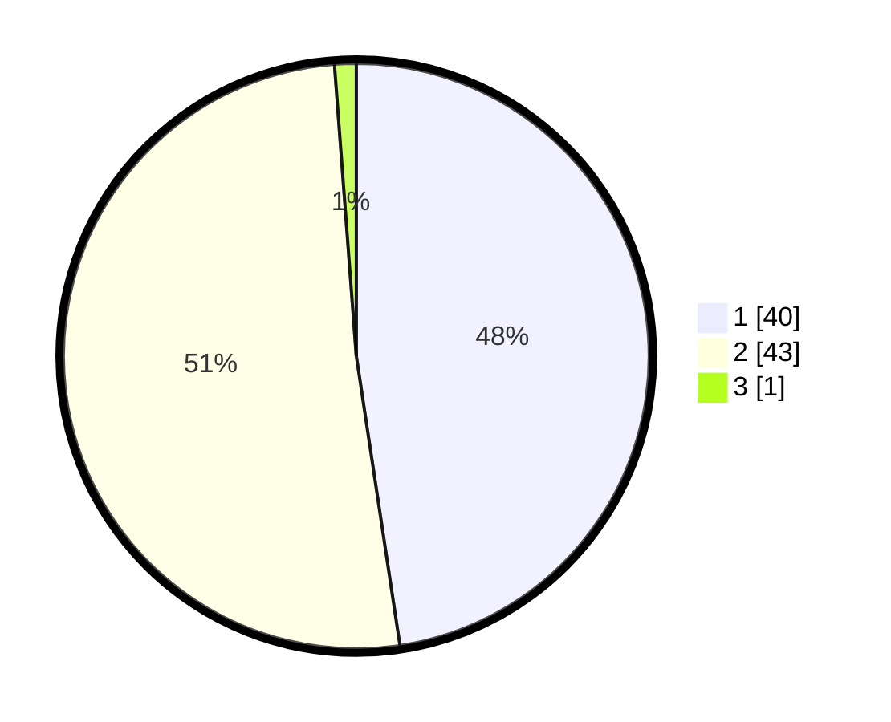

# Hasil

## Grafik

## Tabel

| No. | Nama Paslon    | Suara | Suara (raw) | Persentase |
|:--- |:-------------- | -----:| -----------:| ----------:|
| 1   | ANIES MUHAIMIN | 40    | [40][p-1]   | 47,62      |
| 2   | PRABOWO GIBRAN | 43    | [43][p-2]   | 51,19      |
| 3   | GANJAR MAHFUD  | 1     | [1][p-3]    | 1,19       |

[p-1]: https://github.com/gigit-pemilu/pemilu-2024/blob/main/pilpres/hitung-suara/sub/12-sumatera-utara/sub/03-tapanuli-selatan/sub/02-batang-toru/sub/2037-sisipa/sub/003-tps/sub/paslon-1.txt
[p-2]: https://github.com/gigit-pemilu/pemilu-2024/blob/main/pilpres/hitung-suara/sub/12-sumatera-utara/sub/03-tapanuli-selatan/sub/02-batang-toru/sub/2037-sisipa/sub/003-tps/sub/paslon-2.txt
[p-3]: https://github.com/gigit-pemilu/pemilu-2024/blob/main/pilpres/hitung-suara/sub/12-sumatera-utara/sub/03-tapanuli-selatan/sub/02-batang-toru/sub/2037-sisipa/sub/003-tps/sub/paslon-3.txt

## Foto C Plano

https://sirekap-obj-formc.kpu.go.id/4dae/pemilu/ppwp/12/03/02/20/37/1203022037003-20240215-122747--3d03ba96-9631-46a7-b227-ca2ab891827b.jpg

https://sirekap-obj-formc.kpu.go.id/4dae/pemilu/ppwp/12/03/02/20/37/1203022037003-20240215-131736--ec22d6d5-7e41-4a48-aa6f-0200043fa729.jpg

https://sirekap-obj-formc.kpu.go.id/4dae/pemilu/ppwp/12/03/02/20/37/1203022037003-20240215-144802--0a588aee-e338-46f7-975f-f8b22e8e228d.jpg

## Metadata

| Key        | Value               |
| ---------- | ------------------- |
| Time Stamp | 2024-02-15 16:30:25 |

