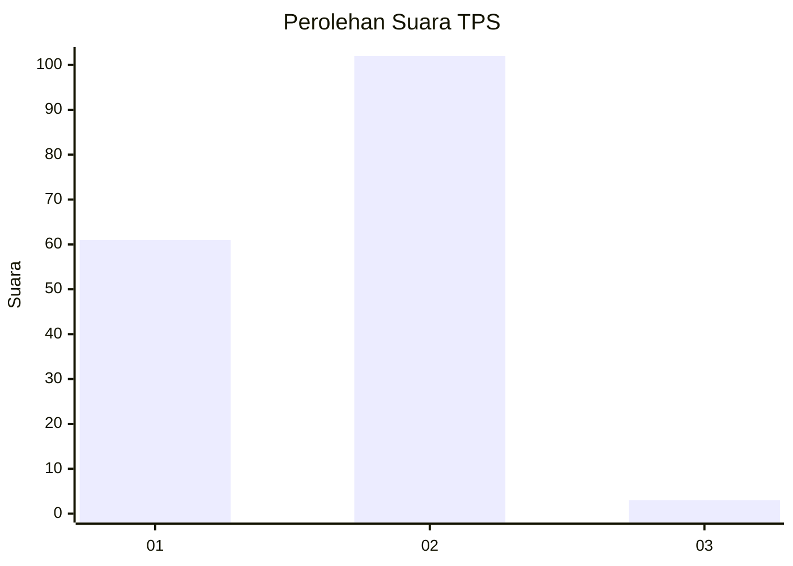
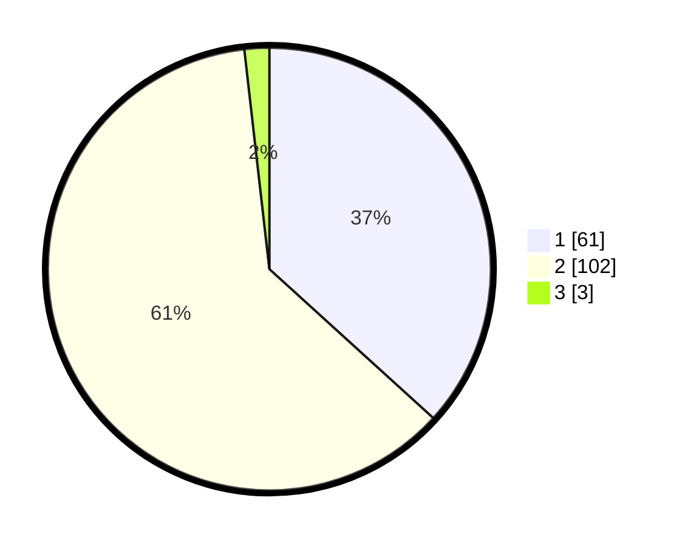

# Hasil

## Grafik

## Tabel

| No. | Nama Paslon    | Suara | Suara (raw) | Persentase |
|:--- |:-------------- | -----:| -----------:| ----------:|
| 1   | ANIES MUHAIMIN | 61    | [61][p-1]   | 36,75      |
| 2   | PRABOWO GIBRAN | 102   | [102][p-2]  | 61,45      |
| 3   | GANJAR MAHFUD  | 3     | [3][p-3]    | 1,81       |

[p-1]: https://github.com/gigit-pemilu/pemilu-2024-12-sumatera-utara/blob/main/pilpres/hitung-suara/sub/12-sumatera-utara/sub/03-tapanuli-selatan/sub/03-angkola-timur/sub/2012-marisi/sub/004-tps/sub/paslon-1.txt
[p-2]: https://github.com/gigit-pemilu/pemilu-2024-12-sumatera-utara/blob/main/pilpres/hitung-suara/sub/12-sumatera-utara/sub/03-tapanuli-selatan/sub/03-angkola-timur/sub/2012-marisi/sub/004-tps/sub/paslon-2.txt
[p-3]: https://github.com/gigit-pemilu/pemilu-2024-12-sumatera-utara/blob/main/pilpres/hitung-suara/sub/12-sumatera-utara/sub/03-tapanuli-selatan/sub/03-angkola-timur/sub/2012-marisi/sub/004-tps/sub/paslon-3.txt

## Foto C Plano

https://sirekap-obj-formc.kpu.go.id/87be/pemilu/ppwp/12/03/03/20/12/1203032012004-20240216-010143--fe608c6b-cef0-43c1-a668-90c2cb65043b.jpg

https://sirekap-obj-formc.kpu.go.id/87be/pemilu/ppwp/12/03/03/20/12/1203032012004-20240214-213157--5fa67297-811f-4260-acf7-d15d877646ff.jpg

https://sirekap-obj-formc.kpu.go.id/87be/pemilu/ppwp/12/03/03/20/12/1203032012004-20240214-213118--3afd2bdb-ab1b-4650-a8a4-c1d62105307b.jpg

## Metadata

| Key        | Value               |
| ---------- | ------------------- |
| Time Stamp | 2024-02-16 01:30:27 |

## DATA PEMILIH TETAP

Jumlah pemilih dalam DPT: **432**.
 * L: **303**.
 * P: **893**.

## DATA PENGGUNA HAK PILIH

Jumlah pengguna hak pilih dalam DPT: **834**.
 * L: **339**.
 * P: **839**.

Jumlah pengguna hak pilih dalam DPTb: **882**.
 * L: **868**.
 * P: **862**.

Jumlah pengguna hak pilih dalam DPK: **368**.
 * L: **884**.
 * P: **283**.

Jumlah pengguna hak pilih: **269**.
 * L: **888**.
 * P: **835**.

## JUMLAH SUARA SAH DAN TIDAK SAH

JUMLAH SELURUH SUARA SAH: **166**.

JUMLAH SUARA TIDAK SAH: **3**.

JUMLAH SELURUH SUARA SAH DAN SUARA TIDAK SAH: **169**.

