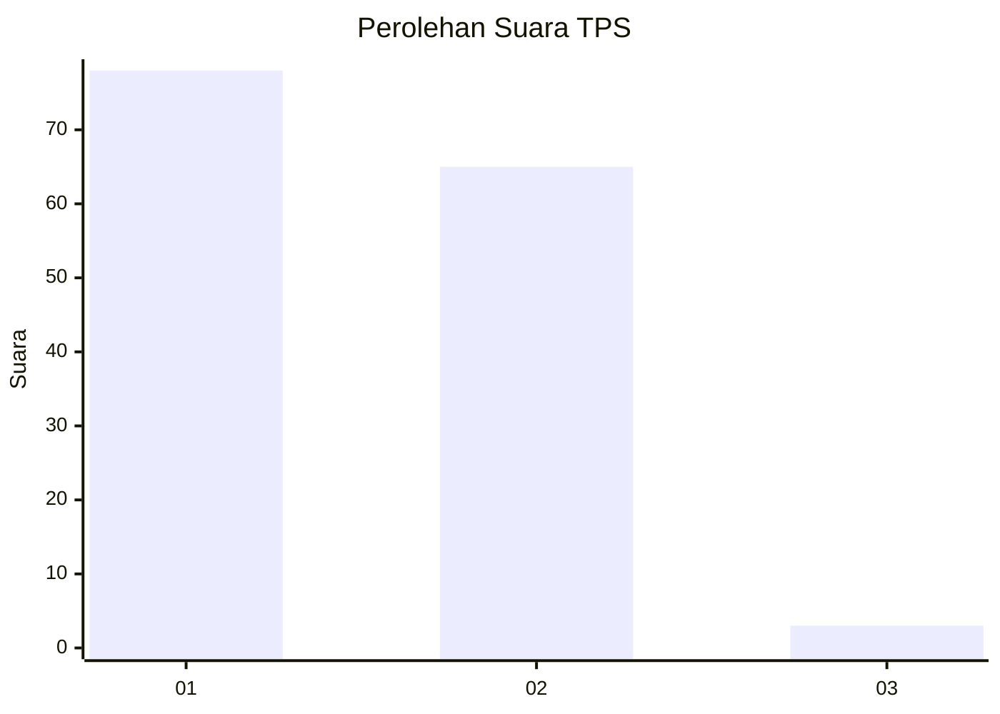
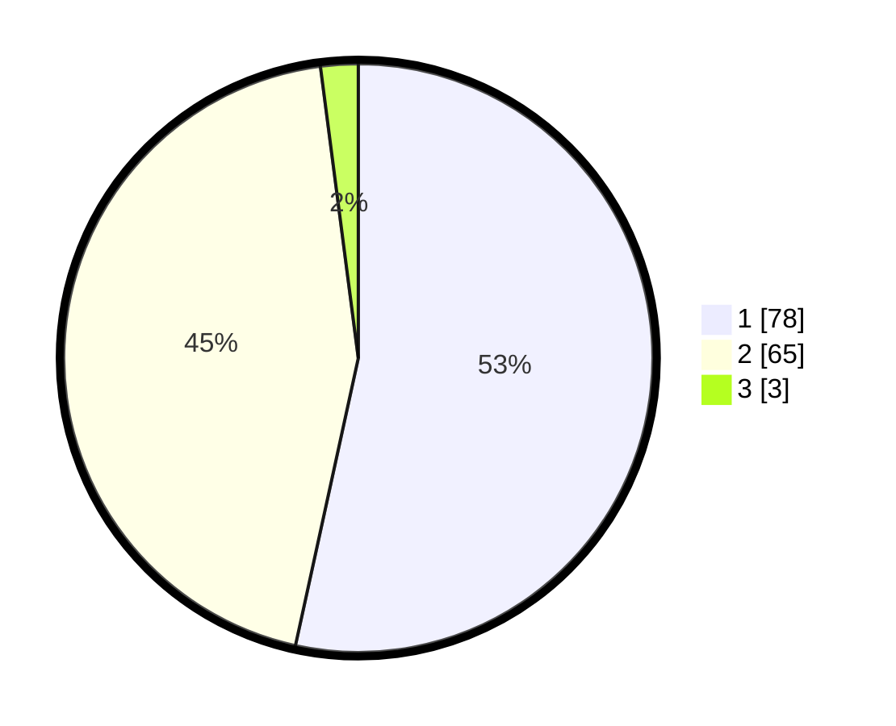

# Hasil

## Grafik

## Tabel

| No. | Nama Paslon    | Suara | Suara (raw) | Persentase |
|:--- |:-------------- | -----:| -----------:| ----------:|
| 1   | ANIES MUHAIMIN | 78    | [78][p-1]   | 53,42      |
| 2   | PRABOWO GIBRAN | 65    | [65][p-2]   | 44,52      |
| 3   | GANJAR MAHFUD  | 3     | [3][p-3]    | 2,05       |

[p-1]: https://github.com/gigit-pemilu/pemilu-2024-12-sumatera-utara/blob/main/pilpres/hitung-suara/sub/12-sumatera-utara/sub/03-tapanuli-selatan/sub/03-angkola-timur/sub/2083-pargarutan-jae/sub/001-tps/sub/paslon-1.txt
[p-2]: https://github.com/gigit-pemilu/pemilu-2024-12-sumatera-utara/blob/main/pilpres/hitung-suara/sub/12-sumatera-utara/sub/03-tapanuli-selatan/sub/03-angkola-timur/sub/2083-pargarutan-jae/sub/001-tps/sub/paslon-2.txt
[p-3]: https://github.com/gigit-pemilu/pemilu-2024-12-sumatera-utara/blob/main/pilpres/hitung-suara/sub/12-sumatera-utara/sub/03-tapanuli-selatan/sub/03-angkola-timur/sub/2083-pargarutan-jae/sub/001-tps/sub/paslon-3.txt

## Foto C Plano

https://sirekap-obj-formc.kpu.go.id/172b/pemilu/ppwp/12/03/03/20/83/1203032083001-20240218-100255--3d0c0588-4788-474a-b401-3db659a5b39a.jpg

https://sirekap-obj-formc.kpu.go.id/172b/pemilu/ppwp/12/03/03/20/83/1203032083001-20240218-105531--9ac7d451-9dea-4c30-b831-51c0e5ac7b4c.jpg

https://sirekap-obj-formc.kpu.go.id/172b/pemilu/ppwp/12/03/03/20/83/1203032083001-20240218-110457--d56e26b6-6461-4ab1-aba5-c59891625054.jpg

## Metadata

| Key        | Value               |
| ---------- | ------------------- |
| Time Stamp | 2024-02-19 10:00:00 |

