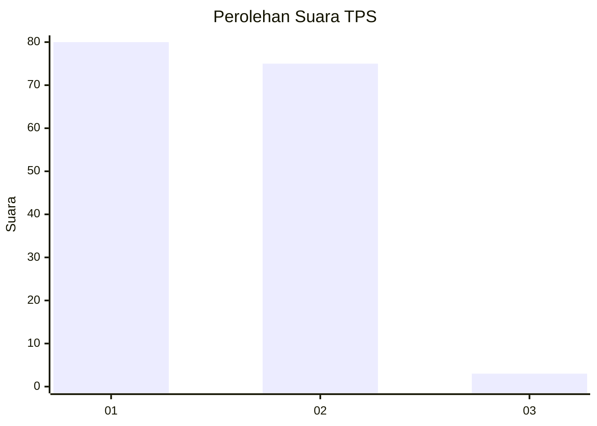
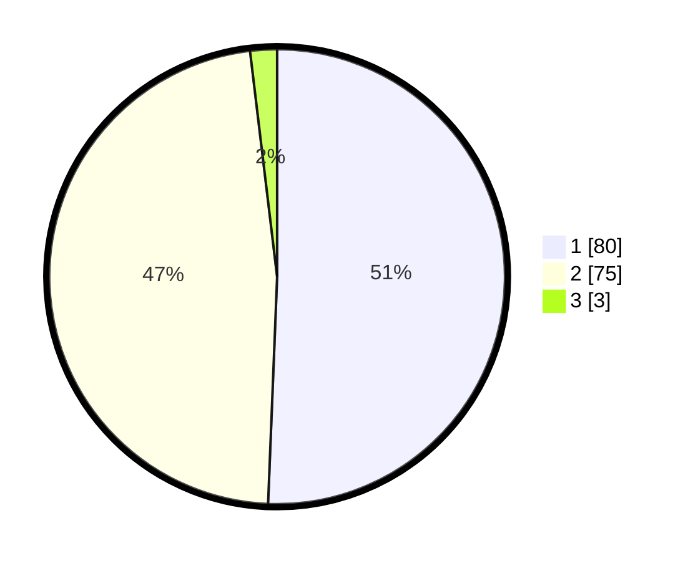

# Hasil

## Grafik

## Tabel

| No. | Nama Paslon    | Suara | Suara (raw) | Persentase |
|:--- |:-------------- | -----:| -----------:| ----------:|
| 1   | ANIES MUHAIMIN | 80    | [80][p-1]   | 50,63      |
| 2   | PRABOWO GIBRAN | 75    | [75][p-2]   | 47,47      |
| 3   | GANJAR MAHFUD  | 3     | [3][p-3]    | 1,90       |

[p-1]: https://github.com/gigit-pemilu/pemilu-2024/blob/main/pilpres/hitung-suara/sub/12-sumatera-utara/sub/03-tapanuli-selatan/sub/03-angkola-timur/sub/2083-pargarutan-jae/sub/005-tps/sub/paslon-1.txt
[p-2]: https://github.com/gigit-pemilu/pemilu-2024/blob/main/pilpres/hitung-suara/sub/12-sumatera-utara/sub/03-tapanuli-selatan/sub/03-angkola-timur/sub/2083-pargarutan-jae/sub/005-tps/sub/paslon-2.txt
[p-3]: https://github.com/gigit-pemilu/pemilu-2024/blob/main/pilpres/hitung-suara/sub/12-sumatera-utara/sub/03-tapanuli-selatan/sub/03-angkola-timur/sub/2083-pargarutan-jae/sub/005-tps/sub/paslon-3.txt

## Foto C Plano

https://sirekap-obj-formc.kpu.go.id/c390/pemilu/ppwp/12/03/03/20/83/1203032083005-20240215-125649--590f9cf4-3379-4e9f-b669-8cc9f8f59a65.jpg

https://sirekap-obj-formc.kpu.go.id/c390/pemilu/ppwp/12/03/03/20/83/1203032083005-20240215-131933--1689ee78-f348-4660-ba15-ca057e3c4687.jpg

https://sirekap-obj-formc.kpu.go.id/c390/pemilu/ppwp/12/03/03/20/83/1203032083005-20240214-224001--e3b78ad3-4e49-4cb8-9e2c-d1da411b00d0.jpg

## Metadata

| Key        | Value               |
| ---------- | ------------------- |
| Time Stamp | 2024-02-19 10:00:00 |

