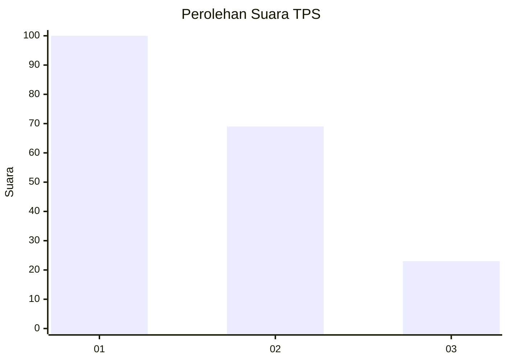
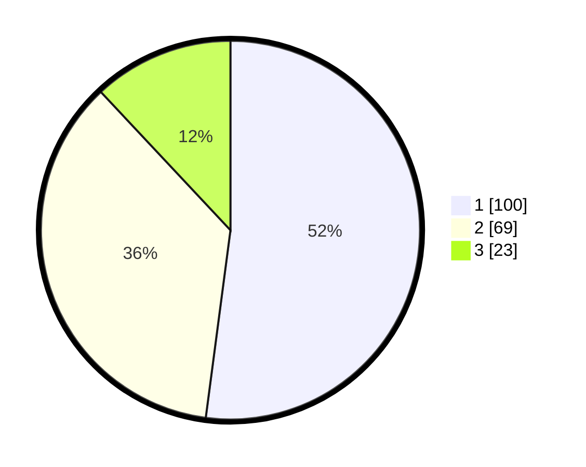

# Hasil

## Grafik

## Tabel

| No. | Nama Paslon    | Suara | Suara (raw) | Persentase |
|:--- |:-------------- | -----:| -----------:| ----------:|
| 1   | ANIES MUHAIMIN | 100   | [100][p-1]  | 52,08      |
| 2   | PRABOWO GIBRAN | 69    | [69][p-2]   | 35,94      |
| 3   | GANJAR MAHFUD  | 23    | [23][p-3]   | 11,98      |

[p-1]: https://github.com/gigit-pemilu/pemilu-2024-12-sumatera-utara/blob/main/pilpres/hitung-suara/sub/12-sumatera-utara/sub/03-tapanuli-selatan/sub/04-sipirok/sub/1001-pasar-sipirok/sub/006-tps/sub/paslon-1.txt
[p-2]: https://github.com/gigit-pemilu/pemilu-2024-12-sumatera-utara/blob/main/pilpres/hitung-suara/sub/12-sumatera-utara/sub/03-tapanuli-selatan/sub/04-sipirok/sub/1001-pasar-sipirok/sub/006-tps/sub/paslon-2.txt
[p-3]: https://github.com/gigit-pemilu/pemilu-2024-12-sumatera-utara/blob/main/pilpres/hitung-suara/sub/12-sumatera-utara/sub/03-tapanuli-selatan/sub/04-sipirok/sub/1001-pasar-sipirok/sub/006-tps/sub/paslon-3.txt

## Foto C Plano

https://sirekap-obj-formc.kpu.go.id/8855/pemilu/ppwp/12/03/04/10/01/1203041001006-20240214-234347--95629dd8-da82-4aa8-bc03-c621a6ea29f4.jpg

https://sirekap-obj-formc.kpu.go.id/8855/pemilu/ppwp/12/03/04/10/01/1203041001006-20240214-234646--5c1309f8-b7a1-4d3a-aa6e-6dbbb4d4a93d.jpg

https://sirekap-obj-formc.kpu.go.id/8855/pemilu/ppwp/12/03/04/10/01/1203041001006-20240214-234852--e2c11b13-8308-4d75-9859-0384db42c456.jpg

## Metadata

| Key        | Value               |
| ---------- | ------------------- |
| Time Stamp | 2024-02-15 23:29:50 |

