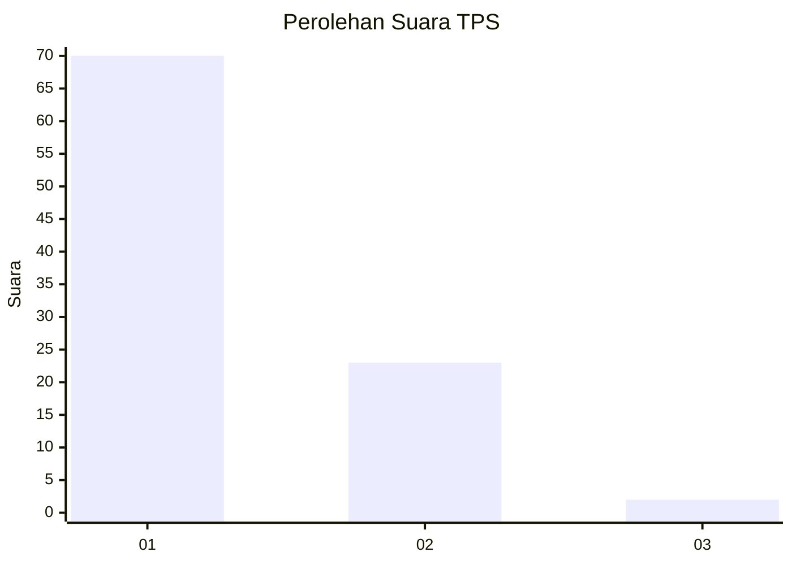
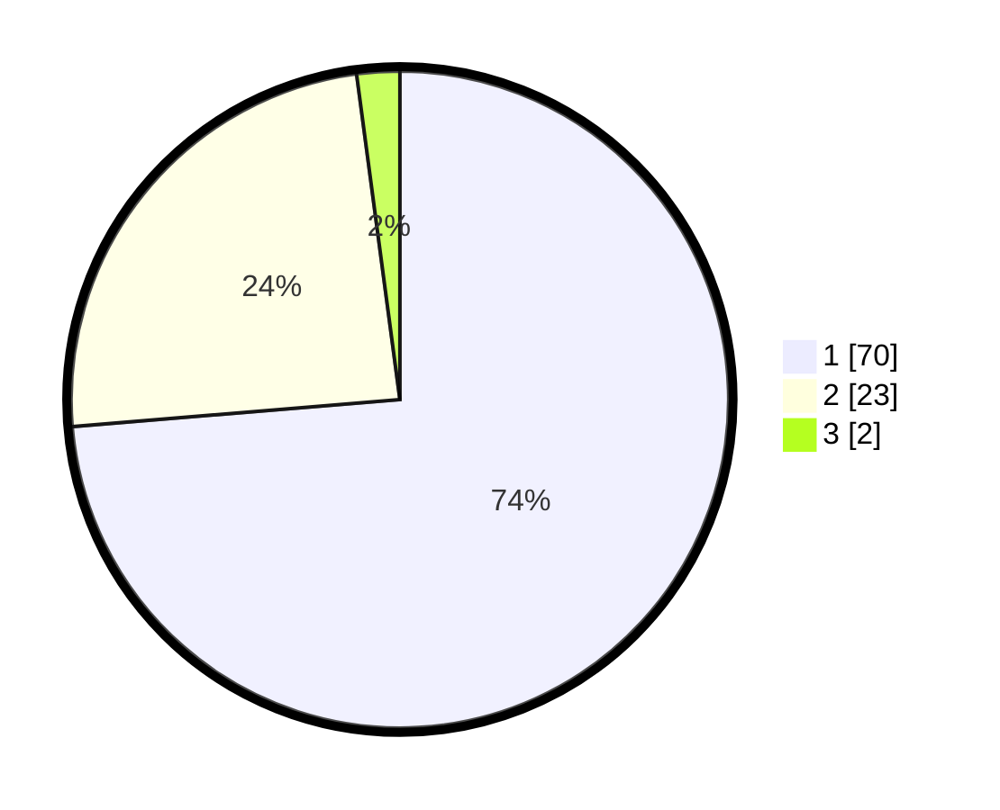

# Hasil

## Grafik

## Tabel

| No. | Nama Paslon    | Suara | Suara (raw) | Persentase |
|:--- |:-------------- | -----:| -----------:| ----------:|
| 1   | ANIES MUHAIMIN | 70    | [70][p-1]   | 73,68      |
| 2   | PRABOWO GIBRAN | 23    | [23][p-2]   | 24,21      |
| 3   | GANJAR MAHFUD  | 2     | [2][p-3]    | 2,11       |

[p-1]: https://github.com/gigit-pemilu/pemilu-2024/blob/main/pilpres/hitung-suara/sub/12-sumatera-utara/sub/03-tapanuli-selatan/sub/04-sipirok/sub/2109-dolok-sordang/sub/001-tps/sub/paslon-1.txt
[p-2]: https://github.com/gigit-pemilu/pemilu-2024/blob/main/pilpres/hitung-suara/sub/12-sumatera-utara/sub/03-tapanuli-selatan/sub/04-sipirok/sub/2109-dolok-sordang/sub/001-tps/sub/paslon-2.txt
[p-3]: https://github.com/gigit-pemilu/pemilu-2024/blob/main/pilpres/hitung-suara/sub/12-sumatera-utara/sub/03-tapanuli-selatan/sub/04-sipirok/sub/2109-dolok-sordang/sub/001-tps/sub/paslon-3.txt

## Foto C Plano

https://sirekap-obj-formc.kpu.go.id/e3b3/pemilu/ppwp/12/03/04/21/09/1203042109001-20240215-092338--b5b5501c-8dbc-4ddb-b5ff-b1908ba2a192.jpg

https://sirekap-obj-formc.kpu.go.id/e3b3/pemilu/ppwp/12/03/04/21/09/1203042109001-20240215-025144--9f67a5d4-8b9f-40fd-a35f-070b93eb3c88.jpg

https://sirekap-obj-formc.kpu.go.id/e3b3/pemilu/ppwp/12/03/04/21/09/1203042109001-20240215-025415--38599c9b-0841-4173-a6b0-92d91311df73.jpg

## Metadata

| Key        | Value               |
| ---------- | ------------------- |
| Time Stamp | 2024-02-25 00:00:00 |

