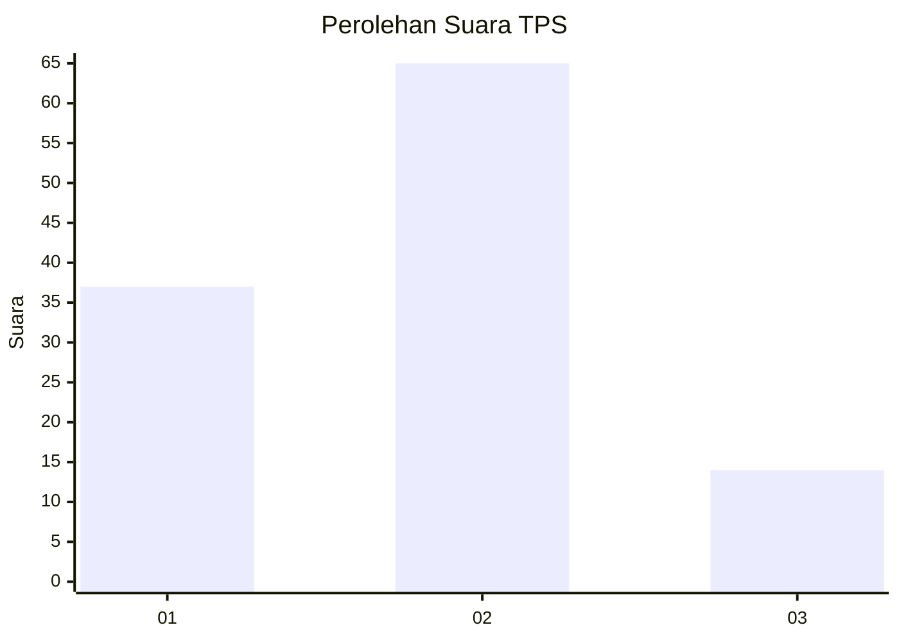
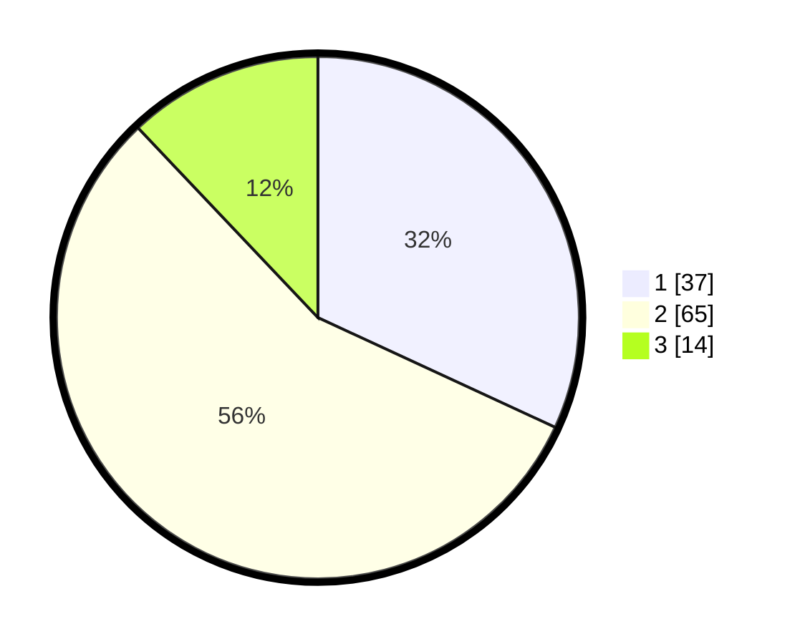

# Hasil

## Grafik

## Tabel

| No. | Nama Paslon    | Suara | Suara (raw) | Persentase |
|:--- |:-------------- | -----:| -----------:| ----------:|
| 1   | ANIES MUHAIMIN | 37    | [37][p-1]   | 31,90      |
| 2   | PRABOWO GIBRAN | 65    | [65][p-2]   | 56,03      |
| 3   | GANJAR MAHFUD  | 14    | [14][p-3]   | 12,07      |

[p-1]: https://github.com/gigit-pemilu/pemilu-2024-12-sumatera-utara/blob/main/pilpres/hitung-suara/sub/12-sumatera-utara/sub/03-tapanuli-selatan/sub/05-saipar-dolok-hole/sub/1001-pasar-sipagimbar/sub/004-tps/sub/paslon-1.txt
[p-2]: https://github.com/gigit-pemilu/pemilu-2024-12-sumatera-utara/blob/main/pilpres/hitung-suara/sub/12-sumatera-utara/sub/03-tapanuli-selatan/sub/05-saipar-dolok-hole/sub/1001-pasar-sipagimbar/sub/004-tps/sub/paslon-2.txt
[p-3]: https://github.com/gigit-pemilu/pemilu-2024-12-sumatera-utara/blob/main/pilpres/hitung-suara/sub/12-sumatera-utara/sub/03-tapanuli-selatan/sub/05-saipar-dolok-hole/sub/1001-pasar-sipagimbar/sub/004-tps/sub/paslon-3.txt

## Foto C Plano

https://sirekap-obj-formc.kpu.go.id/272a/pemilu/ppwp/12/03/05/10/01/1203051001004-20240214-141657--df8af5e4-5a27-48eb-ab20-a7e10ee32e3f.jpg

https://sirekap-obj-formc.kpu.go.id/272a/pemilu/ppwp/12/03/05/10/01/1203051001004-20240214-141823--d7de7055-10a8-4357-a7bf-e8bb0883cb49.jpg

https://sirekap-obj-formc.kpu.go.id/272a/pemilu/ppwp/12/03/05/10/01/1203051001004-20240214-141743--048331f7-0797-44e8-acc3-237b57e81dc2.jpg

## Metadata

| Key        | Value               |
| ---------- | ------------------- |
| Time Stamp | 2024-02-15 17:30:25 |

