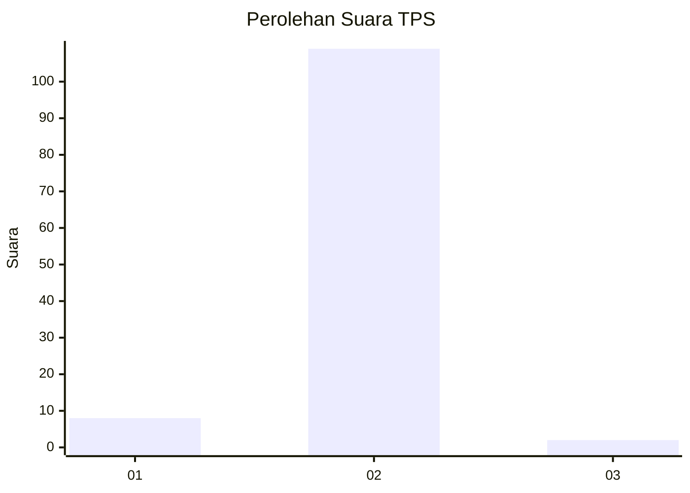
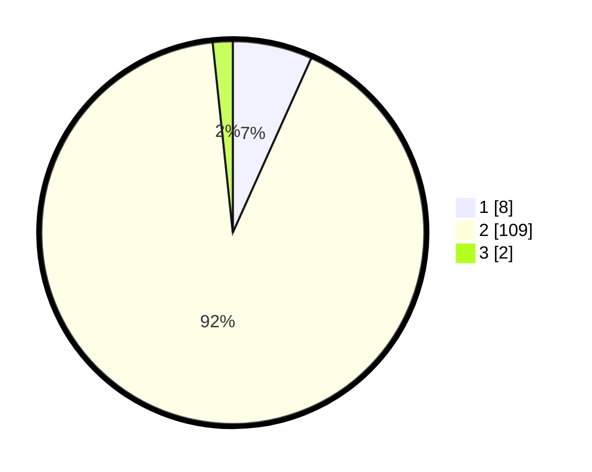

# Hasil

## Grafik

## Tabel

| No. | Nama Paslon    | Suara | Suara (raw) | Persentase |
|:--- |:-------------- | -----:| -----------:| ----------:|
| 1   | ANIES MUHAIMIN | 8     | [8][p-1]    | 6,72       |
| 2   | PRABOWO GIBRAN | 109   | [109][p-2]  | 91,60      |
| 3   | GANJAR MAHFUD  | 2     | [2][p-3]    | 1,68       |

[p-1]: https://github.com/gigit-pemilu/pemilu-2024/blob/main/pilpres/hitung-suara/sub/12-sumatera-utara/sub/03-tapanuli-selatan/sub/05-saipar-dolok-hole/sub/2074-ulu-mamis-situnggaling/sub/001-tps/sub/paslon-1.txt
[p-2]: https://github.com/gigit-pemilu/pemilu-2024/blob/main/pilpres/hitung-suara/sub/12-sumatera-utara/sub/03-tapanuli-selatan/sub/05-saipar-dolok-hole/sub/2074-ulu-mamis-situnggaling/sub/001-tps/sub/paslon-2.txt
[p-3]: https://github.com/gigit-pemilu/pemilu-2024/blob/main/pilpres/hitung-suara/sub/12-sumatera-utara/sub/03-tapanuli-selatan/sub/05-saipar-dolok-hole/sub/2074-ulu-mamis-situnggaling/sub/001-tps/sub/paslon-3.txt

## Foto C Plano

https://sirekap-obj-formc.kpu.go.id/e3ad/pemilu/ppwp/12/03/05/20/74/1203052074001-20240215-161229--3effcf59-0774-4f9c-a9cd-14ec50572381.jpg

https://sirekap-obj-formc.kpu.go.id/e3ad/pemilu/ppwp/12/03/05/20/74/1203052074001-20240215-160008--dc31de67-d1b4-4608-8471-566114839df8.jpg

https://sirekap-obj-formc.kpu.go.id/e3ad/pemilu/ppwp/12/03/05/20/74/1203052074001-20240215-130102--50369ede-66e0-4e43-9ac9-4ab9883dd117.jpg

## Metadata

| Key        | Value               |
| ---------- | ------------------- |
| Time Stamp | 2024-02-25 12:00:00 |

