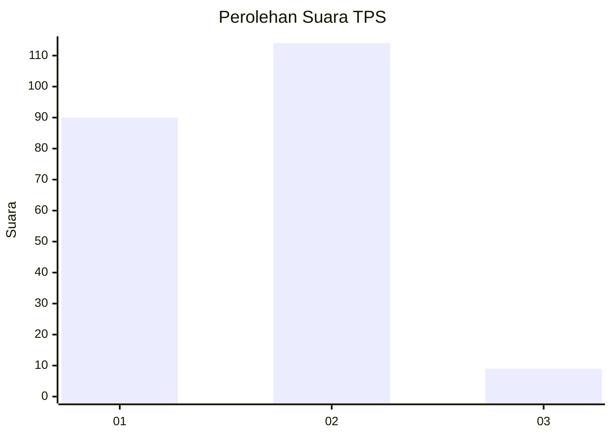
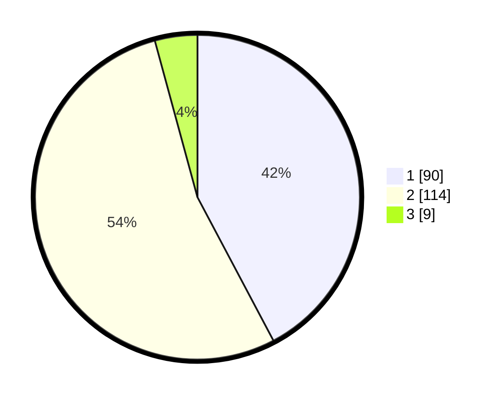

# Hasil

## Grafik

## Tabel

| No. | Nama Paslon    | Suara | Suara (raw) | Persentase |
|:--- |:-------------- | -----:| -----------:| ----------:|
| 1   | ANIES MUHAIMIN | 90    | [90][p-1]   | 42,25      |
| 2   | PRABOWO GIBRAN | 114   | [114][p-2]  | 53,52      |
| 3   | GANJAR MAHFUD  | 9     | [9][p-3]    | 4,23       |

[p-1]: https://github.com/gigit-pemilu/pemilu-2024-12-sumatera-utara/blob/main/pilpres/hitung-suara/sub/12-sumatera-utara/sub/03-tapanuli-selatan/sub/06-angkola-selatan/sub/1001-simarpinggan/sub/002-tps/sub/paslon-1.txt
[p-2]: https://github.com/gigit-pemilu/pemilu-2024-12-sumatera-utara/blob/main/pilpres/hitung-suara/sub/12-sumatera-utara/sub/03-tapanuli-selatan/sub/06-angkola-selatan/sub/1001-simarpinggan/sub/002-tps/sub/paslon-2.txt
[p-3]: https://github.com/gigit-pemilu/pemilu-2024-12-sumatera-utara/blob/main/pilpres/hitung-suara/sub/12-sumatera-utara/sub/03-tapanuli-selatan/sub/06-angkola-selatan/sub/1001-simarpinggan/sub/002-tps/sub/paslon-3.txt

## Foto C Plano

https://sirekap-obj-formc.kpu.go.id/c830/pemilu/ppwp/12/03/06/10/01/1203061001002-20240215-000341--41913759-3d6e-47c8-b2d1-71b2b361357b.jpg

https://sirekap-obj-formc.kpu.go.id/c830/pemilu/ppwp/12/03/06/10/01/1203061001002-20240215-000638--df33032b-4ef3-49b6-af8f-f16ae53bea37.jpg

https://sirekap-obj-formc.kpu.go.id/c830/pemilu/ppwp/12/03/06/10/01/1203061001002-20240215-001115--e8c23ccd-8efe-435c-9d64-c5f0f2a32f47.jpg

## Metadata

| Key        | Value               |
| ---------- | ------------------- |
| Time Stamp | 2024-02-15 21:01:18 |

