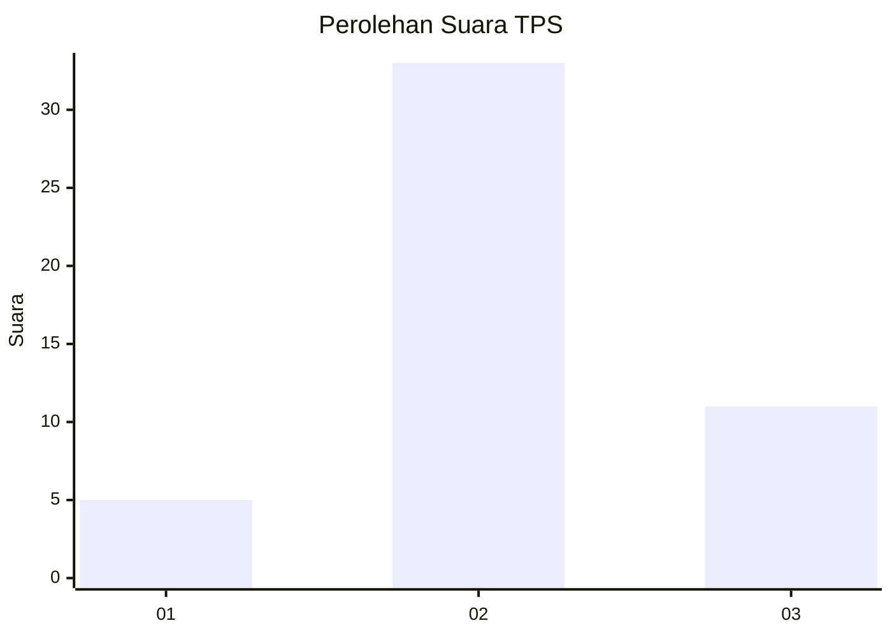
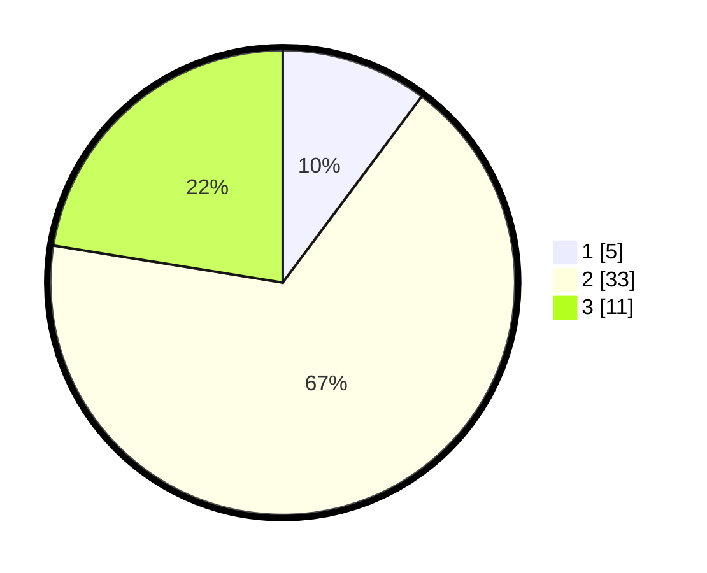

# Hasil

## Grafik

## Tabel

| No. | Nama Paslon    | Suara | Suara (raw) | Persentase |
|:--- |:-------------- | -----:| -----------:| ----------:|
| 1   | ANIES MUHAIMIN | 5     | [5][p-1]    | 10,20      |
| 2   | PRABOWO GIBRAN | 33    | [33][p-2]   | 67,35      |
| 3   | GANJAR MAHFUD  | 11    | [11][p-3]   | 22,45      |

[p-1]: https://github.com/gigit-pemilu/pemilu-2024/blob/main/pilpres/hitung-suara/sub/12-sumatera-utara/sub/03-tapanuli-selatan/sub/06-angkola-selatan/sub/2017-sihuik-huik/sub/005-tps/sub/paslon-1.txt
[p-2]: https://github.com/gigit-pemilu/pemilu-2024/blob/main/pilpres/hitung-suara/sub/12-sumatera-utara/sub/03-tapanuli-selatan/sub/06-angkola-selatan/sub/2017-sihuik-huik/sub/005-tps/sub/paslon-2.txt
[p-3]: https://github.com/gigit-pemilu/pemilu-2024/blob/main/pilpres/hitung-suara/sub/12-sumatera-utara/sub/03-tapanuli-selatan/sub/06-angkola-selatan/sub/2017-sihuik-huik/sub/005-tps/sub/paslon-3.txt

## Foto C Plano

https://sirekap-obj-formc.kpu.go.id/da6d/pemilu/ppwp/12/03/06/20/17/1203062017005-20240217-102744--2c43e3f0-44ae-45a0-9f54-3ee4739e8214.jpg

https://sirekap-obj-formc.kpu.go.id/da6d/pemilu/ppwp/12/03/06/20/17/1203062017005-20240217-102939--4fcd380a-d7e9-47f6-812a-7dec385ecc06.jpg

https://sirekap-obj-formc.kpu.go.id/da6d/pemilu/ppwp/12/03/06/20/17/1203062017005-20240217-103154--a1d61a11-adae-46de-9014-5ddeef9ef6d2.jpg

## Metadata

| Key        | Value               |
| ---------- | ------------------- |
| Time Stamp | 2024-02-25 12:00:00 |

