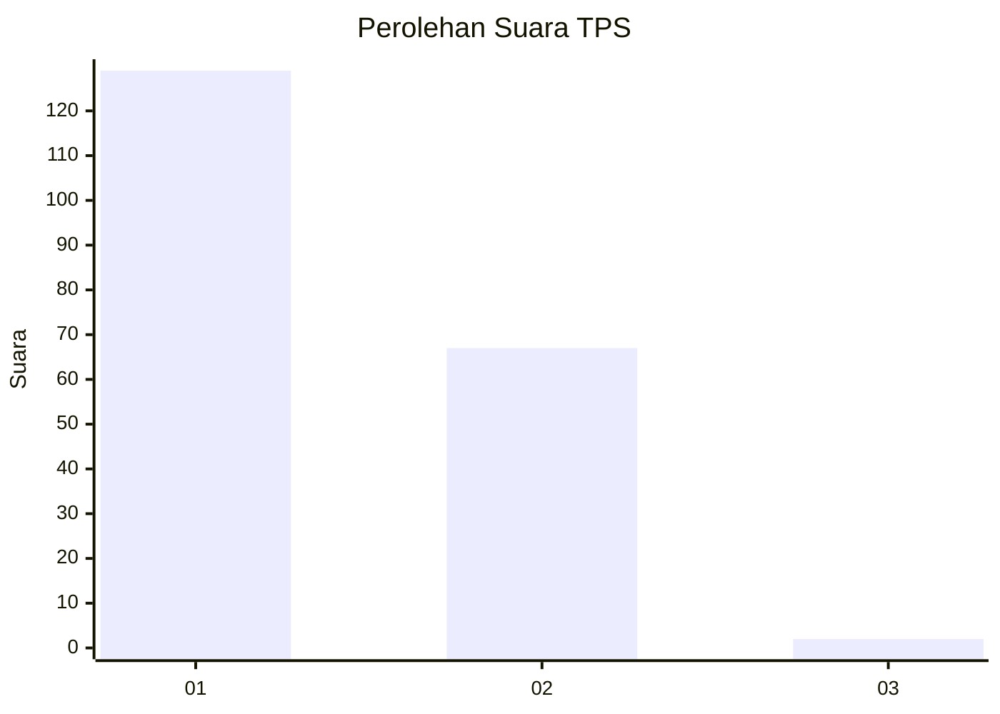
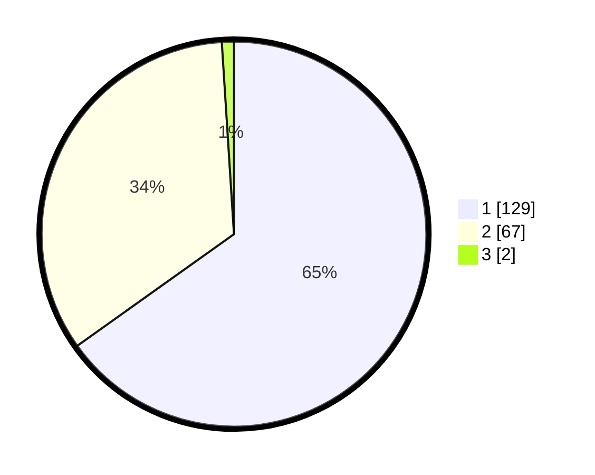

# Hasil

## Grafik

## Tabel

| No. | Nama Paslon    | Suara | Suara (raw) | Persentase |
|:--- |:-------------- | -----:| -----------:| ----------:|
| 1   | ANIES MUHAIMIN | 129   | [129][p-1]  | 65,15      |
| 2   | PRABOWO GIBRAN | 67    | [67][p-2]   | 33,84      |
| 3   | GANJAR MAHFUD  | 2     | [2][p-3]    | 1,01       |

[p-1]: https://github.com/gigit-pemilu/pemilu-2024-12-sumatera-utara/blob/main/pilpres/hitung-suara/sub/12-sumatera-utara/sub/03-tapanuli-selatan/sub/07-batang-angkola/sub/1001-sigalangan/sub/001-tps/sub/paslon-1.txt
[p-2]: https://github.com/gigit-pemilu/pemilu-2024-12-sumatera-utara/blob/main/pilpres/hitung-suara/sub/12-sumatera-utara/sub/03-tapanuli-selatan/sub/07-batang-angkola/sub/1001-sigalangan/sub/001-tps/sub/paslon-2.txt
[p-3]: https://github.com/gigit-pemilu/pemilu-2024-12-sumatera-utara/blob/main/pilpres/hitung-suara/sub/12-sumatera-utara/sub/03-tapanuli-selatan/sub/07-batang-angkola/sub/1001-sigalangan/sub/001-tps/sub/paslon-3.txt

## Foto C Plano

https://sirekap-obj-formc.kpu.go.id/e48a/pemilu/ppwp/12/03/07/10/01/1203071001001-20240216-205432--8ee03676-e287-4d6f-bc59-3e1300503f90.jpg

https://sirekap-obj-formc.kpu.go.id/e48a/pemilu/ppwp/12/03/07/10/01/1203071001001-20240217-075150--48b3c60c-7645-4d21-8d9d-e5be33f70708.jpg

https://sirekap-obj-formc.kpu.go.id/e48a/pemilu/ppwp/12/03/07/10/01/1203071001001-20240217-080349--e2b5b4a5-fdc9-45b3-9dc2-75e63e3fefbb.jpg

## Metadata

| Key        | Value               |
| ---------- | ------------------- |
| Time Stamp | 2024-02-24 22:31:28 |

