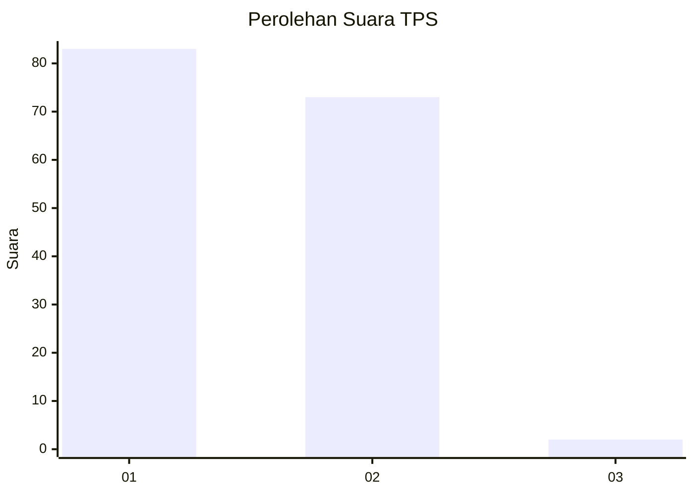
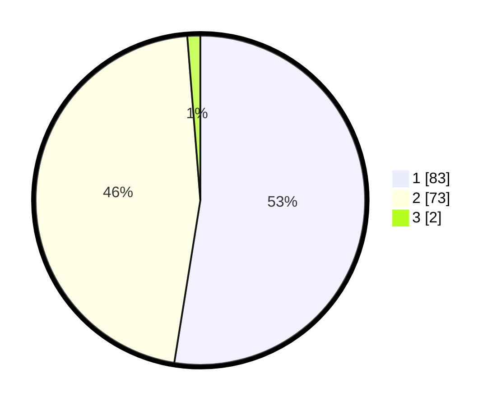

# Hasil

## Grafik

## Tabel

| No. | Nama Paslon    | Suara | Suara (raw) | Persentase |
|:--- |:-------------- | -----:| -----------:| ----------:|
| 1   | ANIES MUHAIMIN | 83    | [83][p-1]   | 52,53      |
| 2   | PRABOWO GIBRAN | 73    | [73][p-2]   | 46,20      |
| 3   | GANJAR MAHFUD  | 2     | [2][p-3]    | 1,27       |

[p-1]: https://github.com/gigit-pemilu/pemilu-2024/blob/main/pilpres/hitung-suara/sub/12-sumatera-utara/sub/03-tapanuli-selatan/sub/07-batang-angkola/sub/1001-sigalangan/sub/002-tps/sub/paslon-1.txt
[p-2]: https://github.com/gigit-pemilu/pemilu-2024/blob/main/pilpres/hitung-suara/sub/12-sumatera-utara/sub/03-tapanuli-selatan/sub/07-batang-angkola/sub/1001-sigalangan/sub/002-tps/sub/paslon-2.txt
[p-3]: https://github.com/gigit-pemilu/pemilu-2024/blob/main/pilpres/hitung-suara/sub/12-sumatera-utara/sub/03-tapanuli-selatan/sub/07-batang-angkola/sub/1001-sigalangan/sub/002-tps/sub/paslon-3.txt

## Foto C Plano

https://sirekap-obj-formc.kpu.go.id/8a62/pemilu/ppwp/12/03/07/10/01/1203071001002-20240214-155908--93dd74fb-b49e-4786-9f65-3421870b312d.jpg

https://sirekap-obj-formc.kpu.go.id/8a62/pemilu/ppwp/12/03/07/10/01/1203071001002-20240214-155256--4978efba-a4fa-459a-b6e0-42be3f1d5c2d.jpg

https://sirekap-obj-formc.kpu.go.id/8a62/pemilu/ppwp/12/03/07/10/01/1203071001002-20240215-142531--87ef75ef-fce1-45b6-ba40-59816003d4e5.jpg

## Metadata

| Key        | Value               |
| ---------- | ------------------- |
| Time Stamp | 2024-02-21 12:00:00 |

