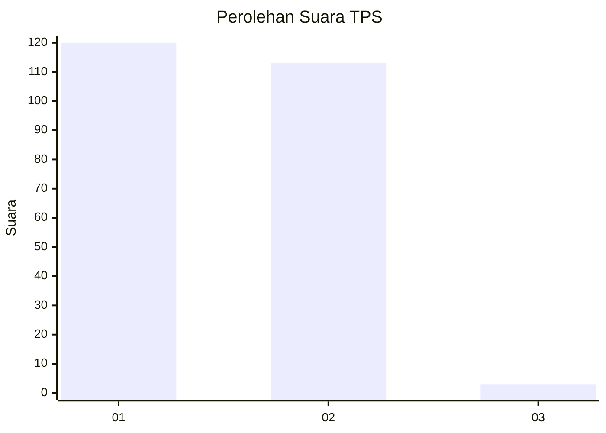
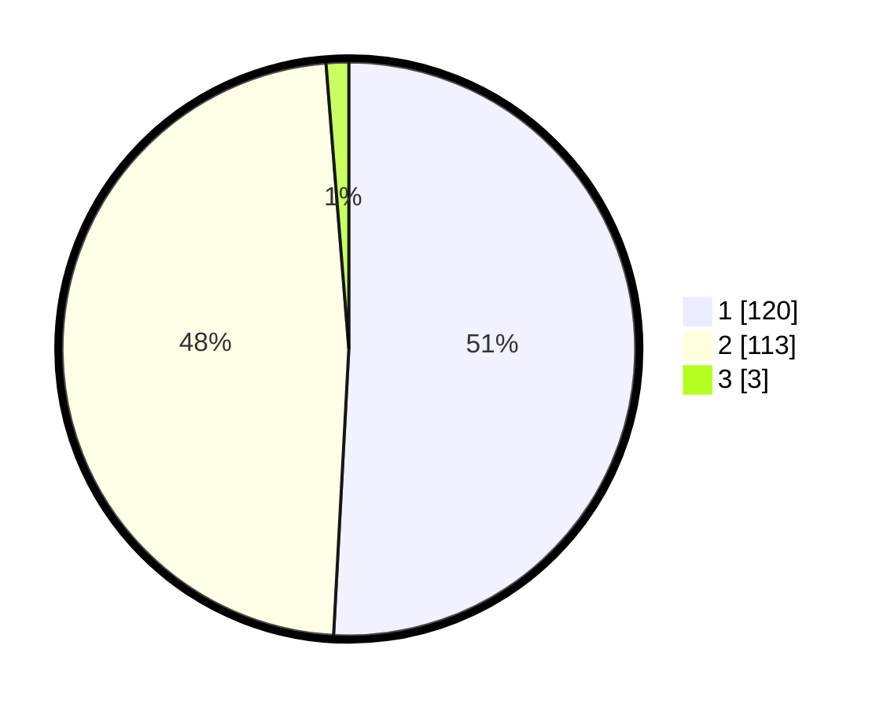

# Hasil

## Grafik

## Tabel

| No. | Nama Paslon    | Suara | Suara (raw) | Persentase |
|:--- |:-------------- | -----:| -----------:| ----------:|
| 1   | ANIES MUHAIMIN | 120   | [120][p-1]  | 50,85      |
| 2   | PRABOWO GIBRAN | 113   | [113][p-2]  | 47,88      |
| 3   | GANJAR MAHFUD  | 3     | [3][p-3]    | 1,27       |

[p-1]: https://github.com/gigit-pemilu/pemilu-2024-12-sumatera-utara/blob/main/pilpres/hitung-suara/sub/12-sumatera-utara/sub/03-tapanuli-selatan/sub/07-batang-angkola/sub/1060-pintu-padang-i/sub/003-tps/sub/paslon-1.txt
[p-2]: https://github.com/gigit-pemilu/pemilu-2024-12-sumatera-utara/blob/main/pilpres/hitung-suara/sub/12-sumatera-utara/sub/03-tapanuli-selatan/sub/07-batang-angkola/sub/1060-pintu-padang-i/sub/003-tps/sub/paslon-2.txt
[p-3]: https://github.com/gigit-pemilu/pemilu-2024-12-sumatera-utara/blob/main/pilpres/hitung-suara/sub/12-sumatera-utara/sub/03-tapanuli-selatan/sub/07-batang-angkola/sub/1060-pintu-padang-i/sub/003-tps/sub/paslon-3.txt

## Foto C Plano

https://sirekap-obj-formc.kpu.go.id/428c/pemilu/ppwp/12/03/07/10/60/1203071060003-20240215-072130--081ea8fa-3f5a-419f-9528-075a270dc11d.jpg

https://sirekap-obj-formc.kpu.go.id/428c/pemilu/ppwp/12/03/07/10/60/1203071060003-20240215-072316--9be3c37d-ae41-4e01-970c-8d370f7adfea.jpg

https://sirekap-obj-formc.kpu.go.id/428c/pemilu/ppwp/12/03/07/10/60/1203071060003-20240215-072445--56899df3-6484-4090-9ef6-760655a7d0ca.jpg

## Metadata

| Key        | Value               |
| ---------- | ------------------- |
| Time Stamp | 2024-02-15 23:29:50 |

## DATA PEMILIH TETAP

Jumlah pemilih dalam DPT: **277**.
 * L: **737**.
 * P: **140**.

## DATA PENGGUNA HAK PILIH

Jumlah pengguna hak pilih dalam DPT: **279**.
 * L: **100**.
 * P: **719**.

Jumlah pengguna hak pilih dalam DPTb: **7**.
 * L: **0**.
 * P: **203**.

Jumlah pengguna hak pilih dalam DPK: **22**.
 * L: **70**.
 * P: **12**.

Jumlah pengguna hak pilih: **242**.
 * L: **710**.
 * P: **132**.

## JUMLAH SUARA SAH DAN TIDAK SAH

JUMLAH SELURUH SUARA SAH: **236**.

JUMLAH SUARA TIDAK SAH: **6**.

JUMLAH SELURUH SUARA SAH DAN SUARA TIDAK SAH: **242**.

