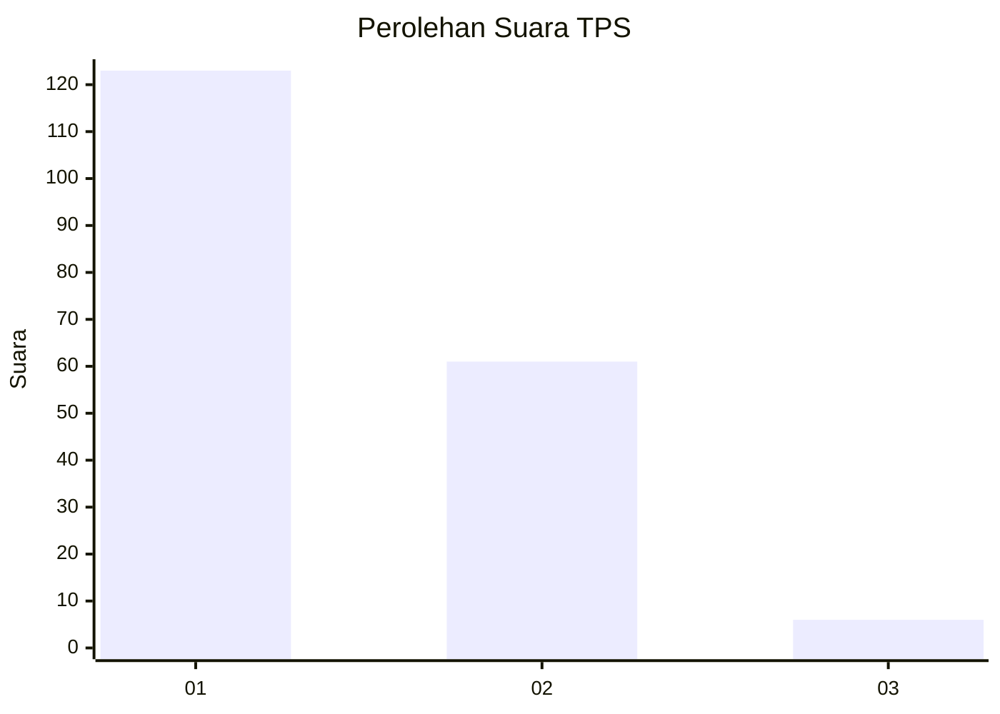
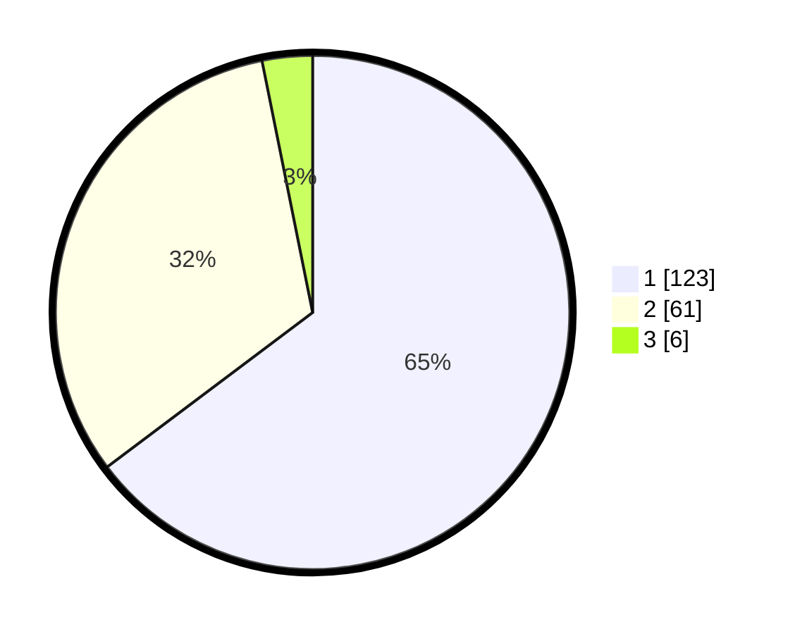

# Hasil

## Grafik

## Tabel

| No. | Nama Paslon    | Suara | Suara (raw) | Persentase |
|:--- |:-------------- | -----:| -----------:| ----------:|
| 1   | ANIES MUHAIMIN | 123   | [123][p-1]  | 64,74      |
| 2   | PRABOWO GIBRAN | 61    | [61][p-2]   | 32,11      |
| 3   | GANJAR MAHFUD  | 6     | [6][p-3]    | 3,16       |

[p-1]: https://github.com/gigit-pemilu/pemilu-2024-12-sumatera-utara/blob/main/pilpres/hitung-suara/sub/12-sumatera-utara/sub/03-tapanuli-selatan/sub/07-batang-angkola/sub/1061-pintu-padang-ii/sub/003-tps/sub/paslon-1.txt
[p-2]: https://github.com/gigit-pemilu/pemilu-2024-12-sumatera-utara/blob/main/pilpres/hitung-suara/sub/12-sumatera-utara/sub/03-tapanuli-selatan/sub/07-batang-angkola/sub/1061-pintu-padang-ii/sub/003-tps/sub/paslon-2.txt
[p-3]: https://github.com/gigit-pemilu/pemilu-2024-12-sumatera-utara/blob/main/pilpres/hitung-suara/sub/12-sumatera-utara/sub/03-tapanuli-selatan/sub/07-batang-angkola/sub/1061-pintu-padang-ii/sub/003-tps/sub/paslon-3.txt

## Foto C Plano

https://sirekap-obj-formc.kpu.go.id/17d8/pemilu/ppwp/12/03/07/10/61/1203071061003-20240215-021252--1cba4b66-24fc-4d48-a070-9ae81a2bd1fe.jpg

https://sirekap-obj-formc.kpu.go.id/17d8/pemilu/ppwp/12/03/07/10/61/1203071061003-20240215-023008--fb4f7033-11d1-4dbd-891e-aca20705c821.jpg

https://sirekap-obj-formc.kpu.go.id/17d8/pemilu/ppwp/12/03/07/10/61/1203071061003-20240215-021900--f1ed6455-7072-4b22-914e-d1fb271e3d25.jpg

## Metadata

| Key        | Value               |
| ---------- | ------------------- |
| Time Stamp | 2024-02-22 09:00:00 |

