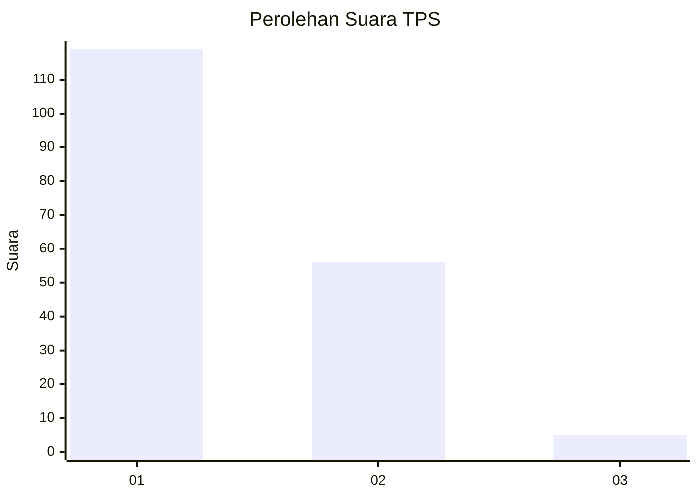
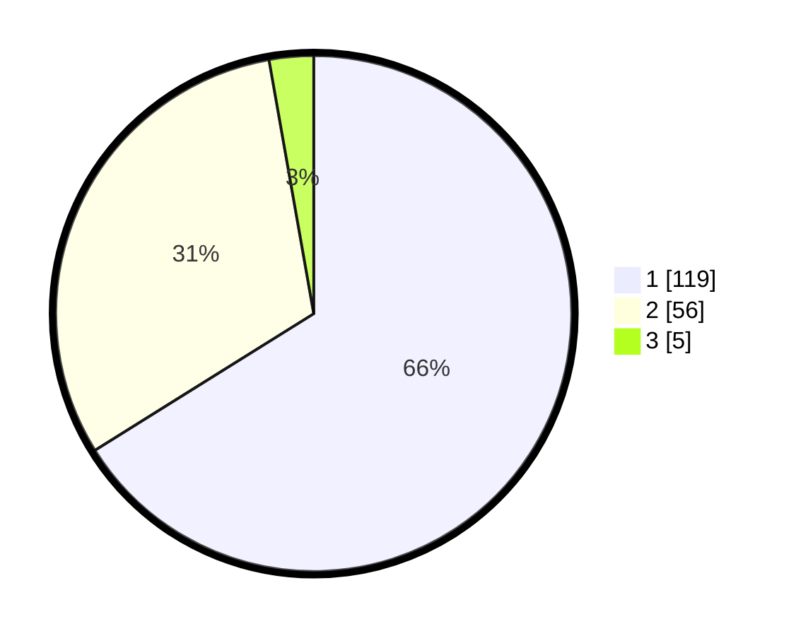

# Hasil

## Grafik

## Tabel

| No. | Nama Paslon    | Suara | Suara (raw) | Persentase |
|:--- |:-------------- | -----:| -----------:| ----------:|
| 1   | ANIES MUHAIMIN | 119   | [119][p-1]  | 66,11      |
| 2   | PRABOWO GIBRAN | 56    | [56][p-2]   | 31,11      |
| 3   | GANJAR MAHFUD  | 5     | [5][p-3]    | 2,78       |

[p-1]: https://github.com/gigit-pemilu/pemilu-2024-12-sumatera-utara/blob/main/pilpres/hitung-suara/sub/12-sumatera-utara/sub/03-tapanuli-selatan/sub/07-batang-angkola/sub/2021-pasar-lama/sub/003-tps/sub/paslon-1.txt
[p-2]: https://github.com/gigit-pemilu/pemilu-2024-12-sumatera-utara/blob/main/pilpres/hitung-suara/sub/12-sumatera-utara/sub/03-tapanuli-selatan/sub/07-batang-angkola/sub/2021-pasar-lama/sub/003-tps/sub/paslon-2.txt
[p-3]: https://github.com/gigit-pemilu/pemilu-2024-12-sumatera-utara/blob/main/pilpres/hitung-suara/sub/12-sumatera-utara/sub/03-tapanuli-selatan/sub/07-batang-angkola/sub/2021-pasar-lama/sub/003-tps/sub/paslon-3.txt

## Foto C Plano

https://sirekap-obj-formc.kpu.go.id/7d5e/pemilu/ppwp/12/03/07/20/21/1203072021003-20240215-013933--3362d7b8-17d8-42a1-9a68-ef9498acc639.jpg

https://sirekap-obj-formc.kpu.go.id/7d5e/pemilu/ppwp/12/03/07/20/21/1203072021003-20240215-014637--02f0dc5a-bae3-45cc-8acd-f1c1ed89f51d.jpg

https://sirekap-obj-formc.kpu.go.id/7d5e/pemilu/ppwp/12/03/07/20/21/1203072021003-20240215-014402--f5c4096b-8d3d-44d1-a15d-1f46090cd556.jpg

## Metadata

| Key        | Value               |
| ---------- | ------------------- |
| Time Stamp | 2024-02-21 13:00:00 |

