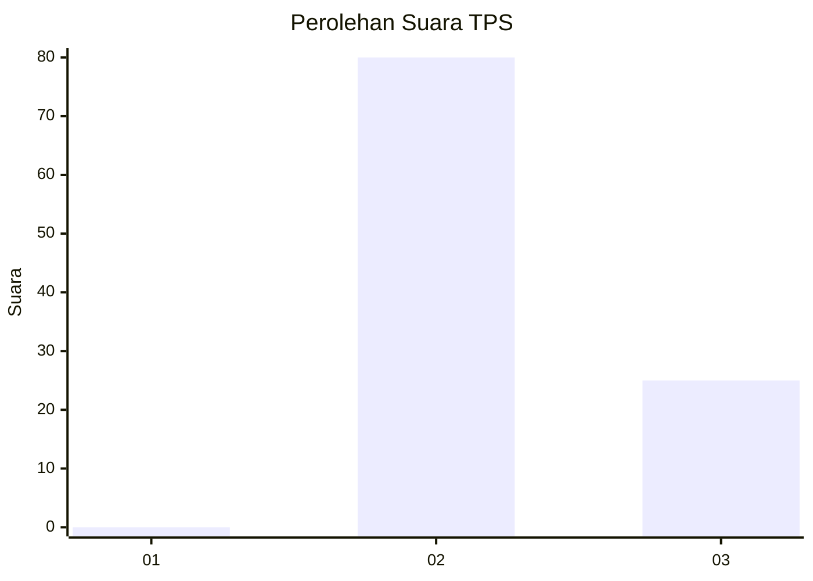
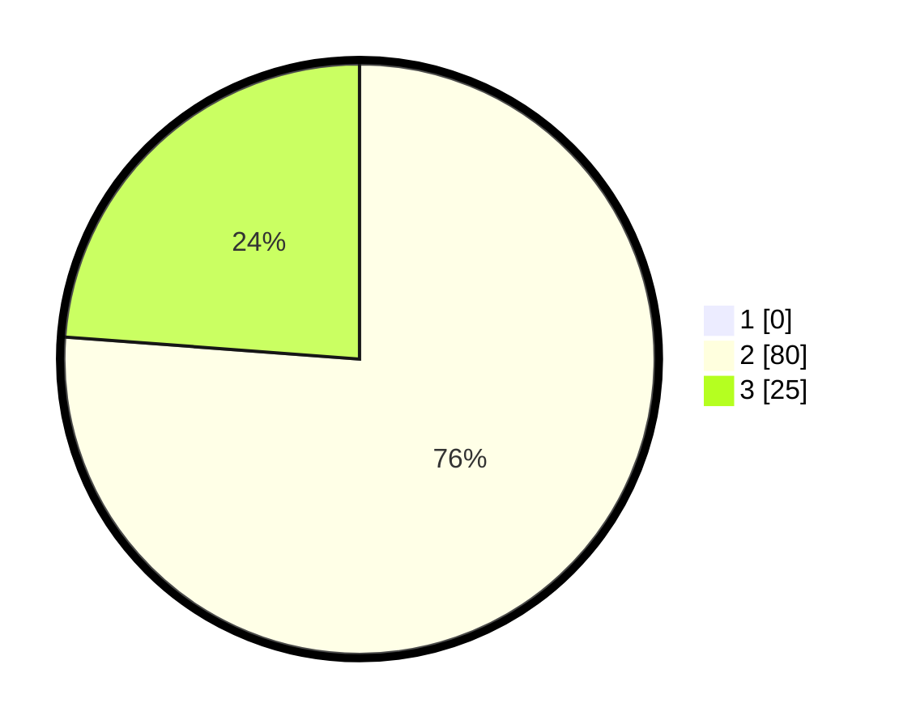

# Hasil

## Grafik

## Tabel

| No. | Nama Paslon    | Suara | Suara (raw) | Persentase |
|:--- |:-------------- | -----:| -----------:| ----------:|
| 1   | ANIES MUHAIMIN | 0     | [0][p-1]    | 0,00       |
| 2   | PRABOWO GIBRAN | 80    | [80][p-2]   | 76,19      |
| 3   | GANJAR MAHFUD  | 25    | [25][p-3]   | 23,81      |

[p-1]: https://github.com/gigit-pemilu/pemilu-2024/blob/main/pilpres/hitung-suara/sub/12-sumatera-utara/sub/03-tapanuli-selatan/sub/07-batang-angkola/sub/2053-sigulang-losung/sub/002-tps/sub/paslon-1.txt
[p-2]: https://github.com/gigit-pemilu/pemilu-2024/blob/main/pilpres/hitung-suara/sub/12-sumatera-utara/sub/03-tapanuli-selatan/sub/07-batang-angkola/sub/2053-sigulang-losung/sub/002-tps/sub/paslon-2.txt
[p-3]: https://github.com/gigit-pemilu/pemilu-2024/blob/main/pilpres/hitung-suara/sub/12-sumatera-utara/sub/03-tapanuli-selatan/sub/07-batang-angkola/sub/2053-sigulang-losung/sub/002-tps/sub/paslon-3.txt

## Foto C Plano

https://sirekap-obj-formc.kpu.go.id/cf1c/pemilu/ppwp/12/03/07/20/53/1203072053002-20240214-194242--fafe7804-6afd-4bb4-84f9-ffac0c55f9b0.jpg

https://sirekap-obj-formc.kpu.go.id/cf1c/pemilu/ppwp/12/03/07/20/53/1203072053002-20240214-194252--a54cbc64-f59f-4616-9cfd-787210c3fa61.jpg

https://sirekap-obj-formc.kpu.go.id/cf1c/pemilu/ppwp/12/03/07/20/53/1203072053002-20240214-194300--a4731cc4-b98e-4cb9-a12f-9feb7006b2e6.jpg

## Metadata

| Key        | Value               |
| ---------- | ------------------- |
| Time Stamp | 2024-02-16 00:00:26 |

