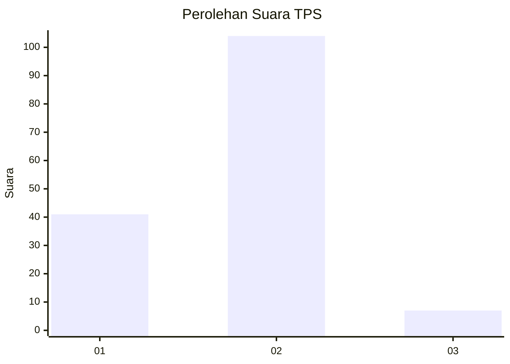
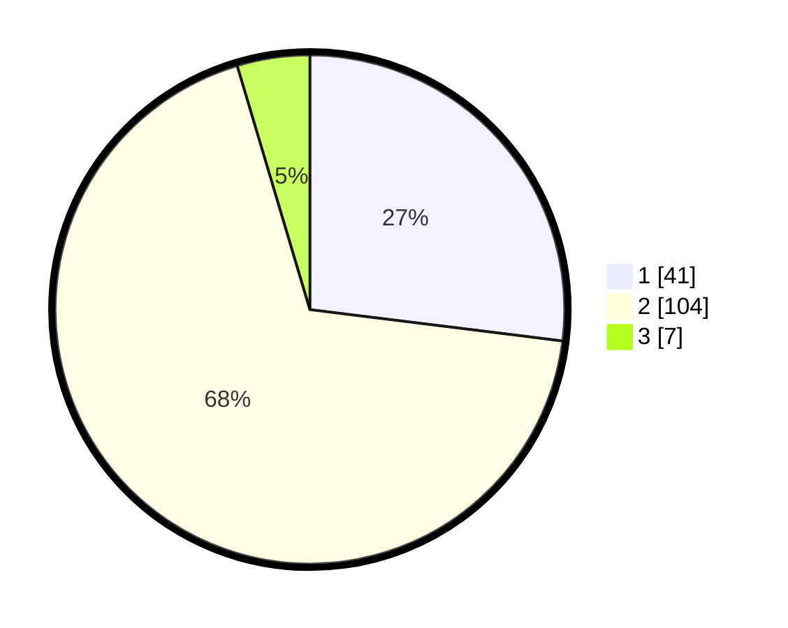

# Hasil

## Grafik

## Tabel

| No. | Nama Paslon    | Suara | Suara (raw) | Persentase |
|:--- |:-------------- | -----:| -----------:| ----------:|
| 1   | ANIES MUHAIMIN | 41    | [41][p-1]   | 26,97      |
| 2   | PRABOWO GIBRAN | 104   | [104][p-2]  | 68,42      |
| 3   | GANJAR MAHFUD  | 7     | [7][p-3]    | 4,61       |

[p-1]: https://github.com/gigit-pemilu/pemilu-2024-12-sumatera-utara/blob/main/pilpres/hitung-suara/sub/12-sumatera-utara/sub/03-tapanuli-selatan/sub/14-arse/sub/1039-arse/sub/003-tps/sub/paslon-1.txt
[p-2]: https://github.com/gigit-pemilu/pemilu-2024-12-sumatera-utara/blob/main/pilpres/hitung-suara/sub/12-sumatera-utara/sub/03-tapanuli-selatan/sub/14-arse/sub/1039-arse/sub/003-tps/sub/paslon-2.txt
[p-3]: https://github.com/gigit-pemilu/pemilu-2024-12-sumatera-utara/blob/main/pilpres/hitung-suara/sub/12-sumatera-utara/sub/03-tapanuli-selatan/sub/14-arse/sub/1039-arse/sub/003-tps/sub/paslon-3.txt

## Foto C Plano

https://sirekap-obj-formc.kpu.go.id/8980/pemilu/ppwp/12/03/14/10/39/1203141039003-20240215-002613--ff329dd1-43a6-4334-9335-37e44df2528a.jpg

https://sirekap-obj-formc.kpu.go.id/8980/pemilu/ppwp/12/03/14/10/39/1203141039003-20240215-002944--941df2a8-81fa-415c-944d-0dd5645353bb.jpg

https://sirekap-obj-formc.kpu.go.id/8980/pemilu/ppwp/12/03/14/10/39/1203141039003-20240215-003124--65201711-3c04-45fe-9801-030cf0169b2a.jpg

## Metadata

| Key        | Value               |
| ---------- | ------------------- |
| Time Stamp | 2024-02-21 13:00:00 |

