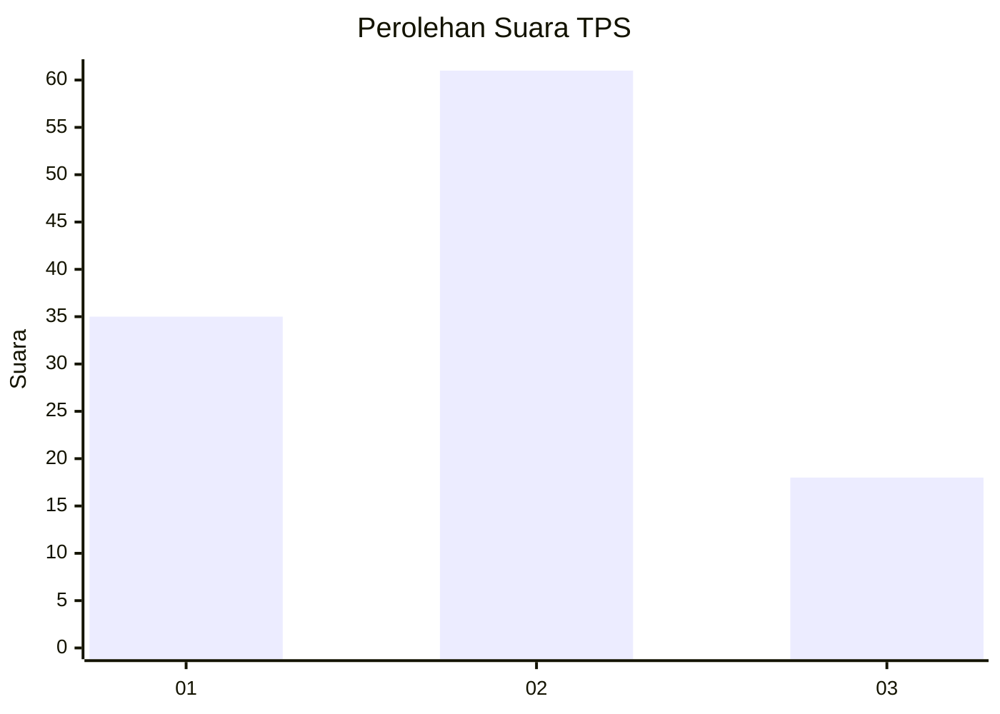
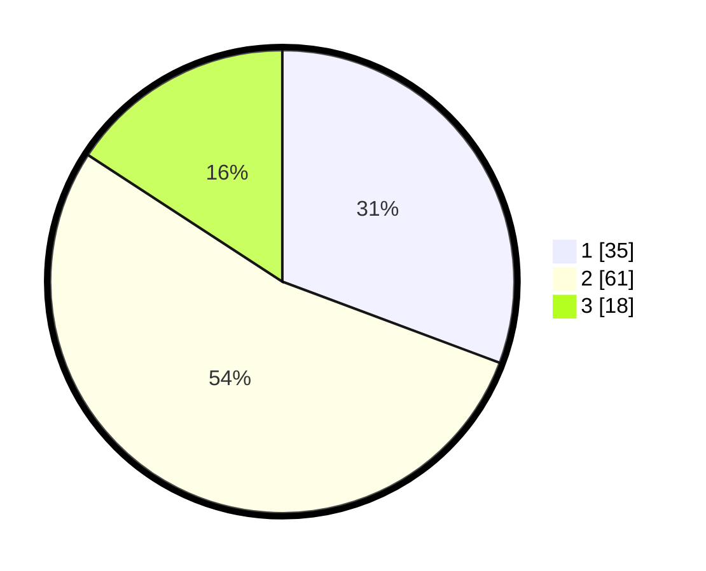

# Hasil

## Grafik

## Tabel

| No. | Nama Paslon    | Suara | Suara (raw) | Persentase |
|:--- |:-------------- | -----:| -----------:| ----------:|
| 1   | ANIES MUHAIMIN | 35    | [35][p-1]   | 30,70      |
| 2   | PRABOWO GIBRAN | 61    | [61][p-2]   | 53,51      |
| 3   | GANJAR MAHFUD  | 18    | [18][p-3]   | 15,79      |

[p-1]: https://github.com/gigit-pemilu/pemilu-2024-12-sumatera-utara/blob/main/pilpres/hitung-suara/sub/12-sumatera-utara/sub/03-tapanuli-selatan/sub/14-arse/sub/1039-arse/sub/008-tps/sub/paslon-1.txt
[p-2]: https://github.com/gigit-pemilu/pemilu-2024-12-sumatera-utara/blob/main/pilpres/hitung-suara/sub/12-sumatera-utara/sub/03-tapanuli-selatan/sub/14-arse/sub/1039-arse/sub/008-tps/sub/paslon-2.txt
[p-3]: https://github.com/gigit-pemilu/pemilu-2024-12-sumatera-utara/blob/main/pilpres/hitung-suara/sub/12-sumatera-utara/sub/03-tapanuli-selatan/sub/14-arse/sub/1039-arse/sub/008-tps/sub/paslon-3.txt

## Foto C Plano

https://sirekap-obj-formc.kpu.go.id/cf03/pemilu/ppwp/12/03/14/10/39/1203141039008-20240215-001451--7339177c-9842-41a0-b86a-e138961117f3.jpg

https://sirekap-obj-formc.kpu.go.id/cf03/pemilu/ppwp/12/03/14/10/39/1203141039008-20240215-001745--6b8d189c-c7b7-4fdb-92a3-1fa848b7ae1b.jpg

https://sirekap-obj-formc.kpu.go.id/cf03/pemilu/ppwp/12/03/14/10/39/1203141039008-20240215-002005--10d4b37d-283f-4a7e-a87c-7391ab31052a.jpg

## Metadata

| Key        | Value               |
| ---------- | ------------------- |
| Time Stamp | 2024-02-16 12:51:22 |

