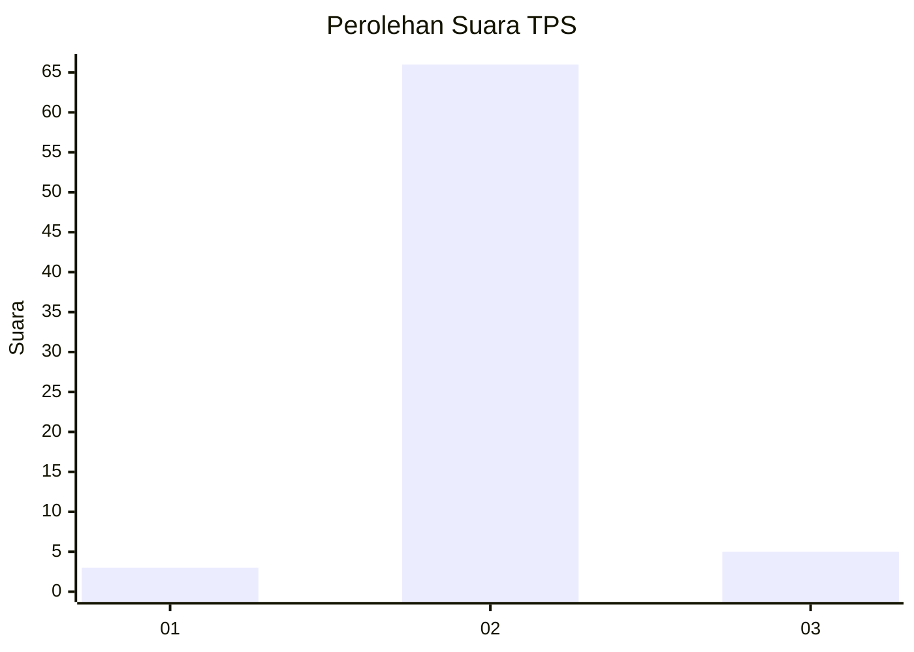
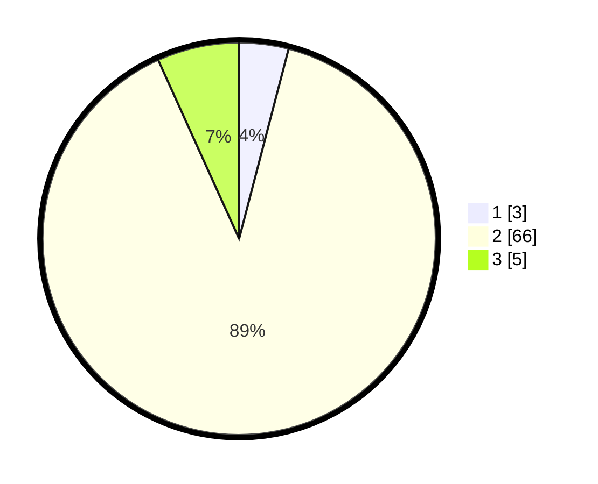

# Hasil

## Grafik

## Tabel

| No. | Nama Paslon    | Suara | Suara (raw) | Persentase |
|:--- |:-------------- | -----:| -----------:| ----------:|
| 1   | ANIES MUHAIMIN | 3     | [3][p-1]    | 4,05       |
| 2   | PRABOWO GIBRAN | 66    | [66][p-2]   | 89,19      |
| 3   | GANJAR MAHFUD  | 5     | [5][p-3]    | 6,76       |

[p-1]: https://github.com/gigit-pemilu/pemilu-2024/blob/main/pilpres/hitung-suara/sub/12-sumatera-utara/sub/03-tapanuli-selatan/sub/14-arse/sub/1040-lancat/sub/004-tps/sub/paslon-1.txt
[p-2]: https://github.com/gigit-pemilu/pemilu-2024/blob/main/pilpres/hitung-suara/sub/12-sumatera-utara/sub/03-tapanuli-selatan/sub/14-arse/sub/1040-lancat/sub/004-tps/sub/paslon-2.txt
[p-3]: https://github.com/gigit-pemilu/pemilu-2024/blob/main/pilpres/hitung-suara/sub/12-sumatera-utara/sub/03-tapanuli-selatan/sub/14-arse/sub/1040-lancat/sub/004-tps/sub/paslon-3.txt

## Foto C Plano

https://sirekap-obj-formc.kpu.go.id/bf4f/pemilu/ppwp/12/03/14/10/40/1203141040004-20240216-100806--0d53b02b-a9af-4c22-b12f-a8e3d52b8724.jpg

https://sirekap-obj-formc.kpu.go.id/bf4f/pemilu/ppwp/12/03/14/10/40/1203141040004-20240216-100856--56a799ba-aa40-4387-b815-ae2959d001d1.jpg

https://sirekap-obj-formc.kpu.go.id/bf4f/pemilu/ppwp/12/03/14/10/40/1203141040004-20240216-100920--e19ae8f8-3188-482e-aaa4-2697dca98987.jpg

## Metadata

| Key        | Value               |
| ---------- | ------------------- |
| Time Stamp | 2024-02-16 12:51:22 |

