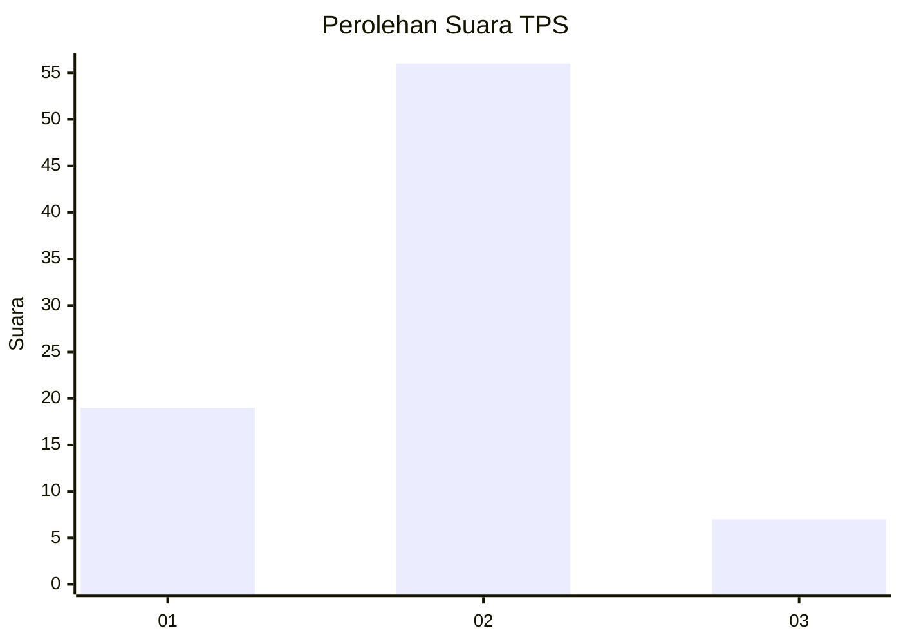
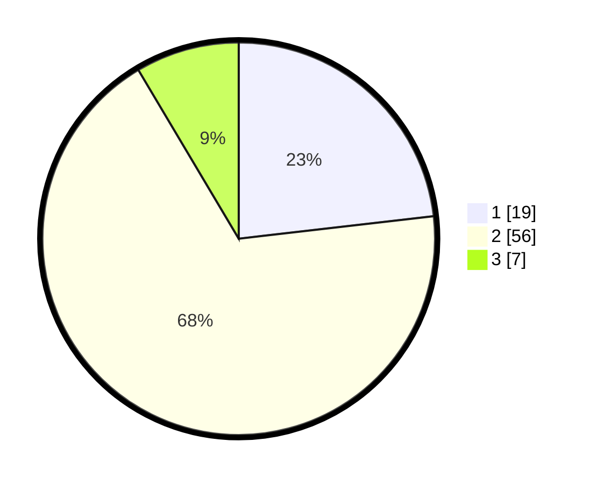

# Hasil

## Grafik

## Tabel

| No. | Nama Paslon    | Suara | Suara (raw) | Persentase |
|:--- |:-------------- | -----:| -----------:| ----------:|
| 1   | ANIES MUHAIMIN | 19    | [19][p-1]   | 23,17      |
| 2   | PRABOWO GIBRAN | 56    | [56][p-2]   | 68,29      |
| 3   | GANJAR MAHFUD  | 7     | [7][p-3]    | 8,54       |

[p-1]: https://github.com/gigit-pemilu/pemilu-2024-12-sumatera-utara/blob/main/pilpres/hitung-suara/sub/12-sumatera-utara/sub/03-tapanuli-selatan/sub/14-arse/sub/2032-pinagar/sub/005-tps/sub/paslon-1.txt
[p-2]: https://github.com/gigit-pemilu/pemilu-2024-12-sumatera-utara/blob/main/pilpres/hitung-suara/sub/12-sumatera-utara/sub/03-tapanuli-selatan/sub/14-arse/sub/2032-pinagar/sub/005-tps/sub/paslon-2.txt
[p-3]: https://github.com/gigit-pemilu/pemilu-2024-12-sumatera-utara/blob/main/pilpres/hitung-suara/sub/12-sumatera-utara/sub/03-tapanuli-selatan/sub/14-arse/sub/2032-pinagar/sub/005-tps/sub/paslon-3.txt

## Foto C Plano

https://sirekap-obj-formc.kpu.go.id/c1c1/pemilu/ppwp/12/03/14/20/32/1203142032005-20240215-020225--16d08767-83ed-4eb3-827f-a049ef227ee3.jpg

https://sirekap-obj-formc.kpu.go.id/c1c1/pemilu/ppwp/12/03/14/20/32/1203142032005-20240215-020431--fdbb0ab3-be1f-4ebc-9fc3-ce66713e20c0.jpg

https://sirekap-obj-formc.kpu.go.id/c1c1/pemilu/ppwp/12/03/14/20/32/1203142032005-20240215-020556--40b32779-720b-4075-be05-f80885ceac27.jpg

## Metadata

| Key        | Value               |
| ---------- | ------------------- |
| Time Stamp | 2024-02-21 13:00:00 |

## DATA PEMILIH TETAP

Jumlah pemilih dalam DPT: **58**.
 * L: **53**.
 * P: **45**.

## DATA PENGGUNA HAK PILIH

Jumlah pengguna hak pilih dalam DPT: **47**.
 * L: **46**.
 * P: **77**.

Jumlah pengguna hak pilih dalam DPTb: **555**.
 * L: **0**.
 * P: **5**.

Jumlah pengguna hak pilih dalam DPK: **555**.
 * L: **0**.
 * P: **505**.

Jumlah pengguna hak pilih: **63**.
 * L: **46**.
 * P: **31**.

## JUMLAH SUARA SAH DAN TIDAK SAH

JUMLAH SELURUH SUARA SAH: **82**.

JUMLAH SUARA TIDAK SAH: **1**.

JUMLAH SELURUH SUARA SAH DAN SUARA TIDAK SAH: **83**.

