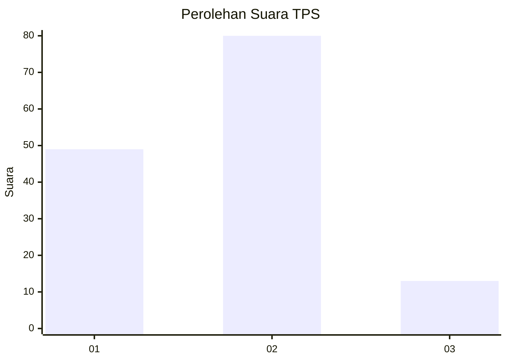
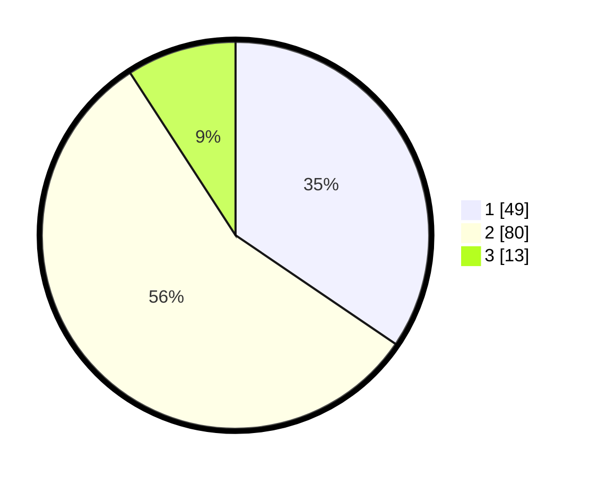

# Hasil

## Grafik

## Tabel

| No. | Nama Paslon    | Suara | Suara (raw) | Persentase |
|:--- |:-------------- | -----:| -----------:| ----------:|
| 1   | ANIES MUHAIMIN | 49    | [49][p-1]   | 34,51      |
| 2   | PRABOWO GIBRAN | 80    | [80][p-2]   | 56,34      |
| 3   | GANJAR MAHFUD  | 13    | [13][p-3]   | 9,15       |

[p-1]: https://github.com/gigit-pemilu/pemilu-2024/blob/main/pilpres/hitung-suara/sub/12-sumatera-utara/sub/03-tapanuli-selatan/sub/14-arse/sub/2034-aek-haminjon/sub/001-tps/sub/paslon-1.txt
[p-2]: https://github.com/gigit-pemilu/pemilu-2024/blob/main/pilpres/hitung-suara/sub/12-sumatera-utara/sub/03-tapanuli-selatan/sub/14-arse/sub/2034-aek-haminjon/sub/001-tps/sub/paslon-2.txt
[p-3]: https://github.com/gigit-pemilu/pemilu-2024/blob/main/pilpres/hitung-suara/sub/12-sumatera-utara/sub/03-tapanuli-selatan/sub/14-arse/sub/2034-aek-haminjon/sub/001-tps/sub/paslon-3.txt

## Foto C Plano

https://sirekap-obj-formc.kpu.go.id/984d/pemilu/ppwp/12/03/14/20/34/1203142034001-20240214-220506--96ee0530-66b9-4fa6-8f53-9dd3b6c7286c.jpg

https://sirekap-obj-formc.kpu.go.id/984d/pemilu/ppwp/12/03/14/20/34/1203142034001-20240214-212756--2f364b54-0b97-48fd-9273-82c0efcec45d.jpg

https://sirekap-obj-formc.kpu.go.id/984d/pemilu/ppwp/12/03/14/20/34/1203142034001-20240214-220736--0dcba16e-d19b-48d4-9468-55773bb45439.jpg

## Metadata

| Key        | Value               |
| ---------- | ------------------- |
| Time Stamp | 2024-02-16 12:51:22 |

