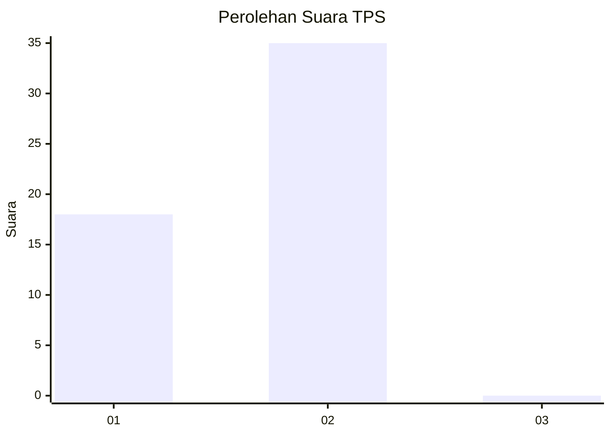
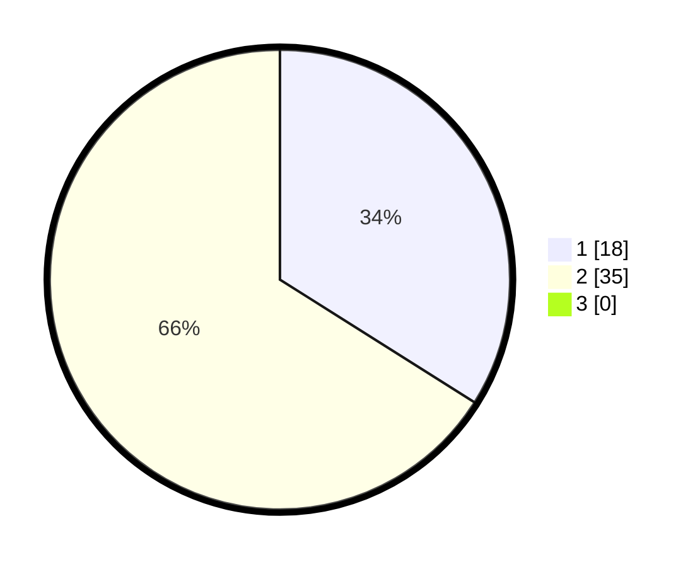

# Hasil

## Grafik

## Tabel

| No. | Nama Paslon    | Suara | Suara (raw) | Persentase |
|:--- |:-------------- | -----:| -----------:| ----------:|
| 1   | ANIES MUHAIMIN | 18    | [18][p-1]   | 33,96      |
| 2   | PRABOWO GIBRAN | 35    | [35][p-2]   | 66,04      |
| 3   | GANJAR MAHFUD  | 0     | [0][p-3]    | 0,00       |

[p-1]: https://github.com/gigit-pemilu/pemilu-2024/blob/main/pilpres/hitung-suara/sub/12-sumatera-utara/sub/03-tapanuli-selatan/sub/14-arse/sub/2034-aek-haminjon/sub/005-tps/sub/paslon-1.txt
[p-2]: https://github.com/gigit-pemilu/pemilu-2024/blob/main/pilpres/hitung-suara/sub/12-sumatera-utara/sub/03-tapanuli-selatan/sub/14-arse/sub/2034-aek-haminjon/sub/005-tps/sub/paslon-2.txt
[p-3]: https://github.com/gigit-pemilu/pemilu-2024/blob/main/pilpres/hitung-suara/sub/12-sumatera-utara/sub/03-tapanuli-selatan/sub/14-arse/sub/2034-aek-haminjon/sub/005-tps/sub/paslon-3.txt

## Foto C Plano

https://sirekap-obj-formc.kpu.go.id/da9e/pemilu/ppwp/12/03/14/20/34/1203142034005-20240214-224431--7f815514-7c69-490d-bdfb-acc000c270fe.jpg

https://sirekap-obj-formc.kpu.go.id/da9e/pemilu/ppwp/12/03/14/20/34/1203142034005-20240214-224643--c691d738-fea9-48f0-8ab8-7e3136bb18bb.jpg

https://sirekap-obj-formc.kpu.go.id/da9e/pemilu/ppwp/12/03/14/20/34/1203142034005-20240215-033241--f40dcfd4-7945-4ed2-844a-eb3257189416.jpg

## Metadata

| Key        | Value               |
| ---------- | ------------------- |
| Time Stamp | 2024-02-16 12:51:22 |

