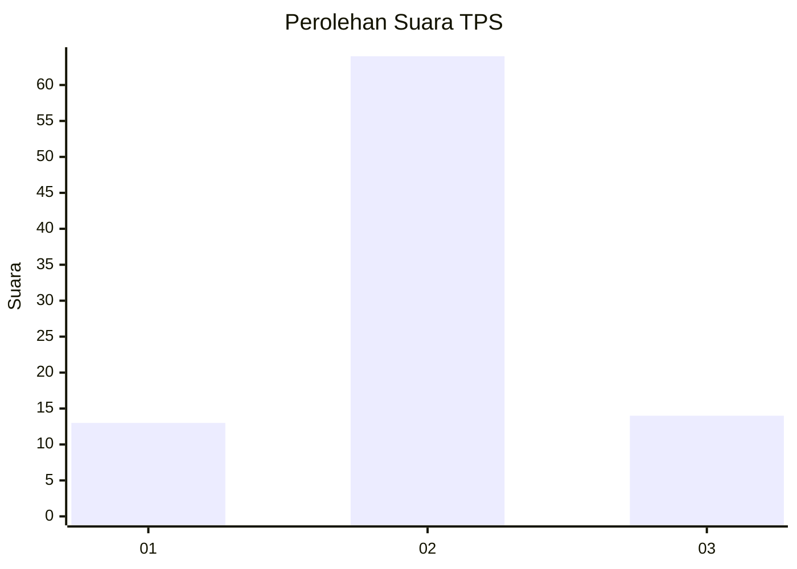
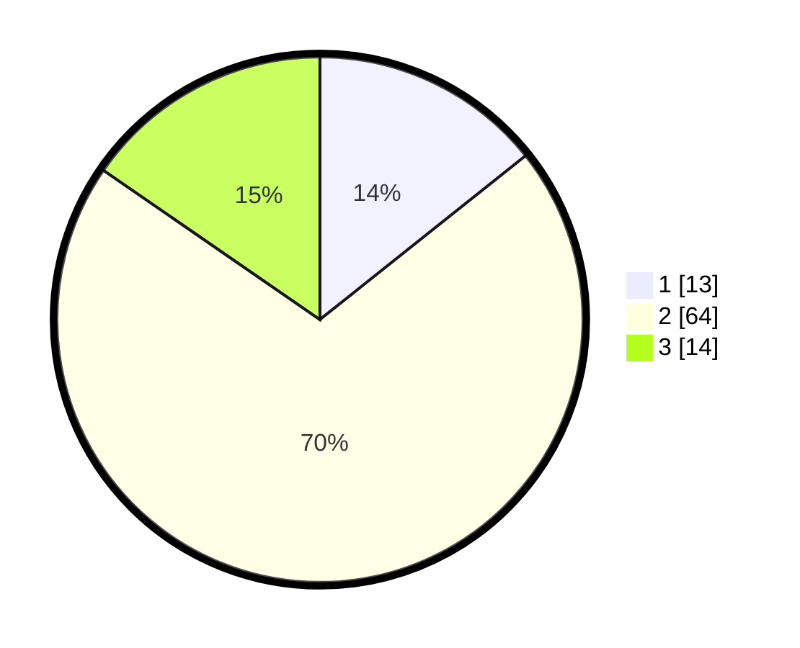

# Hasil

## Grafik

## Tabel

| No. | Nama Paslon    | Suara | Suara (raw) | Persentase |
|:--- |:-------------- | -----:| -----------:| ----------:|
| 1   | ANIES MUHAIMIN | 13    | [13][p-1]   | 14,29      |
| 2   | PRABOWO GIBRAN | 64    | [64][p-2]   | 70,33      |
| 3   | GANJAR MAHFUD  | 14    | [14][p-3]   | 15,38      |

[p-1]: https://github.com/gigit-pemilu/pemilu-2024/blob/main/pilpres/hitung-suara/sub/12-sumatera-utara/sub/03-tapanuli-selatan/sub/14-arse/sub/2038-dalihan-natolu/sub/001-tps/sub/paslon-1.txt
[p-2]: https://github.com/gigit-pemilu/pemilu-2024/blob/main/pilpres/hitung-suara/sub/12-sumatera-utara/sub/03-tapanuli-selatan/sub/14-arse/sub/2038-dalihan-natolu/sub/001-tps/sub/paslon-2.txt
[p-3]: https://github.com/gigit-pemilu/pemilu-2024/blob/main/pilpres/hitung-suara/sub/12-sumatera-utara/sub/03-tapanuli-selatan/sub/14-arse/sub/2038-dalihan-natolu/sub/001-tps/sub/paslon-3.txt

## Foto C Plano

https://sirekap-obj-formc.kpu.go.id/5c82/pemilu/ppwp/12/03/14/20/38/1203142038001-20240215-170753--cd478846-ec79-4462-af0e-ecd884587612.jpg

https://sirekap-obj-formc.kpu.go.id/5c82/pemilu/ppwp/12/03/14/20/38/1203142038001-20240215-171309--1345d71b-70b7-43bd-a27c-f1d4bc2863cb.jpg

https://sirekap-obj-formc.kpu.go.id/5c82/pemilu/ppwp/12/03/14/20/38/1203142038001-20240215-171743--e0714dfe-c0dc-4106-bd93-6b18cc4fb950.jpg

## Metadata

| Key        | Value               |
| ---------- | ------------------- |
| Time Stamp | 2024-02-22 11:00:00 |

