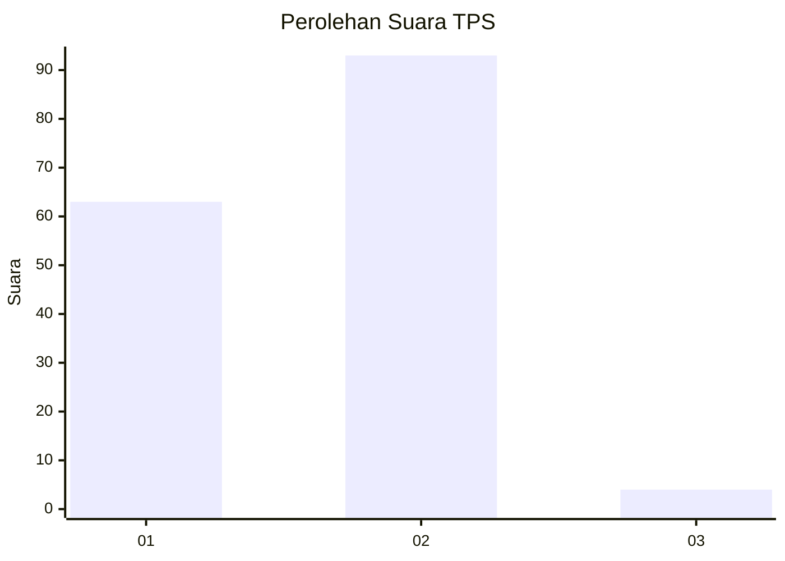
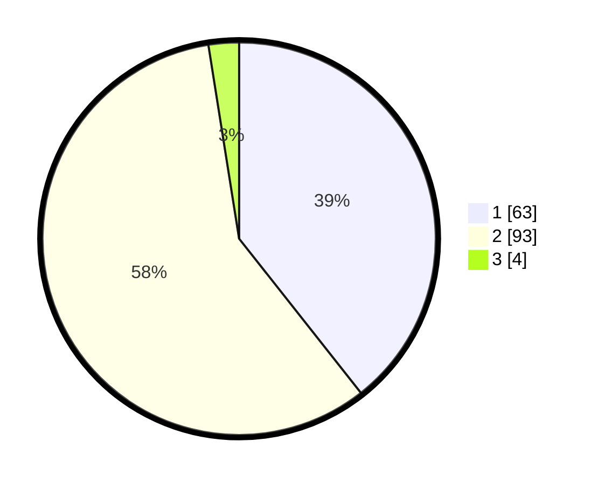

# Hasil

## Grafik

## Tabel

| No. | Nama Paslon    | Suara | Suara (raw) | Persentase |
|:--- |:-------------- | -----:| -----------:| ----------:|
| 1   | ANIES MUHAIMIN | 63    | [63][p-1]   | 39,38      |
| 2   | PRABOWO GIBRAN | 93    | [93][p-2]   | 58,13      |
| 3   | GANJAR MAHFUD  | 4     | [4][p-3]    | 2,50       |

[p-1]: https://github.com/gigit-pemilu/pemilu-2024/blob/main/pilpres/hitung-suara/sub/12-sumatera-utara/sub/03-tapanuli-selatan/sub/20-marancar/sub/1004-pasar-sempurna/sub/004-tps/sub/paslon-1.txt
[p-2]: https://github.com/gigit-pemilu/pemilu-2024/blob/main/pilpres/hitung-suara/sub/12-sumatera-utara/sub/03-tapanuli-selatan/sub/20-marancar/sub/1004-pasar-sempurna/sub/004-tps/sub/paslon-2.txt
[p-3]: https://github.com/gigit-pemilu/pemilu-2024/blob/main/pilpres/hitung-suara/sub/12-sumatera-utara/sub/03-tapanuli-selatan/sub/20-marancar/sub/1004-pasar-sempurna/sub/004-tps/sub/paslon-3.txt

## Foto C Plano

https://sirekap-obj-formc.kpu.go.id/6a0d/pemilu/ppwp/12/03/20/10/04/1203201004004-20240215-184517--2497d21d-a229-4d4b-82ad-7c90383837e9.jpg

https://sirekap-obj-formc.kpu.go.id/6a0d/pemilu/ppwp/12/03/20/10/04/1203201004004-20240215-025300--441f3111-03e0-4138-9c1c-8b5cf903204e.jpg

https://sirekap-obj-formc.kpu.go.id/6a0d/pemilu/ppwp/12/03/20/10/04/1203201004004-20240215-025430--8e479ae2-eb1c-4276-8000-9ce406212aca.jpg

## Metadata

| Key        | Value               |
| ---------- | ------------------- |
| Time Stamp | 2024-02-24 22:31:28 |

