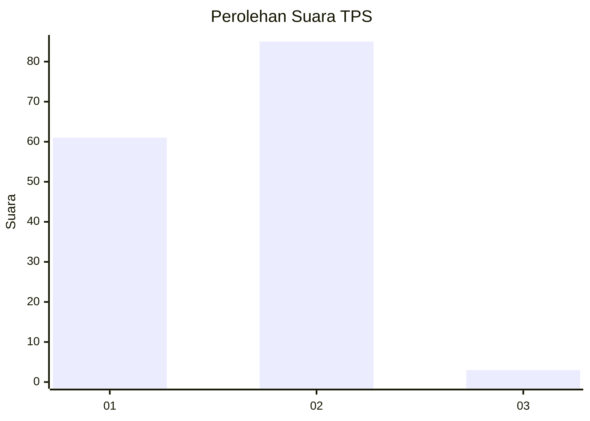
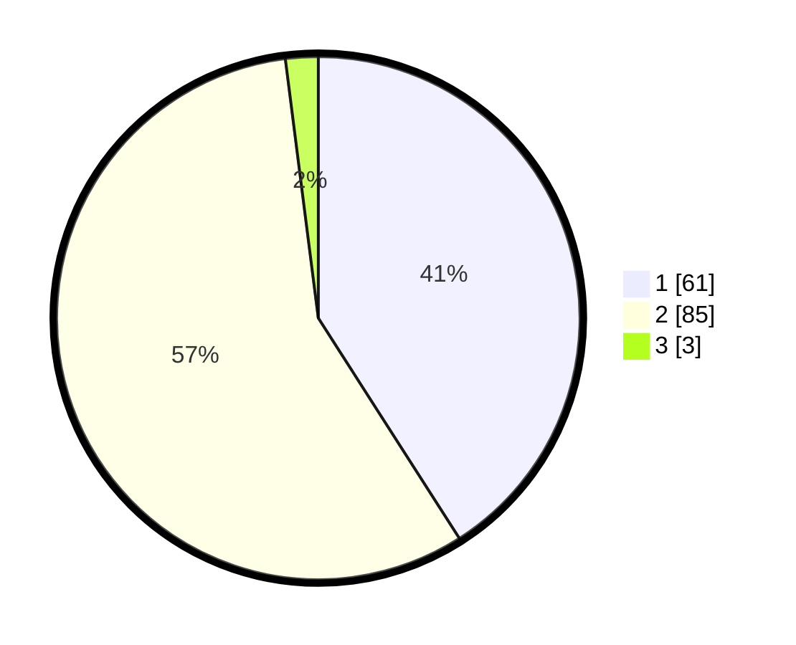

# Hasil

## Grafik

## Tabel

| No. | Nama Paslon    | Suara | Suara (raw) | Persentase |
|:--- |:-------------- | -----:| -----------:| ----------:|
| 1   | ANIES MUHAIMIN | 61    | [61][p-1]   | 40,94      |
| 2   | PRABOWO GIBRAN | 85    | [85][p-2]   | 57,05      |
| 3   | GANJAR MAHFUD  | 3     | [3][p-3]    | 2,01       |

[p-1]: https://github.com/gigit-pemilu/pemilu-2024/blob/main/pilpres/hitung-suara/sub/12-sumatera-utara/sub/03-tapanuli-selatan/sub/20-marancar/sub/1004-pasar-sempurna/sub/007-tps/sub/paslon-1.txt
[p-2]: https://github.com/gigit-pemilu/pemilu-2024/blob/main/pilpres/hitung-suara/sub/12-sumatera-utara/sub/03-tapanuli-selatan/sub/20-marancar/sub/1004-pasar-sempurna/sub/007-tps/sub/paslon-2.txt
[p-3]: https://github.com/gigit-pemilu/pemilu-2024/blob/main/pilpres/hitung-suara/sub/12-sumatera-utara/sub/03-tapanuli-selatan/sub/20-marancar/sub/1004-pasar-sempurna/sub/007-tps/sub/paslon-3.txt

## Foto C Plano

https://sirekap-obj-formc.kpu.go.id/5e81/pemilu/ppwp/12/03/20/10/04/1203201004007-20240215-003114--9cbdb6e8-8386-44af-89dc-3ab8b1e156c4.jpg

https://sirekap-obj-formc.kpu.go.id/5e81/pemilu/ppwp/12/03/20/10/04/1203201004007-20240215-003203--67f07d16-631c-41bd-b2cc-a76201f2e662.jpg

https://sirekap-obj-formc.kpu.go.id/5e81/pemilu/ppwp/12/03/20/10/04/1203201004007-20240215-003407--c459f342-7b0f-41c5-b4cf-0314967fa5f5.jpg

## Metadata

| Key        | Value               |
| ---------- | ------------------- |
| Time Stamp | 2024-02-21 14:00:00 |

## DATA PEMILIH TETAP

Jumlah pemilih dalam DPT: **683**.
 * L: **873**.
 * P: **436**.

## DATA PENGGUNA HAK PILIH

Jumlah pengguna hak pilih dalam DPT: **52**.
 * L: **853**.
 * P: **834**.

Jumlah pengguna hak pilih dalam DPTb: **84**.
 * L: **888**.
 * P: **888**.

Jumlah pengguna hak pilih dalam DPK: **4**.
 * L: **884**.
 * P: **808**.

Jumlah pengguna hak pilih: **652**.
 * L: **809**.
 * P: **834**.

## JUMLAH SUARA SAH DAN TIDAK SAH

JUMLAH SELURUH SUARA SAH: **149**.

JUMLAH SUARA TIDAK SAH: **4**.

JUMLAH SELURUH SUARA SAH DAN SUARA TIDAK SAH: **153**.

