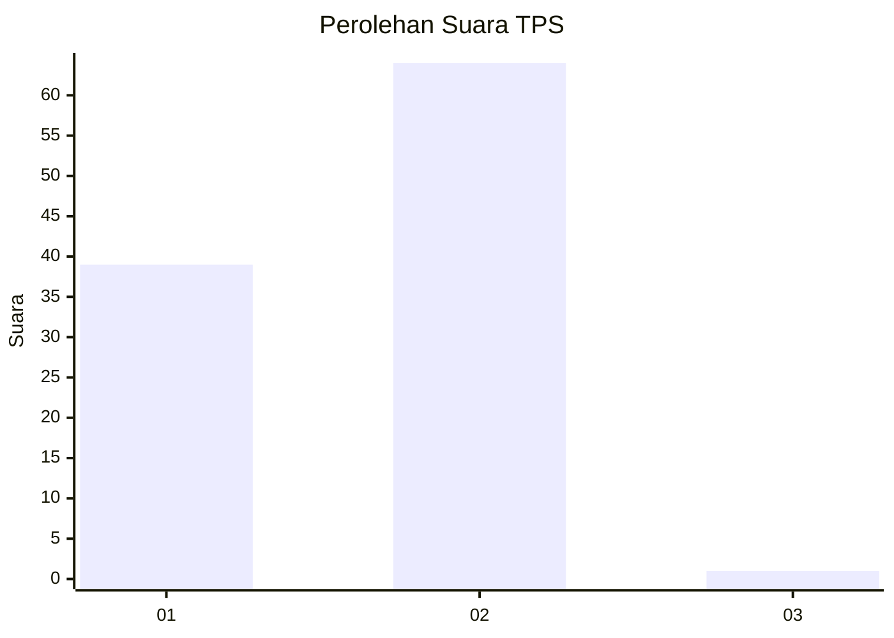
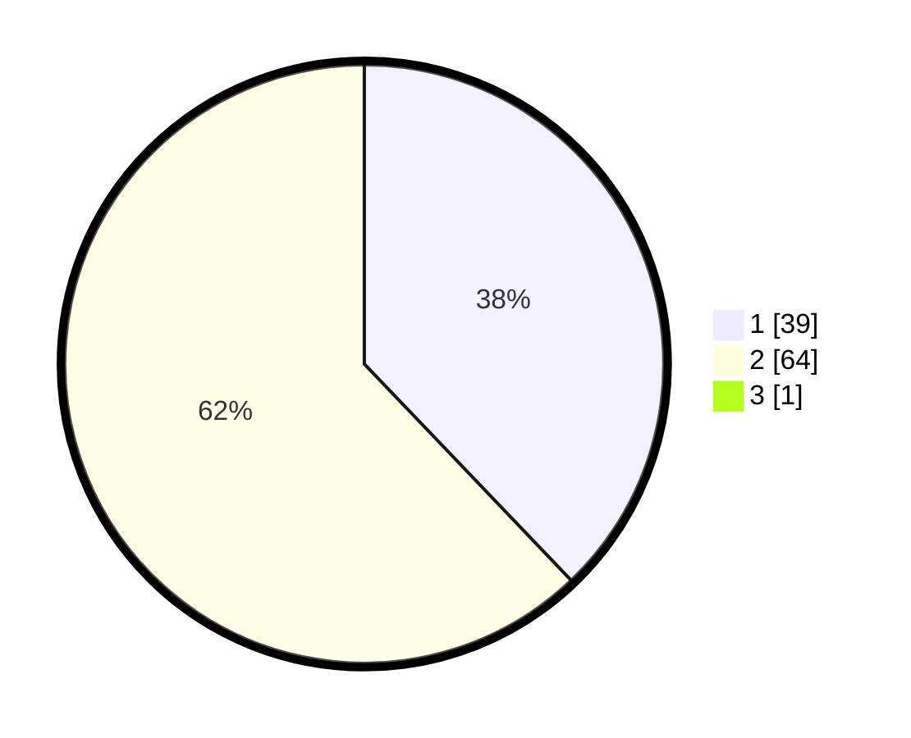

# Hasil

## Grafik

## Tabel

| No. | Nama Paslon    | Suara | Suara (raw) | Persentase |
|:--- |:-------------- | -----:| -----------:| ----------:|
| 1   | ANIES MUHAIMIN | 39    | [39][p-1]   | 37,50      |
| 2   | PRABOWO GIBRAN | 64    | [64][p-2]   | 61,54      |
| 3   | GANJAR MAHFUD  | 1     | [1][p-3]    | 0,96       |

[p-1]: https://github.com/gigit-pemilu/pemilu-2024/blob/main/pilpres/hitung-suara/sub/12-sumatera-utara/sub/03-tapanuli-selatan/sub/20-marancar/sub/2014-gunung-binanga/sub/001-tps/sub/paslon-1.txt
[p-2]: https://github.com/gigit-pemilu/pemilu-2024/blob/main/pilpres/hitung-suara/sub/12-sumatera-utara/sub/03-tapanuli-selatan/sub/20-marancar/sub/2014-gunung-binanga/sub/001-tps/sub/paslon-2.txt
[p-3]: https://github.com/gigit-pemilu/pemilu-2024/blob/main/pilpres/hitung-suara/sub/12-sumatera-utara/sub/03-tapanuli-selatan/sub/20-marancar/sub/2014-gunung-binanga/sub/001-tps/sub/paslon-3.txt

## Foto C Plano

https://sirekap-obj-formc.kpu.go.id/45ea/pemilu/ppwp/12/03/20/20/14/1203202014001-20240214-222309--c24990e8-f350-4ac4-ae7d-6c6c088204e1.jpg

https://sirekap-obj-formc.kpu.go.id/45ea/pemilu/ppwp/12/03/20/20/14/1203202014001-20240214-222529--fc5c705f-0bfe-4362-98df-03e30108fb82.jpg

https://sirekap-obj-formc.kpu.go.id/45ea/pemilu/ppwp/12/03/20/20/14/1203202014001-20240214-222813--8d0347c2-1f3b-43d0-9ff4-b5f62a9c0649.jpg

## Metadata

| Key        | Value               |
| ---------- | ------------------- |
| Time Stamp | 2024-02-24 22:31:28 |

