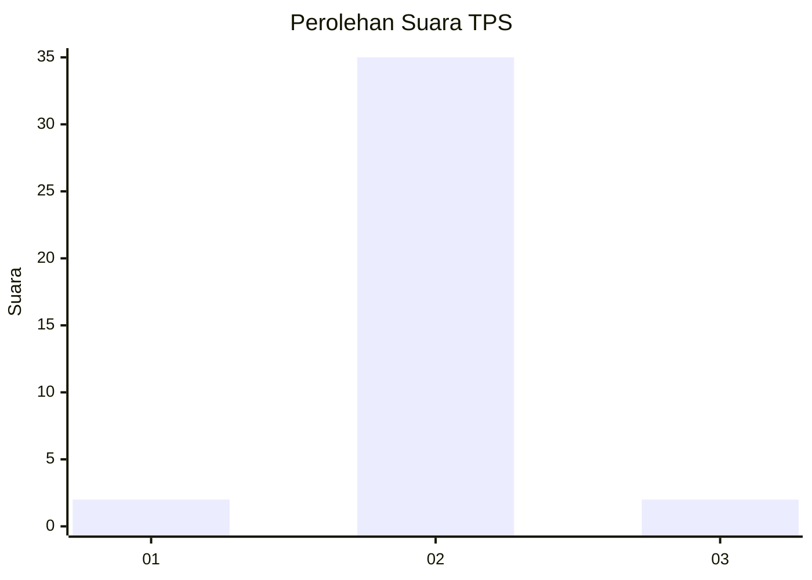
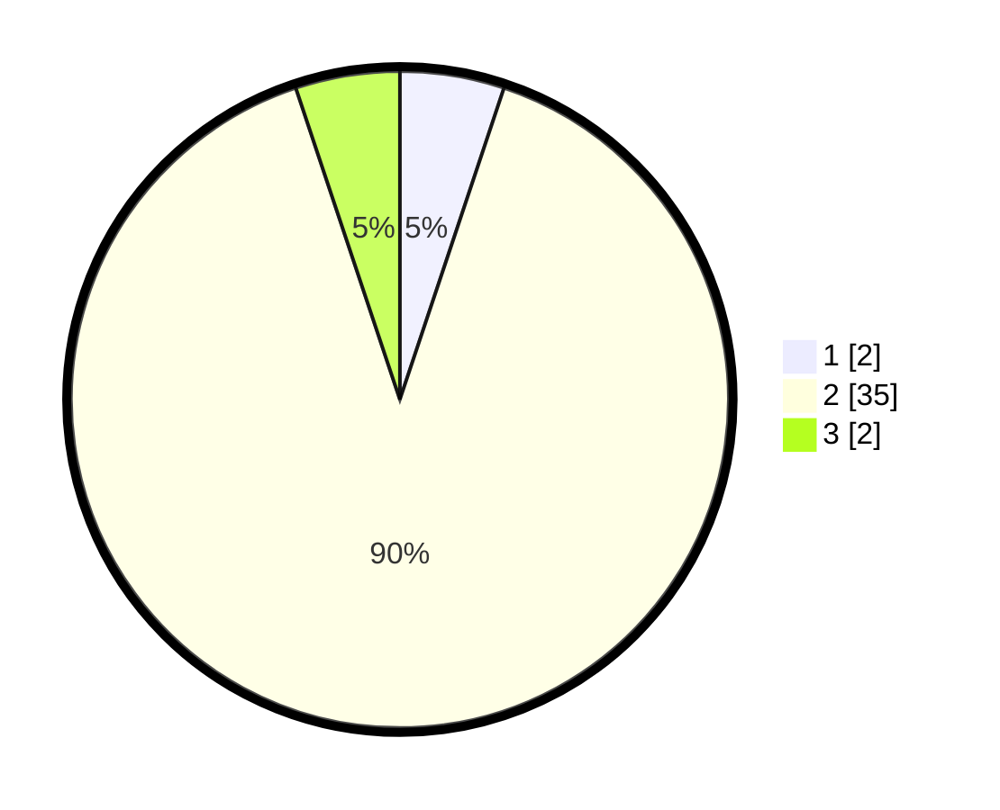

# Hasil

## Grafik

## Tabel

| No. | Nama Paslon    | Suara | Suara (raw) | Persentase |
|:--- |:-------------- | -----:| -----------:| ----------:|
| 1   | ANIES MUHAIMIN | 2     | [2][p-1]    | 5,13       |
| 2   | PRABOWO GIBRAN | 35    | [35][p-2]   | 89,74      |
| 3   | GANJAR MAHFUD  | 2     | [2][p-3]    | 5,13       |

[p-1]: https://github.com/gigit-pemilu/pemilu-2024-12-sumatera-utara/blob/main/pilpres/hitung-suara/sub/12-sumatera-utara/sub/03-tapanuli-selatan/sub/20-marancar/sub/2014-gunung-binanga/sub/004-tps/sub/paslon-1.txt
[p-2]: https://github.com/gigit-pemilu/pemilu-2024-12-sumatera-utara/blob/main/pilpres/hitung-suara/sub/12-sumatera-utara/sub/03-tapanuli-selatan/sub/20-marancar/sub/2014-gunung-binanga/sub/004-tps/sub/paslon-2.txt
[p-3]: https://github.com/gigit-pemilu/pemilu-2024-12-sumatera-utara/blob/main/pilpres/hitung-suara/sub/12-sumatera-utara/sub/03-tapanuli-selatan/sub/20-marancar/sub/2014-gunung-binanga/sub/004-tps/sub/paslon-3.txt

## Foto C Plano

https://sirekap-obj-formc.kpu.go.id/935f/pemilu/ppwp/12/03/20/20/14/1203202014004-20240215-142609--54cec292-094b-4852-b132-296b18cbad07.jpg

https://sirekap-obj-formc.kpu.go.id/935f/pemilu/ppwp/12/03/20/20/14/1203202014004-20240215-094152--03d72243-848a-49df-aacb-b7dd276c416d.jpg

https://sirekap-obj-formc.kpu.go.id/935f/pemilu/ppwp/12/03/20/20/14/1203202014004-20240215-142736--1f9a8c7f-0466-4e77-b4e0-d939b3dfc8df.jpg

## Metadata

| Key        | Value               |
| ---------- | ------------------- |
| Time Stamp | 2024-02-24 22:31:28 |

