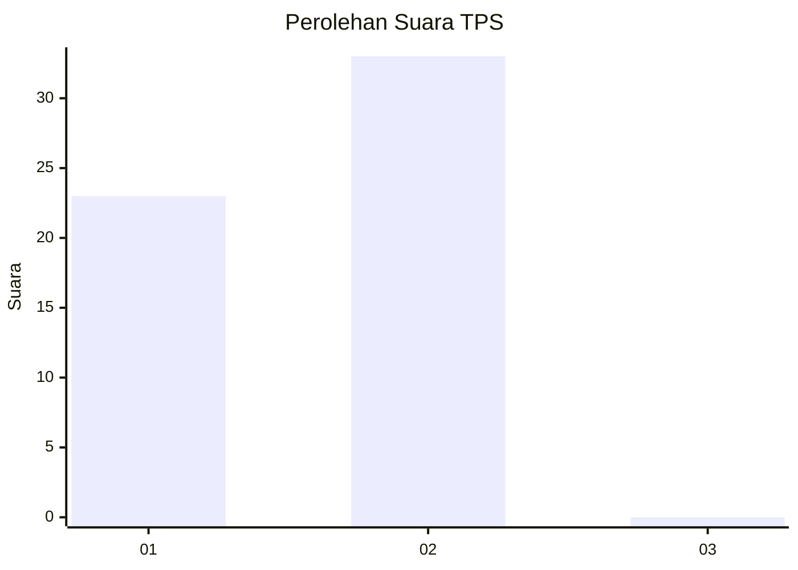
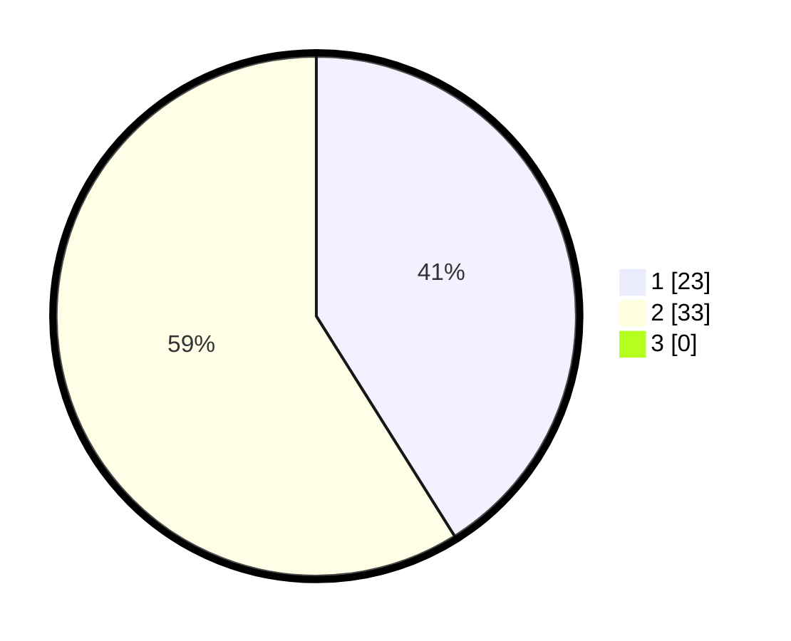

# Hasil

## Grafik

## Tabel

| No. | Nama Paslon    | Suara | Suara (raw) | Persentase |
|:--- |:-------------- | -----:| -----------:| ----------:|
| 1   | ANIES MUHAIMIN | 23    | [23][p-1]   | 41,07      |
| 2   | PRABOWO GIBRAN | 33    | [33][p-2]   | 58,93      |
| 3   | GANJAR MAHFUD  | 0     | [0][p-3]    | 0,00       |

[p-1]: https://github.com/gigit-pemilu/pemilu-2024/blob/main/pilpres/hitung-suara/sub/12-sumatera-utara/sub/03-tapanuli-selatan/sub/20-marancar/sub/2035-aek-sabaon/sub/001-tps/sub/paslon-1.txt
[p-2]: https://github.com/gigit-pemilu/pemilu-2024/blob/main/pilpres/hitung-suara/sub/12-sumatera-utara/sub/03-tapanuli-selatan/sub/20-marancar/sub/2035-aek-sabaon/sub/001-tps/sub/paslon-2.txt
[p-3]: https://github.com/gigit-pemilu/pemilu-2024/blob/main/pilpres/hitung-suara/sub/12-sumatera-utara/sub/03-tapanuli-selatan/sub/20-marancar/sub/2035-aek-sabaon/sub/001-tps/sub/paslon-3.txt

## Foto C Plano

https://sirekap-obj-formc.kpu.go.id/8d01/pemilu/ppwp/12/03/20/20/35/1203202035001-20240215-001751--322591e3-59f5-4886-9abd-15dc30d54de3.jpg

https://sirekap-obj-formc.kpu.go.id/8d01/pemilu/ppwp/12/03/20/20/35/1203202035001-20240214-205738--fce9a88f-54f4-4515-acb9-cc8464555bae.jpg

https://sirekap-obj-formc.kpu.go.id/8d01/pemilu/ppwp/12/03/20/20/35/1203202035001-20240214-210623--c44172b5-a673-44e6-9638-70b8bc2dd558.jpg

## Metadata

| Key        | Value               |
| ---------- | ------------------- |
| Time Stamp | 2024-02-21 14:00:00 |

