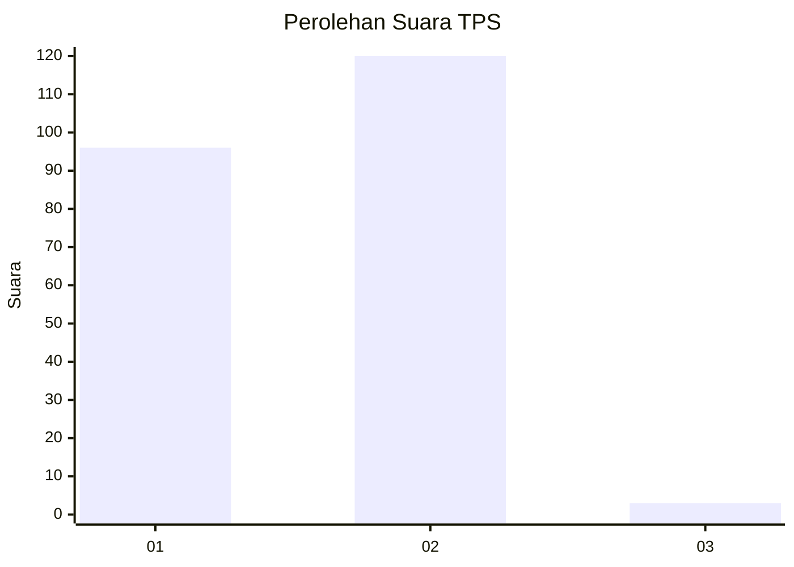
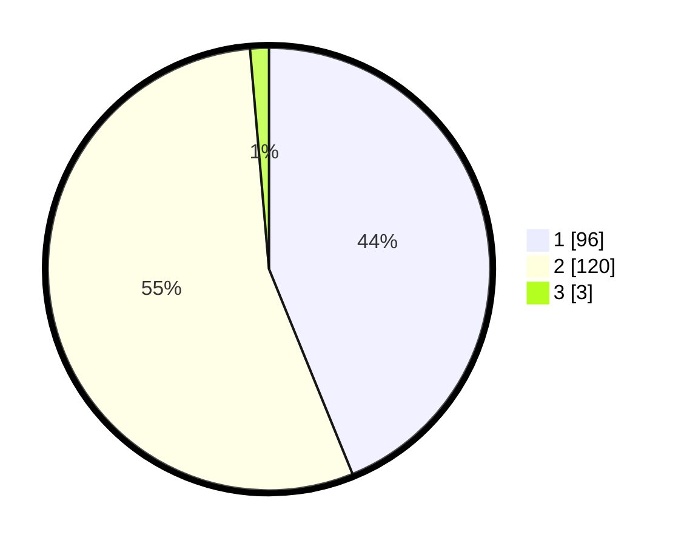

# Hasil

## Grafik

## Tabel

| No. | Nama Paslon    | Suara | Suara (raw) | Persentase |
|:--- |:-------------- | -----:| -----------:| ----------:|
| 1   | ANIES MUHAIMIN | 96    | [96][p-1]   | 43,84      |
| 2   | PRABOWO GIBRAN | 120   | [120][p-2]  | 54,79      |
| 3   | GANJAR MAHFUD  | 3     | [3][p-3]    | 1,37       |

[p-1]: https://github.com/gigit-pemilu/pemilu-2024-12-sumatera-utara/blob/main/pilpres/hitung-suara/sub/12-sumatera-utara/sub/03-tapanuli-selatan/sub/29-muara-batang-toru/sub/1002-hutaraja/sub/004-tps/sub/paslon-1.txt
[p-2]: https://github.com/gigit-pemilu/pemilu-2024-12-sumatera-utara/blob/main/pilpres/hitung-suara/sub/12-sumatera-utara/sub/03-tapanuli-selatan/sub/29-muara-batang-toru/sub/1002-hutaraja/sub/004-tps/sub/paslon-2.txt
[p-3]: https://github.com/gigit-pemilu/pemilu-2024-12-sumatera-utara/blob/main/pilpres/hitung-suara/sub/12-sumatera-utara/sub/03-tapanuli-selatan/sub/29-muara-batang-toru/sub/1002-hutaraja/sub/004-tps/sub/paslon-3.txt

## Foto C Plano

https://sirekap-obj-formc.kpu.go.id/ef42/pemilu/ppwp/12/03/29/10/02/1203291002004-20240216-162044--3c681731-c0fe-4957-82e1-c2d8fb2e02bc.jpg

https://sirekap-obj-formc.kpu.go.id/ef42/pemilu/ppwp/12/03/29/10/02/1203291002004-20240216-162207--2719e547-2d72-48cb-9a6a-fa24d893a0ef.jpg

https://sirekap-obj-formc.kpu.go.id/ef42/pemilu/ppwp/12/03/29/10/02/1203291002004-20240216-162333--a9b855ff-896f-4471-a2ad-b6227ac0b26d.jpg

## Metadata

| Key        | Value               |
| ---------- | ------------------- |
| Time Stamp | 2024-02-25 18:00:00 |

