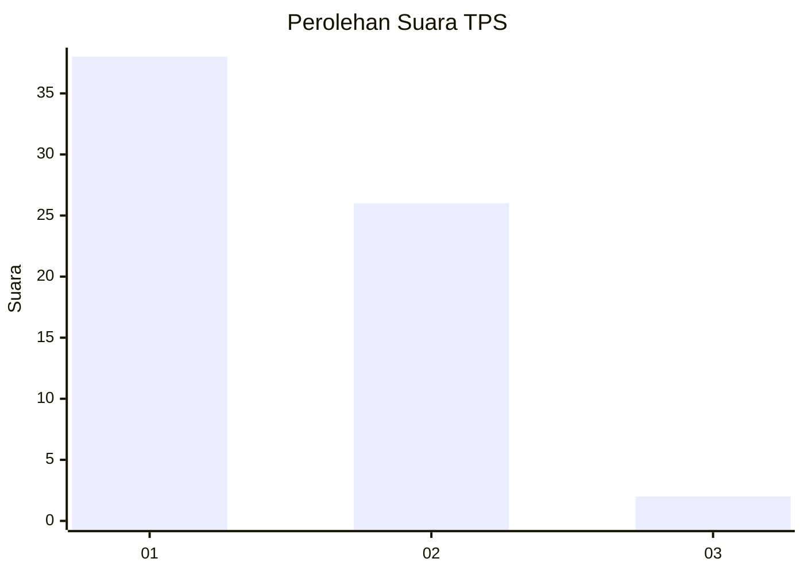
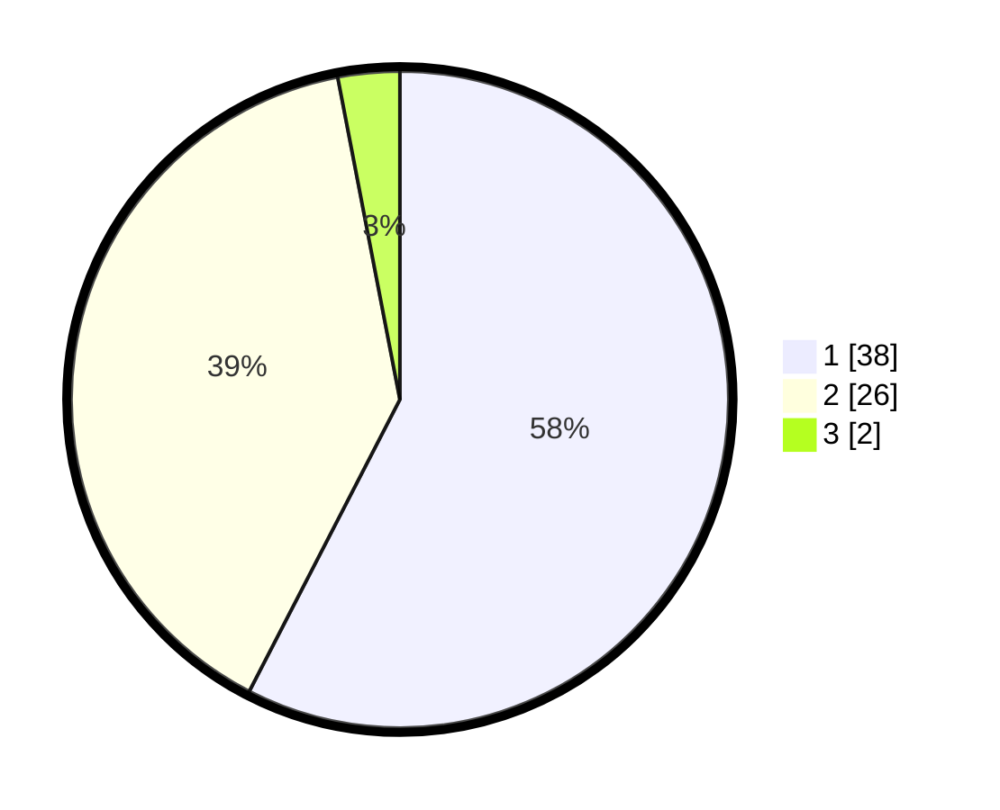

# Hasil

## Grafik

## Tabel

| No. | Nama Paslon    | Suara | Suara (raw) | Persentase |
|:--- |:-------------- | -----:| -----------:| ----------:|
| 1   | ANIES MUHAIMIN | 38    | [38][p-1]   | 57,58      |
| 2   | PRABOWO GIBRAN | 26    | [26][p-2]   | 39,39      |
| 3   | GANJAR MAHFUD  | 2     | [2][p-3]    | 3,03       |

[p-1]: https://github.com/gigit-pemilu/pemilu-2024/blob/main/pilpres/hitung-suara/sub/12-sumatera-utara/sub/03-tapanuli-selatan/sub/29-muara-batang-toru/sub/1002-hutaraja/sub/006-tps/sub/paslon-1.txt
[p-2]: https://github.com/gigit-pemilu/pemilu-2024/blob/main/pilpres/hitung-suara/sub/12-sumatera-utara/sub/03-tapanuli-selatan/sub/29-muara-batang-toru/sub/1002-hutaraja/sub/006-tps/sub/paslon-2.txt
[p-3]: https://github.com/gigit-pemilu/pemilu-2024/blob/main/pilpres/hitung-suara/sub/12-sumatera-utara/sub/03-tapanuli-selatan/sub/29-muara-batang-toru/sub/1002-hutaraja/sub/006-tps/sub/paslon-3.txt

## Foto C Plano

https://sirekap-obj-formc.kpu.go.id/3db8/pemilu/ppwp/12/03/29/10/02/1203291002006-20240216-213122--238048ed-4f08-4f18-bcc8-fc5884b98db0.jpg

https://sirekap-obj-formc.kpu.go.id/3db8/pemilu/ppwp/12/03/29/10/02/1203291002006-20240216-213514--74fb875c-d367-48f5-b41f-e754786188aa.jpg

https://sirekap-obj-formc.kpu.go.id/3db8/pemilu/ppwp/12/03/29/10/02/1203291002006-20240216-213735--7780b15b-1f7b-4aa8-a577-38db4c70e86b.jpg

## Metadata

| Key        | Value               |
| ---------- | ------------------- |
| Time Stamp | 2024-02-22 00:00:00 |

## DATA PEMILIH TETAP

Jumlah pemilih dalam DPT: **72**.
 * L: **33**.
 * P: **39**.

## DATA PENGGUNA HAK PILIH

Jumlah pengguna hak pilih dalam DPT: **64**.
 * L: **29**.
 * P: **35**.

Jumlah pengguna hak pilih dalam DPTb: **2**.
 * L: **2**.
 * P: **0**.

Jumlah pengguna hak pilih dalam DPK: **3**.
 * L: **3**.
 * P: **0**.

Jumlah pengguna hak pilih: **69**.
 * L: **34**.
 * P: **35**.

## JUMLAH SUARA SAH DAN TIDAK SAH

JUMLAH SELURUH SUARA SAH: **66**.

JUMLAH SUARA TIDAK SAH: **3**.

JUMLAH SELURUH SUARA SAH DAN SUARA TIDAK SAH: **69**.

