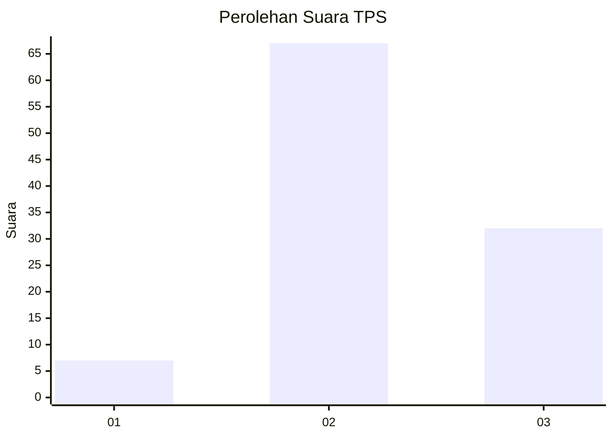
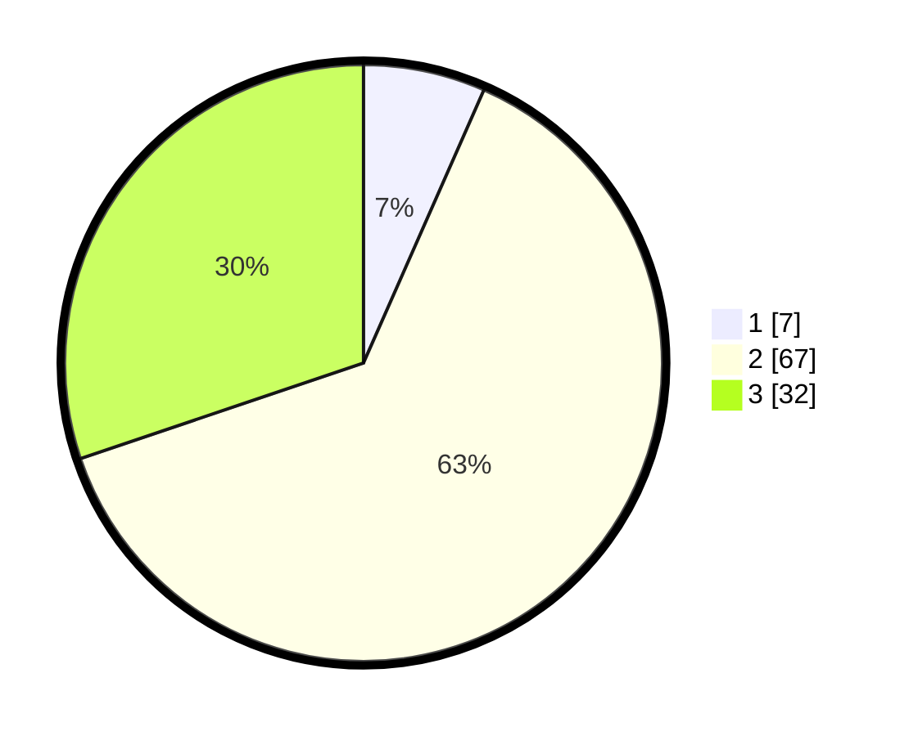

# Hasil

## Grafik

## Tabel

| No. | Nama Paslon    | Suara | Suara (raw) | Persentase |
|:--- |:-------------- | -----:| -----------:| ----------:|
| 1   | ANIES MUHAIMIN | 7     | [7][p-1]    | 6,60       |
| 2   | PRABOWO GIBRAN | 67    | [67][p-2]   | 63,21      |
| 3   | GANJAR MAHFUD  | 32    | [32][p-3]   | 30,19      |

[p-1]: https://github.com/gigit-pemilu/pemilu-2024-12-sumatera-utara/blob/main/pilpres/hitung-suara/sub/12-sumatera-utara/sub/03-tapanuli-selatan/sub/30-tano-tombangan-angkola/sub/1001-panabari-hutatonga/sub/006-tps/sub/paslon-1.txt
[p-2]: https://github.com/gigit-pemilu/pemilu-2024-12-sumatera-utara/blob/main/pilpres/hitung-suara/sub/12-sumatera-utara/sub/03-tapanuli-selatan/sub/30-tano-tombangan-angkola/sub/1001-panabari-hutatonga/sub/006-tps/sub/paslon-2.txt
[p-3]: https://github.com/gigit-pemilu/pemilu-2024-12-sumatera-utara/blob/main/pilpres/hitung-suara/sub/12-sumatera-utara/sub/03-tapanuli-selatan/sub/30-tano-tombangan-angkola/sub/1001-panabari-hutatonga/sub/006-tps/sub/paslon-3.txt

## Foto C Plano

https://sirekap-obj-formc.kpu.go.id/13d3/pemilu/ppwp/12/03/30/10/01/1203301001006-20240218-213836--6dcc6e6e-c783-4edc-b702-fb7479d151a8.jpg

https://sirekap-obj-formc.kpu.go.id/13d3/pemilu/ppwp/12/03/30/10/01/1203301001006-20240218-231017--fc6ed148-7322-4a21-8716-82dbaefd6860.jpg

https://sirekap-obj-formc.kpu.go.id/13d3/pemilu/ppwp/12/03/30/10/01/1203301001006-20240218-224750--198c4ac7-a7aa-41e6-9335-df3edfe1d1af.jpg

## Metadata

| Key        | Value               |
| ---------- | ------------------- |
| Time Stamp | 2024-02-24 22:31:28 |

