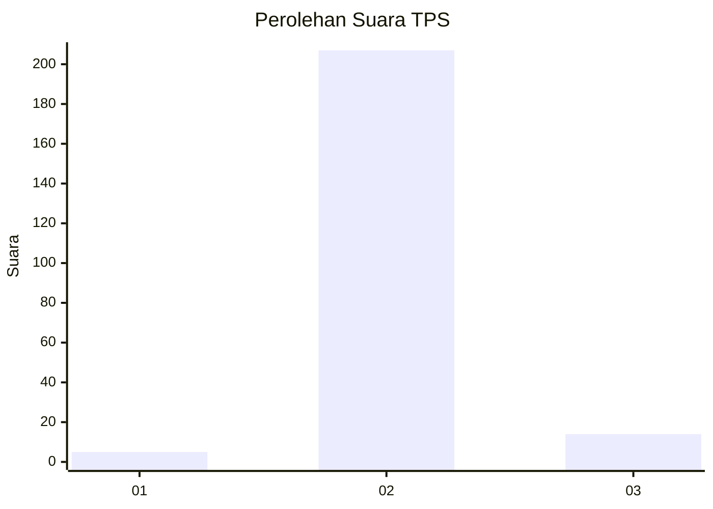
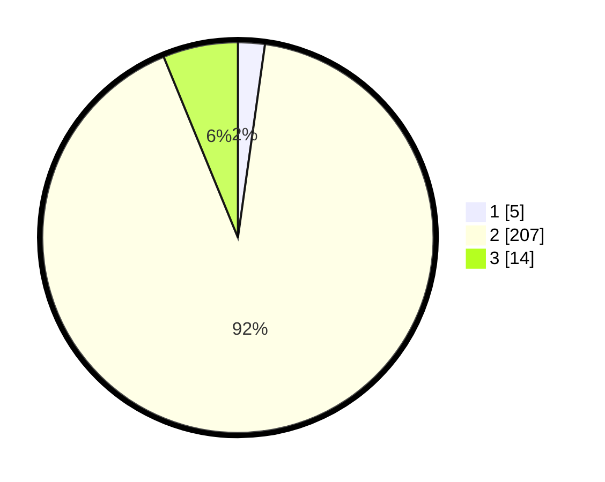

# Hasil

## Grafik

## Tabel

| No. | Nama Paslon    | Suara | Suara (raw) | Persentase |
|:--- |:-------------- | -----:| -----------:| ----------:|
| 1   | ANIES MUHAIMIN | 5     | [5][p-1]    | 2,21       |
| 2   | PRABOWO GIBRAN | 207   | [207][p-2]  | 91,59      |
| 3   | GANJAR MAHFUD  | 14    | [14][p-3]   | 6,19       |

[p-1]: https://github.com/gigit-pemilu/pemilu-2024/blob/main/pilpres/hitung-suara/sub/12-sumatera-utara/sub/03-tapanuli-selatan/sub/30-tano-tombangan-angkola/sub/2013-simaninggir-tano-tombangan/sub/001-tps/sub/paslon-1.txt
[p-2]: https://github.com/gigit-pemilu/pemilu-2024/blob/main/pilpres/hitung-suara/sub/12-sumatera-utara/sub/03-tapanuli-selatan/sub/30-tano-tombangan-angkola/sub/2013-simaninggir-tano-tombangan/sub/001-tps/sub/paslon-2.txt
[p-3]: https://github.com/gigit-pemilu/pemilu-2024/blob/main/pilpres/hitung-suara/sub/12-sumatera-utara/sub/03-tapanuli-selatan/sub/30-tano-tombangan-angkola/sub/2013-simaninggir-tano-tombangan/sub/001-tps/sub/paslon-3.txt

## Foto C Plano

https://sirekap-obj-formc.kpu.go.id/4c30/pemilu/ppwp/12/03/30/20/13/1203302013001-20240220-094341--1c1fc5f1-e570-4584-8d3a-7a5e941d1180.jpg

https://sirekap-obj-formc.kpu.go.id/4c30/pemilu/ppwp/12/03/30/20/13/1203302013001-20240220-094616--ff2c4601-7408-4130-ae27-ff24b97fb7aa.jpg

https://sirekap-obj-formc.kpu.go.id/4c30/pemilu/ppwp/12/03/30/20/13/1203302013001-20240220-094829--bbc7fbf9-d1e2-4bb9-b39c-31ab1530bd09.jpg

## Metadata

| Key        | Value               |
| ---------- | ------------------- |
| Time Stamp | 2024-02-24 22:31:28 |

