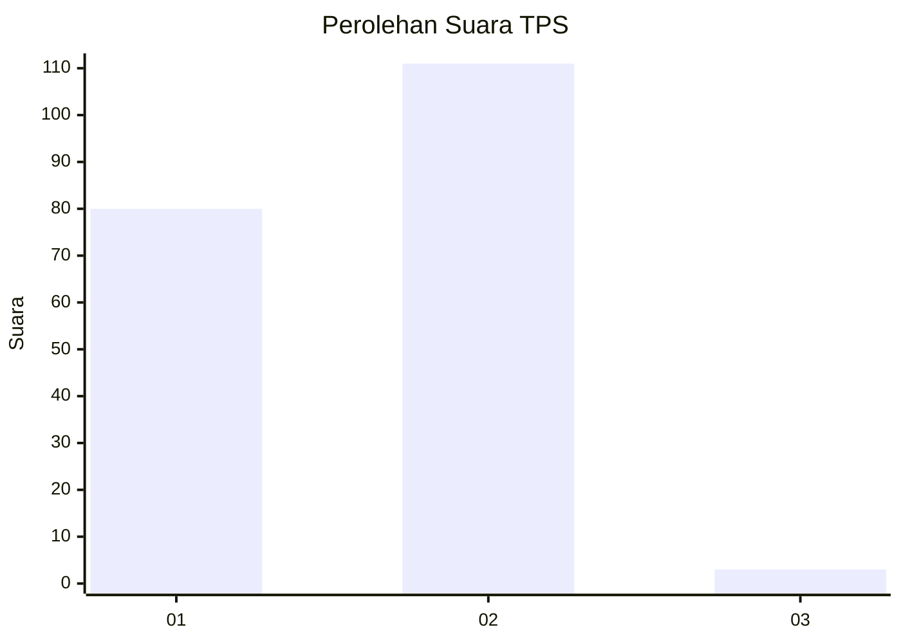
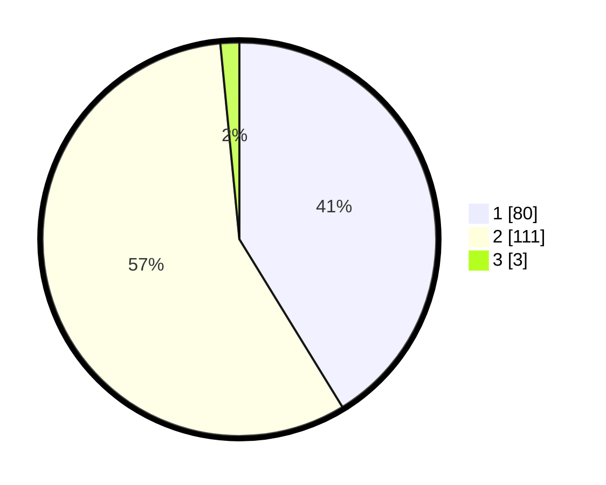

# Hasil

## Grafik

## Tabel

| No. | Nama Paslon    | Suara | Suara (raw) | Persentase |
|:--- |:-------------- | -----:| -----------:| ----------:|
| 1   | ANIES MUHAIMIN | 80    | [80][p-1]   | 41,24      |
| 2   | PRABOWO GIBRAN | 111   | [111][p-2]  | 57,22      |
| 3   | GANJAR MAHFUD  | 3     | [3][p-3]    | 1,55       |

[p-1]: https://github.com/gigit-pemilu/pemilu-2024-12-sumatera-utara/blob/main/pilpres/hitung-suara/sub/12-sumatera-utara/sub/03-tapanuli-selatan/sub/31-angkola-sangkunur/sub/1001-sangkunur/sub/002-tps/sub/paslon-1.txt
[p-2]: https://github.com/gigit-pemilu/pemilu-2024-12-sumatera-utara/blob/main/pilpres/hitung-suara/sub/12-sumatera-utara/sub/03-tapanuli-selatan/sub/31-angkola-sangkunur/sub/1001-sangkunur/sub/002-tps/sub/paslon-2.txt
[p-3]: https://github.com/gigit-pemilu/pemilu-2024-12-sumatera-utara/blob/main/pilpres/hitung-suara/sub/12-sumatera-utara/sub/03-tapanuli-selatan/sub/31-angkola-sangkunur/sub/1001-sangkunur/sub/002-tps/sub/paslon-3.txt

## Foto C Plano

https://sirekap-obj-formc.kpu.go.id/1fc6/pemilu/ppwp/12/03/31/10/01/1203311001002-20240215-093203--1207d878-3f3a-4ba2-b684-8a2d3affc9b9.jpg

https://sirekap-obj-formc.kpu.go.id/1fc6/pemilu/ppwp/12/03/31/10/01/1203311001002-20240215-112426--babc3d24-a0fa-439a-b149-f7bcccd16364.jpg

https://sirekap-obj-formc.kpu.go.id/1fc6/pemilu/ppwp/12/03/31/10/01/1203311001002-20240215-100553--0fabc254-217f-4750-8371-b338cab45f3d.jpg

## Metadata

| Key        | Value               |
| ---------- | ------------------- |
| Time Stamp | 2024-02-24 22:31:28 |

