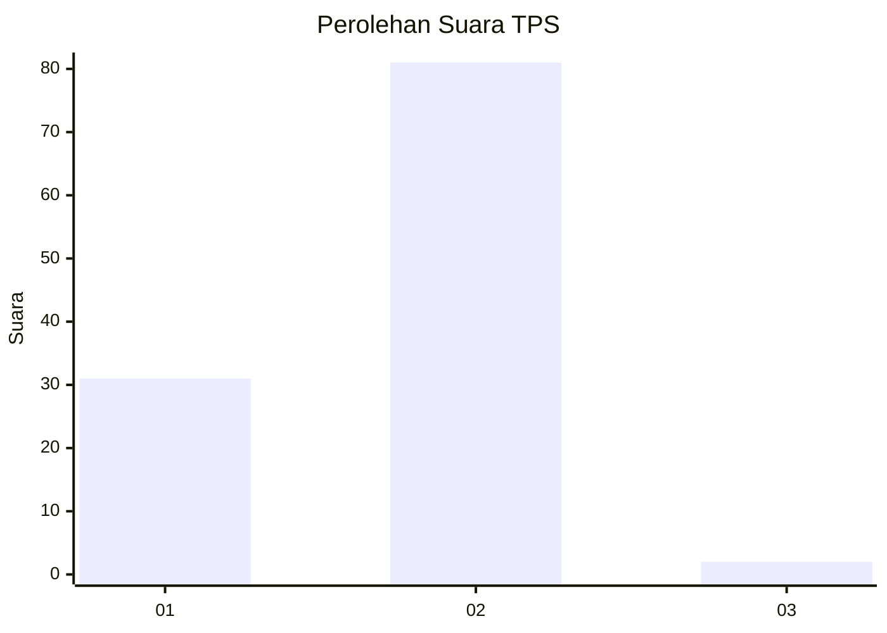
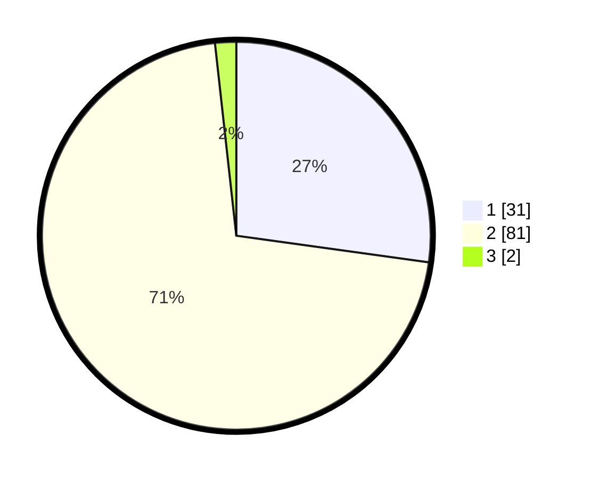

# Hasil

## Grafik

## Tabel

| No. | Nama Paslon    | Suara | Suara (raw) | Persentase |
|:--- |:-------------- | -----:| -----------:| ----------:|
| 1   | ANIES MUHAIMIN | 31    | [31][p-1]   | 27,19      |
| 2   | PRABOWO GIBRAN | 81    | [81][p-2]   | 71,05      |
| 3   | GANJAR MAHFUD  | 2     | [2][p-3]    | 1,75       |

[p-1]: https://github.com/gigit-pemilu/pemilu-2024-12-sumatera-utara/blob/main/pilpres/hitung-suara/sub/12-sumatera-utara/sub/03-tapanuli-selatan/sub/31-angkola-sangkunur/sub/1001-sangkunur/sub/004-tps/sub/paslon-1.txt
[p-2]: https://github.com/gigit-pemilu/pemilu-2024-12-sumatera-utara/blob/main/pilpres/hitung-suara/sub/12-sumatera-utara/sub/03-tapanuli-selatan/sub/31-angkola-sangkunur/sub/1001-sangkunur/sub/004-tps/sub/paslon-2.txt
[p-3]: https://github.com/gigit-pemilu/pemilu-2024-12-sumatera-utara/blob/main/pilpres/hitung-suara/sub/12-sumatera-utara/sub/03-tapanuli-selatan/sub/31-angkola-sangkunur/sub/1001-sangkunur/sub/004-tps/sub/paslon-3.txt

## Foto C Plano

https://sirekap-obj-formc.kpu.go.id/1edc/pemilu/ppwp/12/03/31/10/01/1203311001004-20240215-092547--cb217b1b-1330-4810-91d1-9be83ffe7eef.jpg

https://sirekap-obj-formc.kpu.go.id/1edc/pemilu/ppwp/12/03/31/10/01/1203311001004-20240215-092719--2914bfb5-a204-437a-b978-fdd3d62f2f5f.jpg

https://sirekap-obj-formc.kpu.go.id/1edc/pemilu/ppwp/12/03/31/10/01/1203311001004-20240215-092810--07640048-b3f0-46a0-9aa1-825d479047d6.jpg

## Metadata

| Key        | Value               |
| ---------- | ------------------- |
| Time Stamp | 2024-02-24 22:31:28 |

