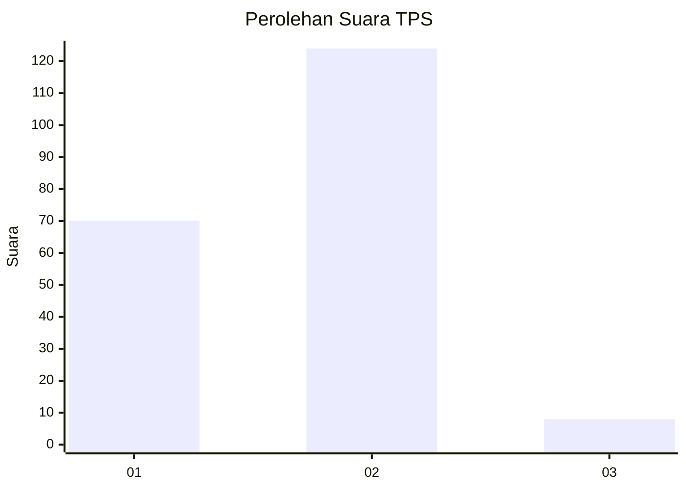
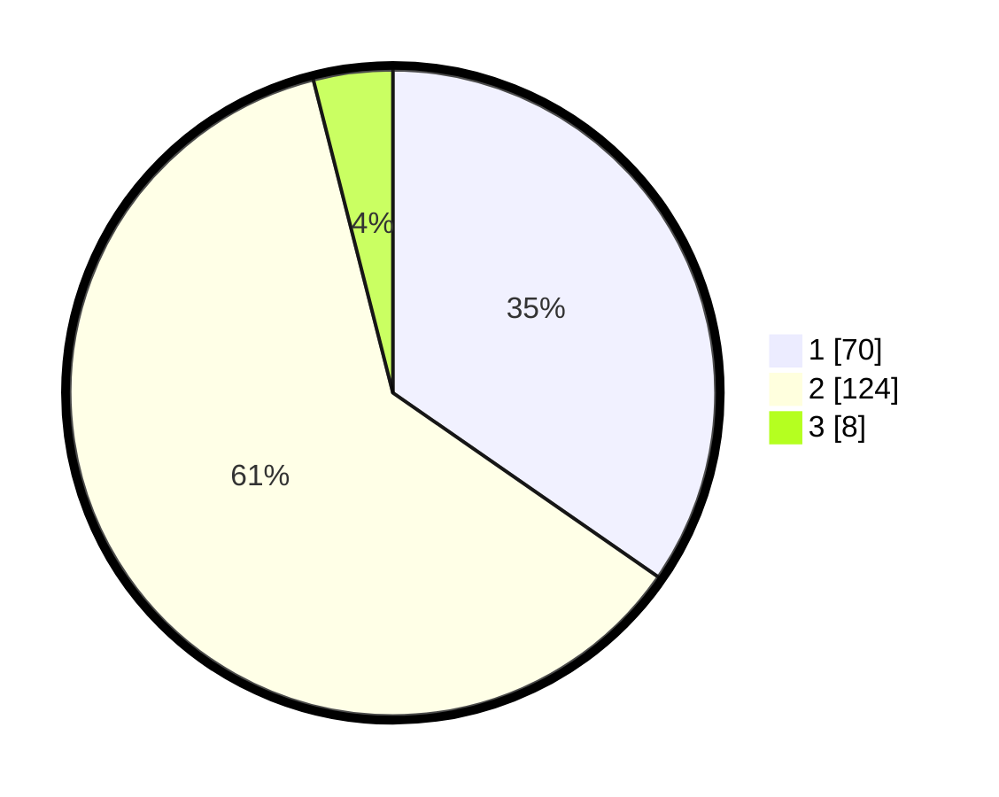

# Hasil

## Grafik

## Tabel

| No. | Nama Paslon    | Suara | Suara (raw) | Persentase |
|:--- |:-------------- | -----:| -----------:| ----------:|
| 1   | ANIES MUHAIMIN | 70    | [70][p-1]   | 34,65      |
| 2   | PRABOWO GIBRAN | 124   | [124][p-2]  | 61,39      |
| 3   | GANJAR MAHFUD  | 8     | [8][p-3]    | 3,96       |

[p-1]: https://github.com/gigit-pemilu/pemilu-2024-12-sumatera-utara/blob/main/pilpres/hitung-suara/sub/12-sumatera-utara/sub/03-tapanuli-selatan/sub/31-angkola-sangkunur/sub/1002-rianiate/sub/004-tps/sub/paslon-1.txt
[p-2]: https://github.com/gigit-pemilu/pemilu-2024-12-sumatera-utara/blob/main/pilpres/hitung-suara/sub/12-sumatera-utara/sub/03-tapanuli-selatan/sub/31-angkola-sangkunur/sub/1002-rianiate/sub/004-tps/sub/paslon-2.txt
[p-3]: https://github.com/gigit-pemilu/pemilu-2024-12-sumatera-utara/blob/main/pilpres/hitung-suara/sub/12-sumatera-utara/sub/03-tapanuli-selatan/sub/31-angkola-sangkunur/sub/1002-rianiate/sub/004-tps/sub/paslon-3.txt

## Foto C Plano

https://sirekap-obj-formc.kpu.go.id/0e88/pemilu/ppwp/12/03/31/10/02/1203311002004-20240215-111053--4ca3d972-b8b6-4ce3-8231-1b7ffd3defea.jpg

https://sirekap-obj-formc.kpu.go.id/0e88/pemilu/ppwp/12/03/31/10/02/1203311002004-20240215-111323--02bfd338-96a1-4445-9232-720ae324efcf.jpg

https://sirekap-obj-formc.kpu.go.id/0e88/pemilu/ppwp/12/03/31/10/02/1203311002004-20240215-111638--47273bae-d162-482d-8222-79f120c4feea.jpg

## Metadata

| Key        | Value               |
| ---------- | ------------------- |
| Time Stamp | 2024-02-25 17:00:00 |

