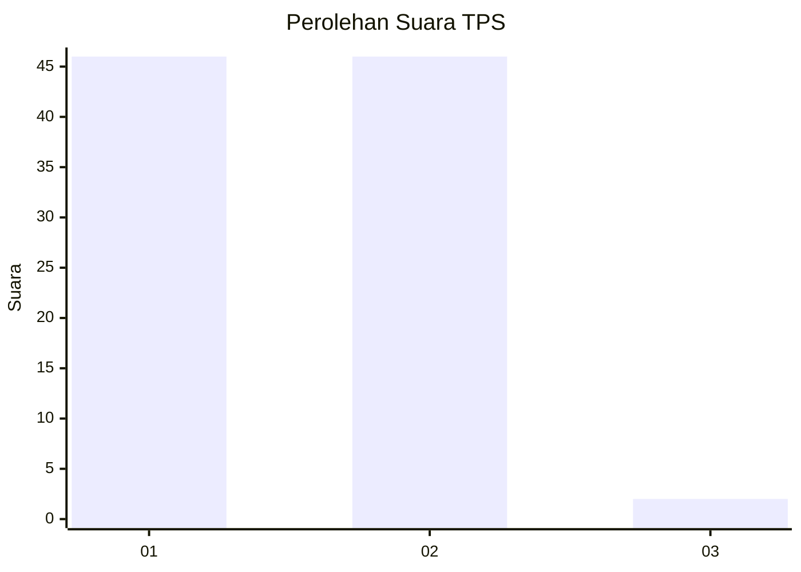
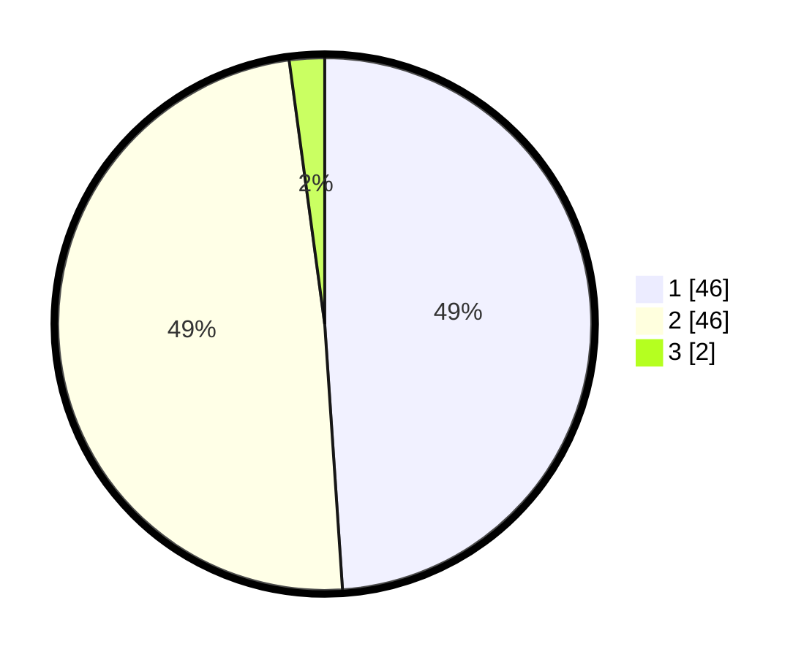

# Hasil

## Grafik

## Tabel

| No. | Nama Paslon    | Suara | Suara (raw) | Persentase |
|:--- |:-------------- | -----:| -----------:| ----------:|
| 1   | ANIES MUHAIMIN | 46    | [46][p-1]   | 48,94      |
| 2   | PRABOWO GIBRAN | 46    | [46][p-2]   | 48,94      |
| 3   | GANJAR MAHFUD  | 2     | [2][p-3]    | 2,13       |

[p-1]: https://github.com/gigit-pemilu/pemilu-2024-12-sumatera-utara/blob/main/pilpres/hitung-suara/sub/12-sumatera-utara/sub/03-tapanuli-selatan/sub/31-angkola-sangkunur/sub/1002-rianiate/sub/017-tps/sub/paslon-1.txt
[p-2]: https://github.com/gigit-pemilu/pemilu-2024-12-sumatera-utara/blob/main/pilpres/hitung-suara/sub/12-sumatera-utara/sub/03-tapanuli-selatan/sub/31-angkola-sangkunur/sub/1002-rianiate/sub/017-tps/sub/paslon-2.txt
[p-3]: https://github.com/gigit-pemilu/pemilu-2024-12-sumatera-utara/blob/main/pilpres/hitung-suara/sub/12-sumatera-utara/sub/03-tapanuli-selatan/sub/31-angkola-sangkunur/sub/1002-rianiate/sub/017-tps/sub/paslon-3.txt

## Foto C Plano

https://sirekap-obj-formc.kpu.go.id/9b85/pemilu/ppwp/12/03/31/10/02/1203311002017-20240215-005247--8242fe20-1954-4a3f-88a0-73665deb2178.jpg

https://sirekap-obj-formc.kpu.go.id/9b85/pemilu/ppwp/12/03/31/10/02/1203311002017-20240215-005446--b5d57be7-5370-4c73-af64-57bf76c2fca9.jpg

https://sirekap-obj-formc.kpu.go.id/9b85/pemilu/ppwp/12/03/31/10/02/1203311002017-20240215-005521--00a49d6d-3d41-4d4e-bfce-fa62fab695a0.jpg

## Metadata

| Key        | Value               |
| ---------- | ------------------- |
| Time Stamp | 2024-02-24 22:31:28 |

