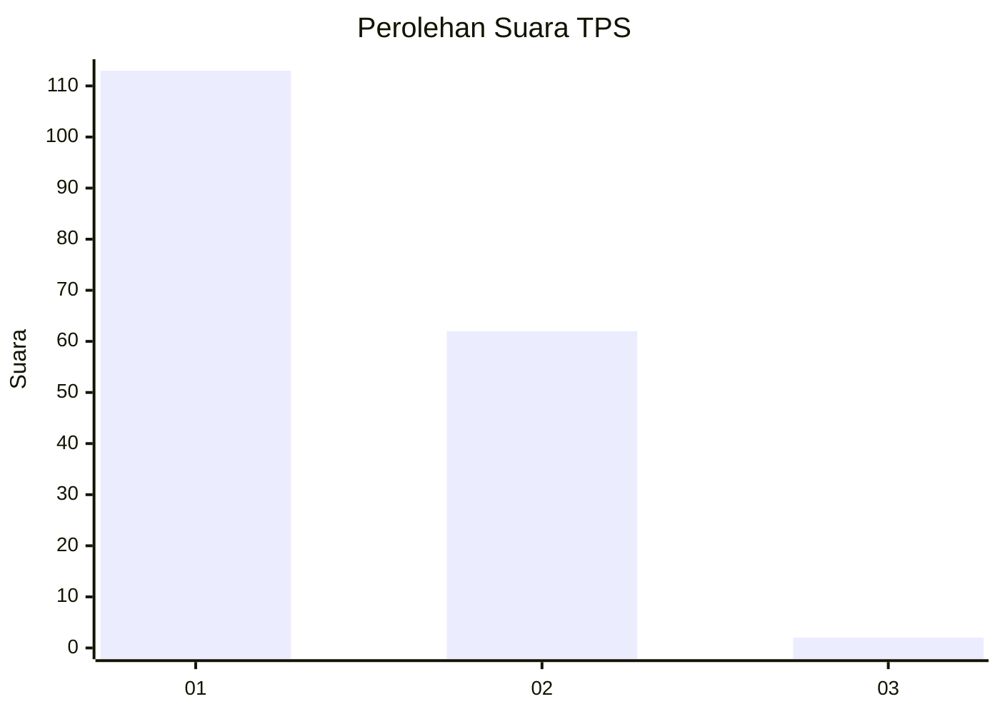
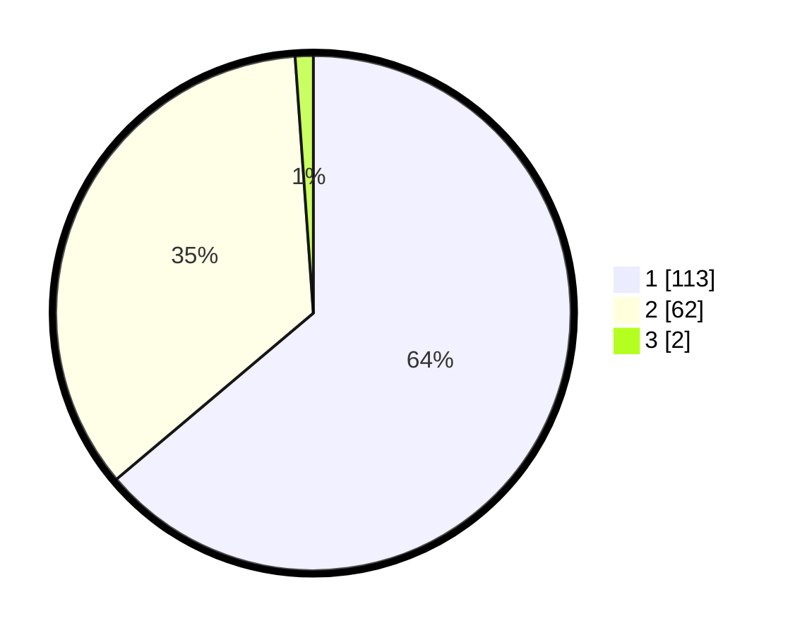

# Hasil

## Grafik

## Tabel

| No. | Nama Paslon    | Suara | Suara (raw) | Persentase |
|:--- |:-------------- | -----:| -----------:| ----------:|
| 1   | ANIES MUHAIMIN | 113   | [113][p-1]  | 63,84      |
| 2   | PRABOWO GIBRAN | 62    | [62][p-2]   | 35,03      |
| 3   | GANJAR MAHFUD  | 2     | [2][p-3]    | 1,13       |

[p-1]: https://github.com/gigit-pemilu/pemilu-2024-12-sumatera-utara/blob/main/pilpres/hitung-suara/sub/12-sumatera-utara/sub/03-tapanuli-selatan/sub/32-angkola-muara-tais/sub/1001-bintuju/sub/004-tps/sub/paslon-1.txt
[p-2]: https://github.com/gigit-pemilu/pemilu-2024-12-sumatera-utara/blob/main/pilpres/hitung-suara/sub/12-sumatera-utara/sub/03-tapanuli-selatan/sub/32-angkola-muara-tais/sub/1001-bintuju/sub/004-tps/sub/paslon-2.txt
[p-3]: https://github.com/gigit-pemilu/pemilu-2024-12-sumatera-utara/blob/main/pilpres/hitung-suara/sub/12-sumatera-utara/sub/03-tapanuli-selatan/sub/32-angkola-muara-tais/sub/1001-bintuju/sub/004-tps/sub/paslon-3.txt

## Foto C Plano

https://sirekap-obj-formc.kpu.go.id/3b36/pemilu/ppwp/12/03/32/10/01/1203321001004-20240215-002301--c4027532-2d7e-46bd-8ced-a844b0bba291.jpg

https://sirekap-obj-formc.kpu.go.id/3b36/pemilu/ppwp/12/03/32/10/01/1203321001004-20240215-002313--d62d1577-3be4-48a9-9ad4-69239b844a12.jpg

https://sirekap-obj-formc.kpu.go.id/3b36/pemilu/ppwp/12/03/32/10/01/1203321001004-20240215-002318--13ce13ef-97b8-4cf9-8fd3-977ebe35f469.jpg

## Metadata

| Key        | Value               |
| ---------- | ------------------- |
| Time Stamp | 2024-02-25 16:00:00 |

