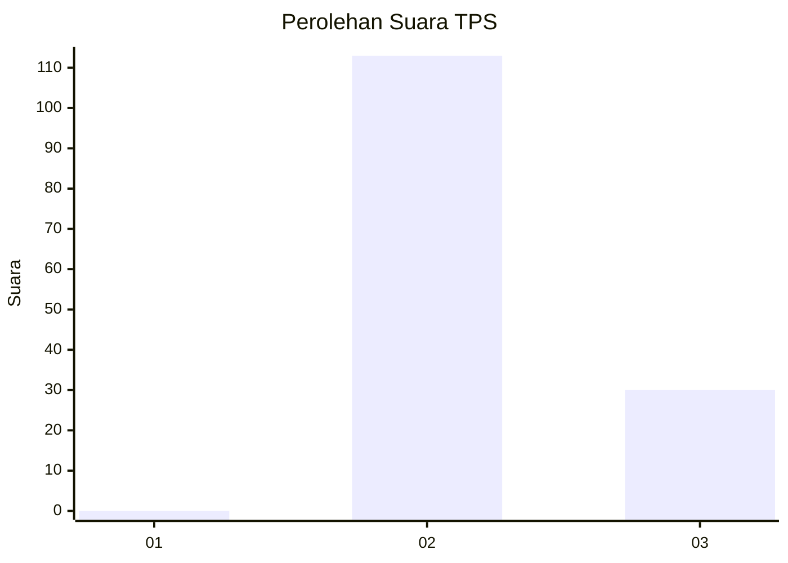
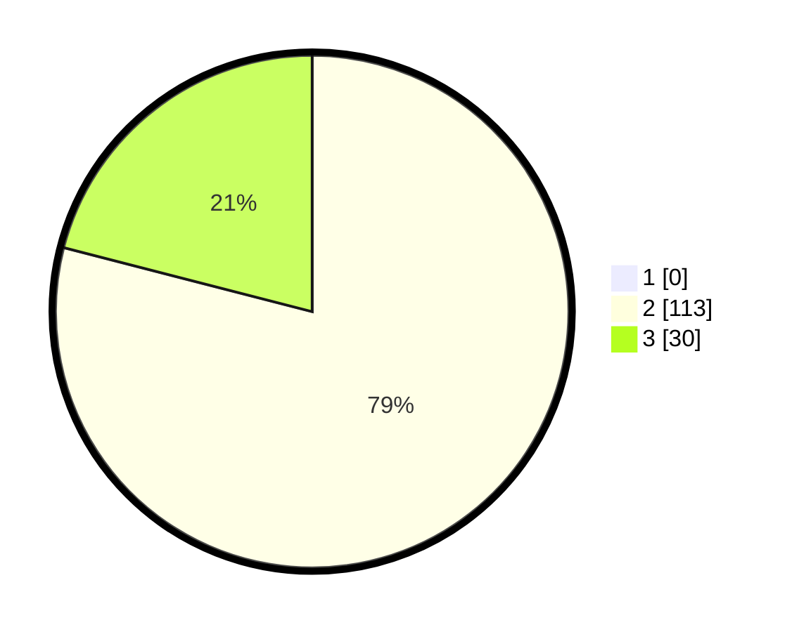

# Hasil

## Grafik

## Tabel

| No. | Nama Paslon    | Suara | Suara (raw) | Persentase |
|:--- |:-------------- | -----:| -----------:| ----------:|
| 1   | ANIES MUHAIMIN | 0     | [0][p-1]    | 0,00       |
| 2   | PRABOWO GIBRAN | 113   | [113][p-2]  | 79,02      |
| 3   | GANJAR MAHFUD  | 30    | [30][p-3]   | 20,98      |

[p-1]: https://github.com/gigit-pemilu/pemilu-2024/blob/main/pilpres/hitung-suara/sub/12-sumatera-utara/sub/04-nias/sub/05-hiliduho/sub/2001-ononamolo-i-bot/sub/001-tps/sub/paslon-1.txt
[p-2]: https://github.com/gigit-pemilu/pemilu-2024/blob/main/pilpres/hitung-suara/sub/12-sumatera-utara/sub/04-nias/sub/05-hiliduho/sub/2001-ononamolo-i-bot/sub/001-tps/sub/paslon-2.txt
[p-3]: https://github.com/gigit-pemilu/pemilu-2024/blob/main/pilpres/hitung-suara/sub/12-sumatera-utara/sub/04-nias/sub/05-hiliduho/sub/2001-ononamolo-i-bot/sub/001-tps/sub/paslon-3.txt

## Foto C Plano

https://sirekap-obj-formc.kpu.go.id/4352/pemilu/ppwp/12/04/05/20/01/1204052001001-20240215-084211--13ac694f-d02e-4121-bc85-58b1d3210cbb.jpg

https://sirekap-obj-formc.kpu.go.id/4352/pemilu/ppwp/12/04/05/20/01/1204052001001-20240215-084153--0fda4793-807b-457f-9d80-db5e295a9478.jpg

https://sirekap-obj-formc.kpu.go.id/4352/pemilu/ppwp/12/04/05/20/01/1204052001001-20240215-084039--7b0843e2-44ff-4c2f-9b48-09e715b37c02.jpg

## Metadata

| Key        | Value               |
| ---------- | ------------------- |
| Time Stamp | 2024-02-15 20:00:44 |

