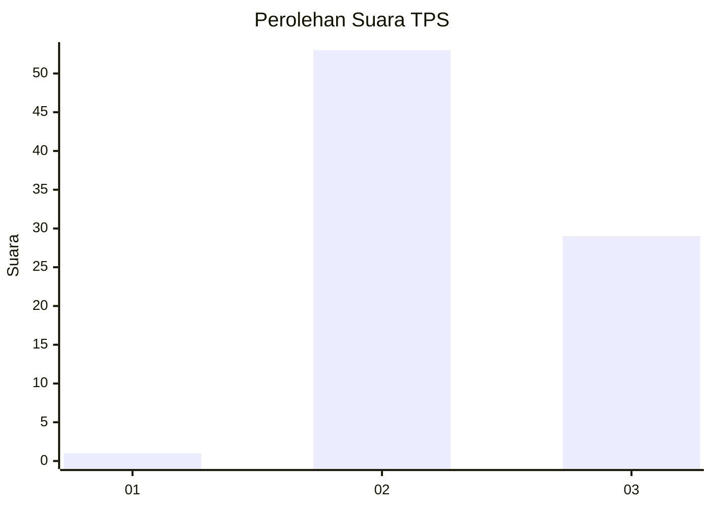
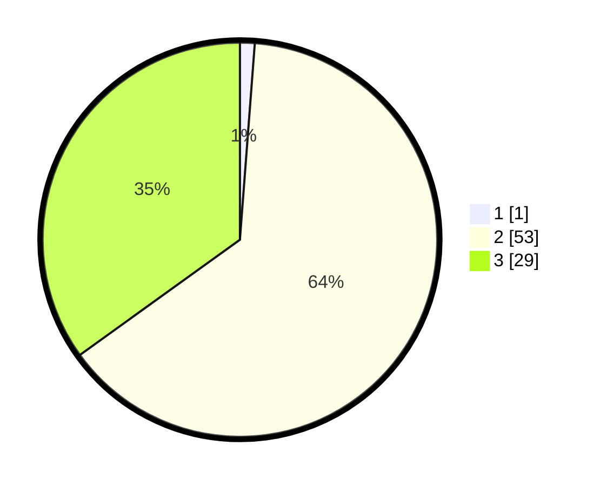

# Hasil

## Grafik

## Tabel

| No. | Nama Paslon    | Suara | Suara (raw) | Persentase |
|:--- |:-------------- | -----:| -----------:| ----------:|
| 1   | ANIES MUHAIMIN | 1     | [1][p-1]    | 1,20       |
| 2   | PRABOWO GIBRAN | 53    | [53][p-2]   | 63,86      |
| 3   | GANJAR MAHFUD  | 29    | [29][p-3]   | 34,94      |

[p-1]: https://github.com/gigit-pemilu/pemilu-2024/blob/main/pilpres/hitung-suara/sub/12-sumatera-utara/sub/04-nias/sub/05-hiliduho/sub/2023-ombolata-salo'o/sub/001-tps/sub/paslon-1.txt
[p-2]: https://github.com/gigit-pemilu/pemilu-2024/blob/main/pilpres/hitung-suara/sub/12-sumatera-utara/sub/04-nias/sub/05-hiliduho/sub/2023-ombolata-salo'o/sub/001-tps/sub/paslon-2.txt
[p-3]: https://github.com/gigit-pemilu/pemilu-2024/blob/main/pilpres/hitung-suara/sub/12-sumatera-utara/sub/04-nias/sub/05-hiliduho/sub/2023-ombolata-salo'o/sub/001-tps/sub/paslon-3.txt

## Foto C Plano

https://sirekap-obj-formc.kpu.go.id/bc37/pemilu/ppwp/12/04/05/20/23/1204052023001-20240214-225838--ea40adec-1c98-411f-86c0-d191d6f41218.jpg

https://sirekap-obj-formc.kpu.go.id/bc37/pemilu/ppwp/12/04/05/20/23/1204052023001-20240214-234759--7c981f57-5ba8-432d-830d-9b510b2a959e.jpg

https://sirekap-obj-formc.kpu.go.id/bc37/pemilu/ppwp/12/04/05/20/23/1204052023001-20240214-225917--1ad30596-71ef-4b35-8b16-1ee5e80d43a6.jpg

## Metadata

| Key        | Value               |
| ---------- | ------------------- |
| Time Stamp | 2024-02-15 12:00:28 |

