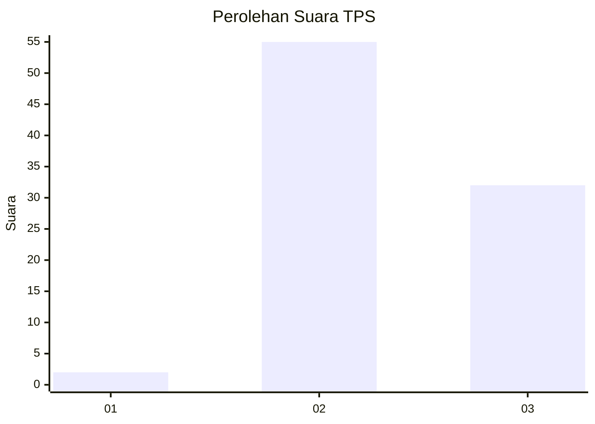
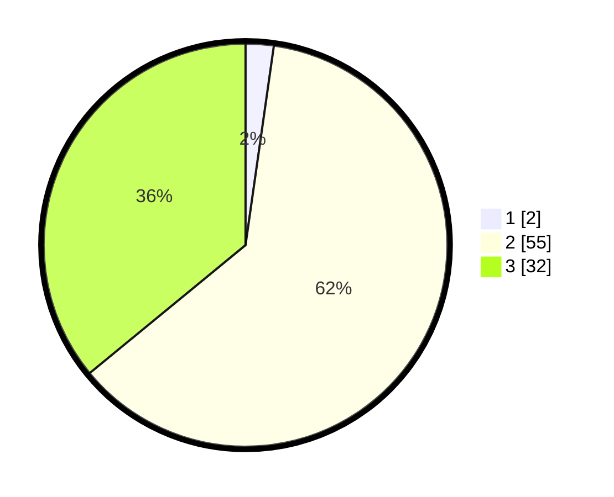

# Hasil

## Grafik

## Tabel

| No. | Nama Paslon    | Suara | Suara (raw) | Persentase |
|:--- |:-------------- | -----:| -----------:| ----------:|
| 1   | ANIES MUHAIMIN | 2     | [2][p-1]    | 2,25       |
| 2   | PRABOWO GIBRAN | 55    | [55][p-2]   | 61,80      |
| 3   | GANJAR MAHFUD  | 32    | [32][p-3]   | 35,96      |

[p-1]: https://github.com/gigit-pemilu/pemilu-2024/blob/main/pilpres/hitung-suara/sub/12-sumatera-utara/sub/04-nias/sub/05-hiliduho/sub/2023-ombolata-salo'o/sub/002-tps/sub/paslon-1.txt
[p-2]: https://github.com/gigit-pemilu/pemilu-2024/blob/main/pilpres/hitung-suara/sub/12-sumatera-utara/sub/04-nias/sub/05-hiliduho/sub/2023-ombolata-salo'o/sub/002-tps/sub/paslon-2.txt
[p-3]: https://github.com/gigit-pemilu/pemilu-2024/blob/main/pilpres/hitung-suara/sub/12-sumatera-utara/sub/04-nias/sub/05-hiliduho/sub/2023-ombolata-salo'o/sub/002-tps/sub/paslon-3.txt

## Foto C Plano

https://sirekap-obj-formc.kpu.go.id/675f/pemilu/ppwp/12/04/05/20/23/1204052023002-20240215-093305--d96c467d-8dc9-41bc-a00d-b8597b2c47db.jpg

https://sirekap-obj-formc.kpu.go.id/675f/pemilu/ppwp/12/04/05/20/23/1204052023002-20240215-093332--94950f53-9a31-452a-b014-dcc372ff153a.jpg

https://sirekap-obj-formc.kpu.go.id/675f/pemilu/ppwp/12/04/05/20/23/1204052023002-20240215-093359--f39f3cdf-147b-41da-ac6d-9114b76a4278.jpg

## Metadata

| Key        | Value               |
| ---------- | ------------------- |
| Time Stamp | 2024-02-15 15:00:29 |

