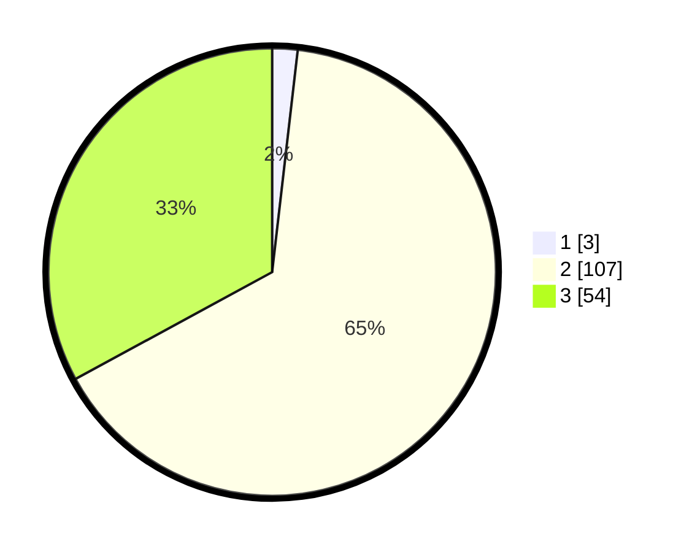

# Hasil

## Grafik

## Tabel

| No. | Nama Paslon    | Suara | Suara (raw) | Persentase |
|:--- |:-------------- | -----:| -----------:| ----------:|
| 1   | ANIES MUHAIMIN | 3     | [3][p-1]    | 1,83       |
| 2   | PRABOWO GIBRAN | 107   | [107][p-2]  | 65,24      |
| 3   | GANJAR MAHFUD  | 54    | [54][p-3]   | 32,93      |

[p-1]: https://github.com/gigit-pemilu/pemilu-2024/blob/main/pilpres/hitung-suara/sub/12-sumatera-utara/sub/04-nias/sub/05-hiliduho/sub/2024-sisobalauru/sub/002-tps/sub/paslon-1.txt
[p-2]: https://github.com/gigit-pemilu/pemilu-2024/blob/main/pilpres/hitung-suara/sub/12-sumatera-utara/sub/04-nias/sub/05-hiliduho/sub/2024-sisobalauru/sub/002-tps/sub/paslon-2.txt
[p-3]: https://github.com/gigit-pemilu/pemilu-2024/blob/main/pilpres/hitung-suara/sub/12-sumatera-utara/sub/04-nias/sub/05-hiliduho/sub/2024-sisobalauru/sub/002-tps/sub/paslon-3.txt

## Foto C Plano

https://sirekap-obj-formc.kpu.go.id/e74b/pemilu/ppwp/12/04/05/20/24/1204052024002-20240215-014736--cb128f51-24fd-430f-9c88-4cbc06798f5e.jpg

https://sirekap-obj-formc.kpu.go.id/e74b/pemilu/ppwp/12/04/05/20/24/1204052024002-20240215-014938--6f89dd58-115b-4853-9e65-a96133ee0823.jpg

https://sirekap-obj-formc.kpu.go.id/e74b/pemilu/ppwp/12/04/05/20/24/1204052024002-20240215-015053--7e9ca9b6-3b2a-4426-be90-e10bb65218f8.jpg

## Metadata

| Key        | Value               |
| ---------- | ------------------- |
| Time Stamp | 2024-02-15 15:00:29 |

